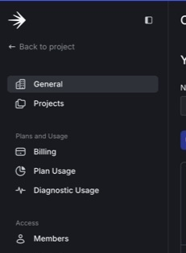
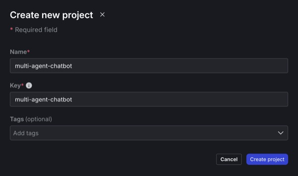
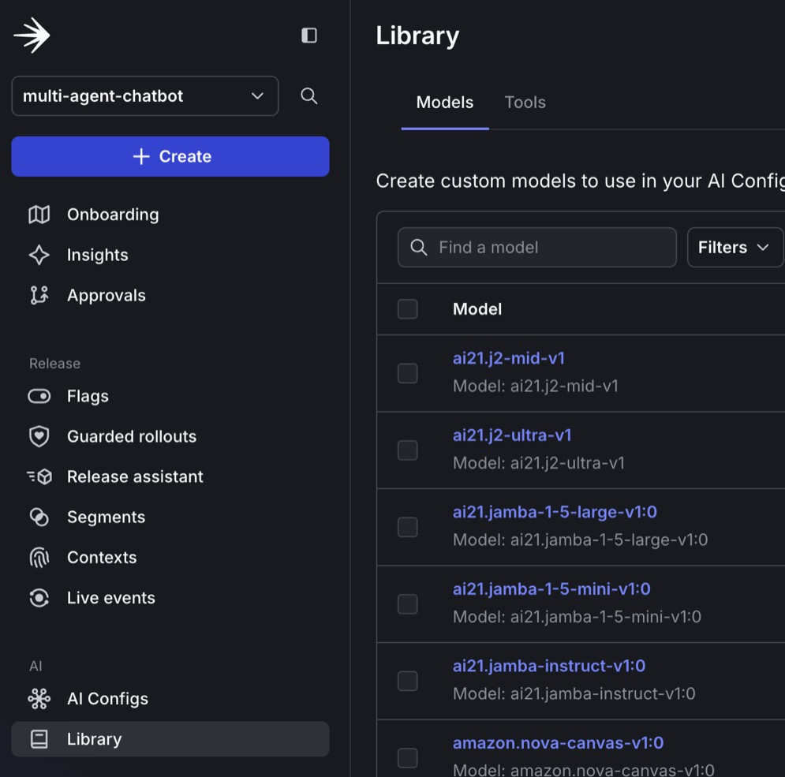
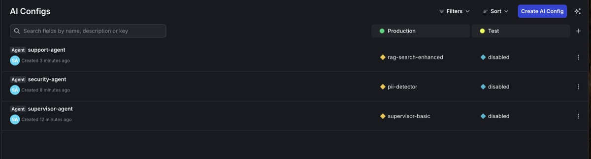
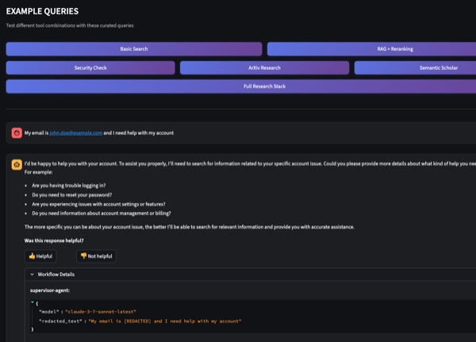

# Build a LangGraph Multi-Agent System in 20 Minutes with LaunchDarkly AI Configs

Build a working multi-agent system with dynamic configuration in 20 minutes using LangGraph multi-agent workflows, RAG search, and LaunchDarkly AI Configs.

*Part 1 of 3 of the series **Chaos to Clarity: Defensible AI Systems That Deliver on Your Goals***

Most AI development follows the same broken pattern: build a system, discover GPT-4 costs too much, find out Claude works better for your use case, realize European users need different privacy handling, then struggle to explain which model, prompt, or tool combination actually works best for different scenarios. Every change requires code deploys, testing cycles, and hoping nothing breaks.

Your competitors ship faster because they control AI behavior dynamically instead of hardcoding everything.

This three-part series shows you how to build **LangGraph multi-agent workflows** that get their intelligence from **RAG search** through your business documents, enhanced with **MCP tools** for live external data, all controlled through **LaunchDarkly AI Configs**.

## What This Series Covers

- **Part 1** (this post): Build a working multi-agent system with dynamic configuration in 20 minutes
- **Part 2**: Add advanced features like segment targeting, MCP tool integration, and cost optimization
- **Part 3**: Run production A/B experiments to prove what actually works

By the end, you'll have a system that measures its own performance and adapts based on user data instead of guesswork.

## What You'll Build Today

In the next 20 minutes, you'll have a LangGraph multi-agent system with:

- **Supervisor Agent**: Orchestrates workflow between specialized agents
- **Security Agent**: Detects PII and sensitive information
- **Support Agent**: Answers questions using your business documents
- **Dynamic Control**: Change models, tools, and behavior through LaunchDarkly without code changes

## Prerequisites

You'll need:

- **Python 3.9+** with `uv` package manager ([install uv](https://docs.astral.sh/uv/getting-started/installation/))
- **LaunchDarkly account** ([sign up for free](https://app.launchdarkly.com/signup))
- **OpenAI API key** (required for RAG architecture embeddings)
- **Anthropic API key** (required for Claude models) or **OpenAI API key** (for GPT models)

## Step 1: Clone and Configure (2 minutes)

Set up the foundation. We'll explain each part as we go.

```bash
# Get the code
git clone https://github.com/launchdarkly/agents-demo.git
cd agents-demo

# Install dependencies (LangGraph, LaunchDarkly SDK, etc.)
uv sync

# Configure your environment
cp .env.example .env
```

First, you need to get your LaunchDarkly SDK key by creating a project:

1. **Sign up for LaunchDarkly** at [app.launchdarkly.com](https://app.launchdarkly.com) (free account)
2. **Find projects on the side bar:**

<br>

<div align="center">



</div>

3. **Create a new project** called "multi-agent-chatbot"

<br>

<div align="center">



</div>

4. **Get your SDK key**:
  
    Go to:
    
    ⚙️ (bottom of sidebar) → **Projects** → **multi-agent-chatbot** → ⚙️ (to the right) 
    
    → **Environments** → **Production** → **...** → **SDK key** 
    
    this is your `LD_SDK_KEY`

<br>

<div align="center">


</div>

Now edit `.env` with your keys:
```bash
LD_SDK_KEY=your-launchdarkly-sdk-key  # From step above
OPENAI_API_KEY=your-openai-key        # Required for RAG embeddings
ANTHROPIC_API_KEY=your-anthropic-key  # Required for Claude models
```

This sets up a LangGraph application that uses LaunchDarkly to control AI behavior. Now you can swap actors and directors mid-performance without stopping the show.

## Step 2: Add Your Business Knowledge (2 minutes)

The system includes a sample reinforcement learning textbook. Replace it with your own documents for your specific domain.

```bash
# Option A: Use the sample (AI/ML knowledge)
# Already included: kb/SuttonBartoIPRLBook2ndEd.pdf

# Option B: Add your documents
rm kb/*.pdf  # Clear sample
cp /path/to/your-docs/*.pdf kb/
```

Document types that work well:
- **Legal**: Contracts, case law, compliance guidelines
- **Healthcare**: Protocols, research papers, care guidelines
- **SaaS**: API docs, user guides, troubleshooting manuals
- **E-commerce**: Product catalogs, policies, FAQs

## Step 3: Initialize Your Knowledge Base (2 minutes)

Turn documents into searchable **RAG architecture** knowledge:

```bash
# Create vector embeddings for semantic search
uv run python initialize_embeddings.py --force
```

This builds your **RAG architecture** (Retrieval-Augmented Generation) foundation using **OpenAI's text-embedding-3-small** model and **FAISS** vector database. The **RAG architecture** converts documents into 1536-dimensional vector embeddings that capture semantic meaning rather than just keywords.

## Step 4: Define Your Tools (3 minutes)

Define the search tools your agents will use.

In **LaunchDarkly Dashboard Sidebar** → **Library** (under AI) → **Tools** tab → **Create New Tool**

<br>

<div align="center">



</div>

### Create the RAG vector search tool:

> **Key:** `search_v2`
>
> **Description:** `Semantic search using vector embeddings`
>
> **Schema:**
> ```json
> {
>   "properties": {
>     "query": {
>       "description": "Search query for semantic matching",
>       "type": "string"
>     },
>     "top_k": {
>       "description": "Number of results to return",
>       "type": "number"
>     }
>   },
>   "additionalProperties": false,
>   "required": [
>     "query"
>   ]
> }
> ```


### Create the reranking tool:

> **Key:** `reranking`
>
> **Description:** `Reorders results by relevance`
>
> **Schema:**
> ```json
> {
>   "properties": {
>     "query": {
>       "description": "Original query for scoring",
>       "type": "string"
>     },
>     "results": {
>       "description": "Results to rerank",
>       "type": "array"
>     }
>   },
>   "additionalProperties": false,
>   "required": [
>     "query",
>     "results"
>   ]
> }
> ```

<Callout intent="info">
**🔍 How Your RAG Architecture Works**

These tools implement your **RAG architecture** in two stages: the `search_v2` tool performs semantic similarity search using **FAISS** by converting queries into the same 1536-dimensional vector space as your documents (via **OpenAI text-embedding-3-small**), while `reranking` uses cross-encoder models to reorder results for maximum relevance. This **FAISS**-powered **RAG architecture** significantly outperforms basic keyword search by understanding context and semantic relationships through high-dimensional vector similarity.
</Callout>

## Step 5: Create Your AI Agents in LaunchDarkly (5 minutes)

Configure your **LangGraph** multi-agent system dynamically. **LangGraph** is LangChain's framework for building stateful, multi-actor applications that maintain conversation state across agent interactions. Your **LangGraph** architecture enables sophisticated workflows where agents collaborate and pass context between each other.

### Create the Supervisor Agent

1. Go to **LaunchDarkly Dashboard Sidebar** → **AI Configs** → **Create New**
2. Select 🤖 `Agent-based`

<br>

<div align="center">


</div>

3. Name it `supervisor-agent`
4. Add this configuration:


> **variation:** `supervisor-basic`
>
> **Model configuration:** `Anthropic` `claude-3-7-sonnet-latest`
>
> → **Add parameters**
> → **Click Custom parameters**
> ```json
> {"max_tool_calls":5}
> ```
>
> **Goal or task:** 
> ```
> You are a helpful assistant that can search documentation and research papers. When search results are available, prioritize information from those results over your general knowledge to provide the most accurate and up-to-date responses. Use available tools to search the knowledge base and external research databases to answer questions accurately and comprehensively.
> ```

The supervisor agent demonstrates **LangGraph** orchestration by routing requests based on content analysis rather than rigid rules. **LangGraph** enables this agent to maintain conversation context and make intelligent routing decisions that adapt to user needs and LaunchDarkly AI Config parameters.


### Create the Security Agent

Similarly, create another AI Config called `security-agent`:

> **variation:** `pii-detector`
>
> **Model configuration:** `Anthropic` `claude-3-7-sonnet-latest`
>
> **Goal or task:** 
> ```
> You are a privacy agent that REMOVES PII and formats the input for another process. Analyze the input text and respond with JSON containing: detected (true if PII found), types (array like ['email', 'name']), redacted (text with PII replaced by [REDACTED], keeping it readable). Examples: Input: 'My email is john@company.com and I need help' Output: {"detected": true, "types": ["email"], "redacted": "My email is [REDACTED] and I need help"}. Input: 'I need help with my account' Output: {"detected": false, "types": [], "redacted": "I need help with my account"}. Input: 'My name is Sarah Johnson and my phone is 555-1234' Output: {"detected": true, "types": ["name", "phone"], "redacted": "My name is [REDACTED] and my phone is [REDACTED]"}. Always return valid JSON format.
> ```

This agent detects PII and provides detailed redaction information, showing exactly what sensitive data was found and how it would be handled for compliance and transparency.

### Create the Support Agent

Finally, create `support-agent`:


> **variation:** `rag-search-enhanced`
>
> **Model configuration:** `Anthropic` `claude-3-7-sonnet-latest`
>
> → **Add tools**
> select **reranking** and **search_v2**
>
> **Goal or task:** 
> ```
> You are a helpful assistant that can search documentation and research papers. When search results are available, prioritize information from those results over your general knowledge to provide the most accurate and up-to-date responses. Use available tools to search the knowledge base and external research databases to answer questions accurately and comprehensively.
> ```

<br>

<div align="center">



</div>

This agent combines **LangGraph** workflow management with your **RAG architecture** tools. **LangGraph** enables the agent to chain multiple tool calls together: first using the **RAG architecture** for document retrieval, then semantic reranking, all while maintaining conversation state and handling error recovery gracefully.

## Step 6: Launch Your System (2 minutes)

Start the system:

```bash
# Terminal 1: Start the backend
uv run uvicorn api.main:app --reload --port 8001
```

```bash
# Terminal 2: Launch the UI  
uv run streamlit run ui/chat_interface.py --server.port 8501
```

Open http://localhost:8501 in your browser. You should see a clean chat interface.

## Step 7: Test Your Multi-Agent System (2 minutes)

Test with these queries:

**Basic Knowledge Test:**
"What is reinforcement learning?" (if using sample docs)
Or ask about your specific domain: "What's our refund policy?"

**PII Detection Test:**
"My email is john.doe@example.com and I need help"

**Workflow Details** show:
- Which agents are activated
- What models and tools are being used
- Text after redaction

<br>

<div align="center">



</div>

Watch **LangGraph** in action: the supervisor routes to security first (detecting PII), then to support which uses your **RAG architecture** for document search. **LangGraph** maintains state throughout this multi-agent workflow, ensuring context flows seamlessly between agents.

## Step 8: Make Changes Without Deploying Code

Try these experiments in LaunchDarkly:

### Switch Models Instantly

Edit your `support-agent` config:
```json
{
  "model": {"name": "chatgpt-4o-latest"}  // was claude
}
```

Save and refresh your chat. No code deployment or restart required.

### Adjust Tool Usage

Want to limit tool calls? Reduce the limits:
```json
{
  "customParameters": {
    "max_tool_calls": 3  // was 5
  }
}
```

### Change Agent Behavior

Want more thorough searches? Update instructions:
```json
{
  "instructions": "You are a research specialist. Always search multiple times from different angles before answering. Prioritize accuracy over speed."
}
```

Changes take effect immediately without downtime.

## Understanding What You Built

Your **LangGraph** multi-agent system with **RAG architecture** includes:

**1. LangGraph Orchestration**
The supervisor agent uses **LangGraph** state management to route requests intelligently based on content analysis.

**2. Privacy Protection**
The security agent integrates with **LangGraph** workflows to detect PII before processing, supporting compliance.

**3. RAG Architecture Knowledge**
The support agent combines **LangGraph** tool chaining with your **RAG architecture** for semantic document search and reranking.

**4. Runtime Control**
LaunchDarkly controls both **LangGraph** behavior and **RAG architecture** parameters without code changes.

## Real-World Use Cases

Teams are using this pattern for:

- **Customer Support**: Route billing to one agent, technical to another, with different cost tolerances
- **Legal Research**: Expensive models for contract analysis, cheap ones for basic queries
- **Healthcare**: Strict PII handling for patient data, different models for research vs. clinical queries
- **E-commerce**: Premium support for enterprise customers, basic for free tier

## What's Next?

Your multi-agent system is running with dynamic control and ready for optimization.

**In Part 2**, we'll add:
- Geographic-based privacy rules (strict for EU, standard for US)
- MCP tools for external data (GitHub, Slack, databases)
- Business tier configurations (free, pro, enterprise)
- Cost optimization strategies

**In Part 3**, we'll run A/B experiments to prove which configurations actually work best with real data.

## Try This Now

Before moving to Part 2, experiment with:

1. **Different Instructions**: Make agents more helpful, more cautious, or more thorough
2. **Tool Combinations**: Add/remove tools to see impact on quality
3. **Model Comparisons**: Try different models for different agents
4. **Cost Limits**: Find the sweet spot between quality and cost

Every change is instant, measurable, and reversible.

## Key Takeaways

- Multi-agent systems work best when each agent has a specific role
- Dynamic configuration handles changing requirements better than hardcoding
- LaunchDarkly AI Configs control and change AI behavior without requiring deployments
- Start simple and add complexity as you learn what works

Ready for more? [Continue to Part 2: Advanced AI Agent Features →](./part-2-advanced-features)

---

*Questions? Issues? Reach out at `aiproduct@launchdarkly.com` or open an issue in the [GitHub repo](https://github.com/launchdarkly/agents-demo).*