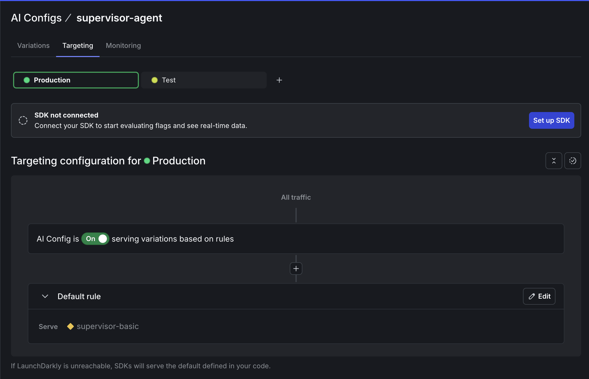

## Overview

Build a working multi-agent system with dynamic configuration in 20 minutes using LangGraph multi-agent workflows, RAG search, and LaunchDarkly AI Configs.

*Part 1 of 3 of the series: **Chaos to Clarity: Defensible AI Systems That Deliver on Your Goals***

You've been there: your AI chatbot works great in testing, then production hits and GPT-4 costs spiral out of control. You switch to Claude, but now European users need different privacy rules. Every change means another deploy, more testing, and crossed fingers that nothing breaks.

The teams shipping faster? They control AI behavior dynamically instead of hardcoding everything.

This series shows you how to build **LangGraph multi-agent workflows** that get their intelligence from **RAG** search through your business documents, enhanced with **MCP tools** for live external data, all controlled through **LaunchDarkly AI Configs** without needing to deploy code changes.

## What This Series Covers

- **Part 1** (this post): Build a working multi-agent system with dynamic configuration in 20 minutes
- **Part 2**: Add advanced features like segment targeting, MCP tool integration, and cost optimization
- **Part 3**: Run production A/B experiments to prove what actually works

By the end, you'll have a system that measures its own performance and adapts based on user data instead of guesswork.

## What You'll Build Today

In the next 20 minutes, you'll have a LangGraph multi-agent system with:

- **Supervisor Agent**: Orchestrates workflow between specialized agents
- **Security Agent**: Detects PII and sensitive information
- **Support Agent**: Answers questions using your business documents
- **Dynamic Control**: Change models, tools, and behavior through LaunchDarkly without code changes

## Prerequisites

You'll need:

- **Python 3.9+** with `uv` package manager ([install uv](https://docs.astral.sh/uv/getting-started/installation/))
- **LaunchDarkly account** ([sign up for free](https://app.launchdarkly.com/signup))

**Choose your AI provider setup:**

**Option A: AWS Bedrock (Recommended)**
- **AWS Account** with Bedrock access and SSO configured
- **No API keys required** - uses AWS SSO authentication
- **Cost-effective** - enterprise-grade with cross-region failover

**Option B: Direct API Keys (Traditional)**
- **OpenAI API key** (required for RAG architecture embeddings)
- **Anthropic API key** (for Claude models) or **OpenAI API key** (for GPT models)

## Step 1: Clone and Configure (2 minutes)

First, let's get everything running locally. We'll explain what each piece does as we build.

```bash
# Get the code
git clone https://github.com/launchdarkly-labs/devrel-agents-tutorial
cd devrel-agents-tutorial

# Install dependencies (LangGraph, LaunchDarkly SDK, etc.)
uv sync

# Configure your environment
cp .env.example .env
```

First, you need to get your LaunchDarkly SDK key by creating a project:

1. **Sign up for LaunchDarkly** at [app.launchdarkly.com](https://app.launchdarkly.com) (free account).
<Note>If you're a brand new user, after signing up for an account, you'll need to verify your email address. You can skip through the new user onboarding flow after that. </Note>
2. **Find projects on the side bar:**

<br />

<div align="center">


*Projects sidebar in the LaunchDarkly app UI.*

</div>

3. **Create a new project** called "multi-agent-chatbot"

> **⚠️ IMPORTANT: Naming Requirements for Part 2**
>
> For the bootstrap script in Part 2 to work correctly, you **MUST** use these exact names:
> - **Project**: `multi-agent-chatbot`
> - **AI Configs**: `supervisor-agent`, `security-agent`, `support-agent`
> - **Tools**: `search_v2`, `reranking` (created in Part 1)
> - **Variations**: `supervisor-basic`, `pii-detector`, `rag-search-enhanced`
>
> The configuration files are hardcoded to use these specific keys.

<div align="center">


*Creating a new project in LaunchDarkly.*

</div>

4. **Get your SDK key**:
    
    ⚙️ (bottom of sidebar) → **Projects** → **multi-agent-chatbot** → ⚙️ (to the right) 
    
    → **Environments** → **Production** → **...** → **SDK key** 
    
    this is your `LD_SDK_KEY`

<br />

<div align="center">


*Location of the SDK key in LaunchDarkly project settings.*

</div>

Now configure your authentication method in `.env`:

### Option A: AWS Bedrock Setup (Recommended)

```bash
# LaunchDarkly Configuration
LD_SDK_KEY=your-launchdarkly-sdk-key  # From step above

# AWS Bedrock Configuration
AUTH_METHOD=sso                       # Use AWS SSO authentication
AWS_REGION=us-east-1                  # Your AWS region
AWS_PROFILE=your-sso-profile-name     # Your AWS SSO profile name

# Optional: Bedrock Embedding Configuration
BEDROCK_EMBEDDING_DIMENSIONS=1024     # Options: 256, 512, 1024
BEDROCK_EMBEDDING_MODEL=amazon.titan-embed-text-v2:0
```

**Then configure AWS SSO:**
```bash
# Configure AWS SSO (one-time setup)
aws configure sso --profile your-sso-profile-name

# Login to AWS SSO (run when token expires)
aws sso login --profile your-sso-profile-name

# Test your access
aws bedrock list-foundation-models --region us-east-1 --profile your-sso-profile-name
```

### Option B: Direct API Keys Setup

```bash
# LaunchDarkly Configuration
LD_SDK_KEY=your-launchdarkly-sdk-key  # From step above

# Direct API Configuration
AUTH_METHOD=api-key                   # Use direct API keys (default)
OPENAI_API_KEY=your-openai-key        # Required for RAG embeddings
ANTHROPIC_API_KEY=your-anthropic-key  # Required for Claude models
```

This sets up a **LangGraph** application that uses LaunchDarkly to control AI behavior. Think of it like swapping actors, directors, even props mid-performance without stopping the show.

**Security Note:** Do not check the `.env` into your source control. Keep those secrets safe!

### 🚨 **Common AWS SSO Issue:**

If you get `AccessDeniedException` errors, verify your Python code is using the correct AWS profile:

```bash
# Check which AWS account your profile uses
aws sts get-caller-identity --profile your-sso-profile-name

# If the account numbers don't match your error message, add AWS_PROFILE to your .env
```

**The error message will show the account number your Python code is using.** Make sure it matches your SSO profile account.

### 🚨 **Bedrock Model ID Requirements:**

When configuring AI models in LaunchDarkly for Bedrock, you should use **inference profile IDs** (with region prefix):

**✅ BEST PRACTICE - Inference Profile IDs (with region prefix):**
```
us.anthropic.claude-3-5-sonnet-20241022-v2:0
us.anthropic.claude-3-7-sonnet-20250219-v1:0
eu.anthropic.claude-3-5-haiku-20241022-v2:0
```

**⚠️ AUTO-CORRECTED - Direct Model IDs (will be fixed automatically):**
```
anthropic.claude-3-7-sonnet-20250219-v1:0  → us.anthropic.claude-3-7-sonnet-20250219-v1:0
anthropic.claude-3-5-sonnet-20241022-v2:0  → us.anthropic.claude-3-5-sonnet-20241022-v2:0
```

**How Auto-Correction Works:**

The system automatically converts direct model IDs to inference profile IDs to prevent `ValidationException` errors from Bedrock. The region prefix is determined by:

1. **`BEDROCK_INFERENCE_REGION`** env var (if set) - explicit user preference
2. **`AWS_REGION`** env var (e.g., `us-east-1` → `us` prefix) - automatic detection
3. **Default to `us`** if neither is set

**Configuring Region Prefix:**

To use European inference profiles, add to your `.env`:
```bash
BEDROCK_INFERENCE_REGION=eu  # Force EU inference profiles
```

**Finding Available Inference Profiles:**
```bash
# List available Bedrock inference profiles
aws bedrock list-inference-profiles --region us-east-1 --profile your-sso-profile-name
```

**Why Inference Profiles?**

Bedrock requires inference profile IDs for on-demand throughput. The region prefix (`us.`, `eu.`, `ap.`, etc.) enables cross-region inference profiles for better availability and failover.

## Step 2: Add Your Business Knowledge (2 minutes)

The system includes a sample reinforcement learning textbook. Replace it with your own documents for your specific domain.

```bash
# Option A: Use the sample (AI/ML knowledge)
# Already included: kb/SuttonBarto-IPRL-Book2ndEd.pdf

# Option B: Add your documents
rm kb/*.pdf  # Clear sample
cp /path/to/your-docs/*.pdf kb/
```

Document types that work well:
- **Legal**: Contracts, case law, compliance guidelines
- **Healthcare**: Protocols, research papers, care guidelines
- **SaaS**: API docs, user guides, troubleshooting manuals
- **E-commerce**: Product catalogs, policies, FAQs

## Step 3: Initialize Your Knowledge Base (2 minutes)

Turn your documents into searchable **RAG** knowledge:

```bash
# Create vector embeddings for semantic search
uv run python initialize_embeddings.py --force
```

This builds your **RAG** (Retrieval-Augmented Generation) foundation using FAISS vector database. The system automatically detects your authentication method:

- **AWS Bedrock**: Uses Amazon Titan V2 embeddings (1024 dimensions by default)
- **Direct API Keys**: Uses OpenAI text-embedding-3-small (1536 dimensions)

**RAG** converts documents into vector embeddings that capture semantic meaning rather than just keywords, making search actually understand context.

## Step 4: Define Your Tools (3 minutes)

Define the search tools your agents will use.

In the LaunchDarkly app sidebar, click **Library** in the AI section. On the following screen, click the **Tools** tab, then **Create tool**.

<br />

<div align="center">


*AI Library section in the LaunchDarkly dashboard sidebar.*

</div>

### Create the RAG vector search tool:
Note: we will be creating a simple search_v1 during part 3 when we learn about experimentation.
Create a tool using the following configuration:
> 
> **Key:** 
> ```
> search_v2
> ```
>
> **Description:** 
> ```
> Semantic search using vector embeddings
> ```
>
> **Schema:**
> ```json
> {
>   "properties": {
>     "query": {
>       "description": "Search query for semantic matching",
>       "type": "string"
>     },
>     "top_k": {
>       "description": "Number of results to return",
>       "type": "number"
>     }
>   },
>   "additionalProperties": false,
>   "required": [
>     "query"
>   ]
> }
> ```
When you're done, click **Save**.

### Create the reranking tool:
Back on the Tools section, click **Add tool** to create a new tool. Add the following properties: 
> 
> **Key:** 
> ```
> reranking
> ```
>
> **Description:** 
> ```
> Reorders results by relevance using BM25 algorithm
> ```
>
> **Schema:**
> ```json
> {
>   "properties": {
>     "query": {
>       "description": "Original query for scoring",
>       "type": "string"
>     },
>     "results": {
>       "description": "Results to rerank",
>       "type": "array"
>     }
>   },
>   "additionalProperties": false,
>   "required": [
>     "query",
>     "results"
>   ]
> }
> ```
When you're done, click **Save**.
The `reranking` tool takes search results from `search_v2` and reorders them using the BM25 algorithm to improve relevance. This hybrid approach combines semantic search (vector embeddings) with lexical matching (keyword-based scoring), making it especially useful for technical terms, product names, and error codes where exact term matching matters more than conceptual similarity.


> **🔍 How Your RAG Architecture Works**
>
> Your **RAG** system works in two stages: `search_v2` performs semantic similarity search using FAISS by converting queries into the same vector space as your documents (via **OpenAI** or **Bedrock Titan** embeddings), while `reranking` reorders results for maximum relevance. This **RAG** approach significantly outperforms keyword search by understanding context, so asking "My app is broken" can find troubleshooting guides that mention "application errors" or "system failures."

## Step 5: Create Your AI Agents in LaunchDarkly (5 minutes)

Create LaunchDarkly AI Configs to control your **LangGraph** multi-agent system dynamically. **LangGraph** is LangChain's framework for building stateful, multi-**agent** applications that maintain conversation state across **agent** interactions. Your **LangGraph** architecture enables sophisticated workflows where **agents** collaborate and pass context between each other.

### Create the Supervisor Agent

1. In the LaunchDarkly dashboard sidebar, navigate to **AI Configs** and click **Create New**
2. Select `🤖 Agent-based`

<br />

<div align="center">


*Selecting the Agent-based configuration type.*

</div>

3. Name it `supervisor-agent`
4. Add this configuration:

>
> **variation:**
> ```
> supervisor-basic
> ```
>
> **Model configuration:**
> ```
> Anthropic
> ```
> ```
> claude-3-7-sonnet-latest
> ```
>
> **Note for Bedrock users:** The system auto-corrects direct model IDs to inference profiles:
> - Use either `claude-3-7-sonnet-latest` (auto-corrected) or `us.anthropic.claude-3-7-sonnet-20250219-v1:0` (explicit)
> - Control region prefix via `BEDROCK_INFERENCE_REGION` env var (defaults to `us`)
> - See "Bedrock Model ID Requirements" section above for details
>
> **Goal or task:**
> ```
> You are an intelligent routing supervisor for a multi-agent system. Your primary job is to assess whether user input likely contains PII (personally identifiable information) to determine the most efficient processing route.
>
> **PII Assessment:**
> Analyze the user input and provide:
> - likely_contains_pii: boolean assessment
> - confidence: confidence score (0.0 to 1.0)
> - reasoning: clear explanation of your decision
> - recommended_route: either 'security_agent' or 'support_agent'
>
> **Route to SECURITY_AGENT** if the text likely contains:
> - Email addresses, phone numbers, addresses
> - Names (first/last names, usernames)
> - Financial information (credit cards, SSNs, account numbers)
> - Sensitive personal data
>
> **Route to SUPPORT_AGENT** if the text appears to be:
> - General questions without personal details
> - Technical queries
> - Search requests
> - Educational content requests
>
> Analyze this user input and recommend the optimal route:
> ```
Click **Review and save**. Now enable your AI Config by switching to the **Targeting** tab and editing the default rule to serve the variation you just created:

<br />

<div align="center">


*Targeting tab showing the default rule configuration for AI agents.*

</div>

Click **Edit** on the Default rule, change it to serve your `supervisor-basic` variation, and save with a note like "Enabling new agent config".
The supervisor **agent** demonstrates **LangGraph** orchestration by routing requests based on content analysis rather than rigid rules. **LangGraph** enables this **agent** to maintain conversation context and make intelligent routing decisions that adapt to user needs and LaunchDarkly AI Config parameters.


### Create the Security Agent

Similarly, create another AI Config called `security-agent`

> 
> **variation:** 
> ```
> pii-detector
> ```
>
> **Model configuration:** 
> ```
> Anthropic
> ``` 
> ```
> claude-3-7-sonnet-latest
> ```
>
> **Goal or task:** 
> ```
>You are a privacy agent that REMOVES PII and formats the input for another process. Analyze the input text and identify any personally identifiable information including: Email addresses, Phone numbers, Social Security Numbers, Names (first, last, full names), Physical addresses, Credit card numbers, Driver's license numbers, Any other sensitive personal data. Respond with: detected: true if any PII was found, false otherwise,types: array of PII types found (e.g., ['email', 'name', 'phone']), redacted: the input text with PII replaced by [REDACTED], keeping the text readable and natural. Examples: Input: 'My email is john@company.com and I need help', Output: detected=true, types=['email'], redacted='My email is [REDACTED] and I need help'. Input: 'I need help with my account',Output: detected=false, types=[], redacted='I need help with my account'. Input: 'My name is Sarah Johnson and my phone is 555-1234', Output: detected=true, types=['name', 'phone'], redacted='My name is [REDACTED] and my phone is [REDACTED]'. Be thorough in your analysis and err on the side of caution when identifying potential PII.

This agent detects PII and provides detailed redaction information, showing exactly what sensitive data was found and how it would be handled for compliance and transparency.

**Remember to switch to the Targeting tab and enable this agent the same way we did for the supervisor - edit the default rule to serve your `pii-detector` variation and save it.**

### Create the Support Agent

Finally, create `support-agent`


> 
> **variation:** 
> ```
> rag-search-enhanced
> ```
>
> **Model configuration:** 
> ```
> Anthropic
> ``` 
> ```
> claude-3-7-sonnet-latest
> ```
>
> Click **Attach tools**.
>
> select:  **✅ reranking** **✅ search_v2**
>
> → **Add parameters**
> → **Click Custom parameters**
> ```json
> {"max_tool_calls":5}
> ```
>
> **Goal or task:** 
> ```
> You are a helpful assistant that can search documentation and research papers. When search results are available, prioritize information from those results over your general knowledge to provide the most accurate and up-to-date responses. Use available tools to search the knowledge base and external research databases to answer questions accurately and comprehensively.
> ```

This **agent** combines **LangGraph** workflow management with your **RAG** tools. **LangGraph** enables the **agent** to chain multiple tool calls together: first using **RAG** for document retrieval, then semantic reranking, all while maintaining conversation state and handling error recovery gracefully.

**Remember to switch to the Targeting tab and enable this agent the same way - edit the default rule to serve your `rag-search-enhanced` variation and save it.**

When you are done, you should have three enabled AI Config Agents as shown below.

<br />

<div align="center">


*Overview of all three configured AI agents in LaunchDarkly.*

</div>

## Step 6: Launch Your System (2 minutes)

Start the system:

```bash
# Terminal 1: Start the backend
uv run uvicorn api.main:app --reload --port 8000
```

```bash
# Terminal 2: Launch the UI  
uv run streamlit run ui/chat_interface.py --server.port 8501
```

Open http://localhost:8501 in your browser. You should see a clean chat interface.

## Step 7: Test Your Multi-Agent System (2 minutes)

Test with these queries:

**Basic Knowledge Test:**
"What is reinforcement learning?" (if using sample docs)
Or ask about your specific domain: "What's our refund policy?"

**PII Detection Test:**
"My email is john.doe@example.com and I need help"

**Workflow Details** show:
- Which agents are activated
- What models and tools are being used
- Text after redaction

<br />

<div align="center">


*Chat interface showing the multi-agent workflow in action.*

</div>

Watch LangGraph in action: the supervisor agent first routes to the security agent, which detects PII. It then passes control to the support agent, which uses your RAG system for document search. LangGraph maintains state across this multi-agent workflow so that context flows seamlessly between agents.

## Step 8: Make Changes Without Deploying Code

Try these experiments in LaunchDarkly:

### Switch Models Instantly

Edit your `support-agent` config:
```json
{
  "model": {"name": "chatgpt-4o-latest"}  // was claude
}
```

Save and refresh your chat. No code deployment or restart required.

### Adjust Tool Usage

Want to limit tool calls? Reduce the limits:
```json
{
  "customParameters": {
    "max_tool_calls": 3  // was 5
  }
}
```

### Change Agent Behavior

Want more thorough searches? Update instructions:
```json
{
  "instructions": "You are a research specialist. Always search multiple times from different angles before answering. Prioritize accuracy over speed."
}
```

Changes take effect immediately without downtime.

## Understanding What You Built

Your **LangGraph** multi-**agent** system with **RAG** includes:

**1. LangGraph Orchestration**
The supervisor **agent** uses **LangGraph** state management to route requests intelligently based on content analysis.

**2. Privacy Protection**
The supervisor **agent** uses **LangGraph** state management to route requests intelligently. This separation allows you to assign a trusted model to the security and supervisor agents and consider on a less-trusted model for the more expensive support agent at a reduced risk of PII exposure.

**3. RAG Knowledge System**
The support **agent** combines **LangGraph** tool chaining with your **RAG** system for semantic document search and reranking.

**4. Runtime Control**
LaunchDarkly controls both **LangGraph** behavior and **RAG** parameters without code changes.

## What's Next?

Your multi-agent system is running with dynamic control and ready for optimization.

 **In Part 2**, we'll add:

- Geographic-based privacy rules (strict for EU, standard for Other)
- MCP tools for external data
- Business tier configurations (free, paid)
- Cost optimization strategies

**In Part 3**, we'll run A/B experiments to prove which configurations actually work best with real data.

## Try This Now

Experiment with:

1. **Different Instructions**: Make agents more helpful, more cautious, or more thorough
2. **Tool Combinations**: Add/remove tools to see impact on quality
3. **Model Comparisons**: Try different models for different agents
4. **Cost Limits**: Find the sweet spot between quality and cost

Every change is instant, measurable, and reversible.

## Key Takeaways

- Multi-agent systems work best when each agent has a specific role
- Dynamic configuration handles changing requirements better than hardcoding
- LaunchDarkly AI Configs control and change AI behavior without requiring deployments
- Start simple and add complexity as you learn what works

## Related Resources

Explore the **[LaunchDarkly MCP Server](/home/getting-started/mcp)** - enable AI agents to access feature flag configurations, user segments, and experimentation data directly through the Model Context Protocol.

---

*Questions? Issues? Reach out at `aiproduct@launchdarkly.com` or open an issue in the [GitHub repo](https://github.com/launchdarkly-labs/devrel-agents-tutorial/issues).*
