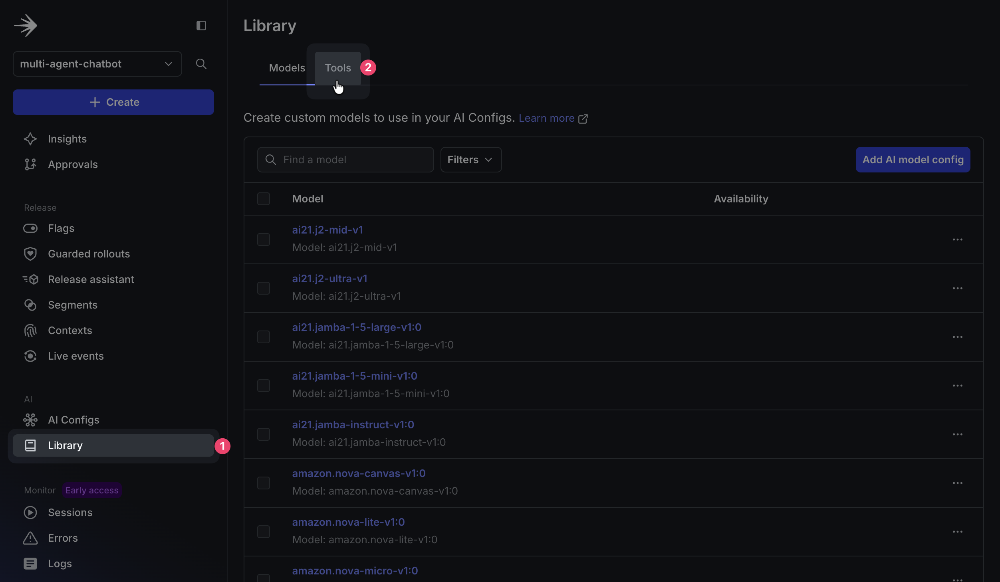

# Level Up Your Multi-Agent System: Geographic + Business Tier Targeting with LaunchDarkly and MCP Tools

## Overview

Your multi-agent system works perfectly in testing, but what happens when enterprise customers expect premium models while free users need cost limits? Or when you need to handle EU privacy requirements? Suddenly you're facing dozens of configuration variations.

*Part 2 of 3 of the series: **Chaos to Clarity: Defensible AI Systems That Deliver on Your Goals***

The solution? **LangGraph multi-agent workflows** controlled by **LaunchDarkly AI Config** targeting rules that intelligently route users: paid customers get premium tools and models, free users get cost-efficient alternatives, and EU users get Claude for enhanced privacy. Deploy this complex matrix through smart configuration in minutes instead of hours.

## What You'll Build Today

In the next 20 minutes, you'll transform your basic multi-agent system with:

- **Business Tiers & MCP Integration**: Free users get internal RAG search, Paid users get premium models with external research tools and expanded tool call limits, all controlled by LaunchDarkly AI Configs
- **Geographic Targeting**: EU users automatically get Claude models (enhanced privacy), other users get cost-optimized alternatives
- **Smart Configuration**: Deploy complex targeting matrices with LaunchDarkly segments and targeting rules

## Prerequisites

You'll need:
- **Completed [Part 1](README.md)**: Working multi-agent system with basic AI Configs
- **Same environment**: Python 3.9+, uv, API keys from [Part 1](README.md)
- **LaunchDarkly API key**: Add `LD_API_KEY=your-api-key` to your `.env` file ([get API key](https://app.launchdarkly.com/settings/authorization))

## Step 1: Install MCP Servers (4 minutes)

**What is MCP?** [Model Context Protocol (MCP)](https://modelcontextprotocol.io/) provides standardized connections between AI assistants and external data sources. Think of it as APIs specifically designed for AI tools - your agents can search academic papers, citation databases, or connect to various databases and services. MCP tools run as separate servers that your agents call when needed.

The [MCP Registry](https://github.com/modelcontextprotocol/registry) serves as a community-driven directory for discovering available MCP servers - like an "app store" for MCP tools. Browse available servers at [registry.modelcontextprotocol.io](https://registry.modelcontextprotocol.io/docs#/operations/list-servers) to see what's currently available. Registry servers install through standard package managers:

```bash
# Example registry installations (not used in this tutorial)
pip install reddit-research-mcp    # Reddit research with citations  
npx scorecard-ai-mcp               # LLM evaluation tools
```

**Our Approach:** For this tutorial, we'll use manual installation since our specific academic research servers (ArXiv and Semantic Scholar) aren't yet available in the registry.

Install external research capabilities:

```bash
# Install ArXiv MCP server for academic paper search
uv tool install arxiv-mcp-server

# Install Semantic Scholar MCP server for citation data  
git clone https://github.com/JackKuo666/semanticscholar-MCP-Server.git
```

**MCP Tools Added:**
- **arxiv_search**: Live academic paper search (Paid users)
- **semantic_scholar**: Citation and research database (Paid users)

These tools integrate with your agents via LangGraph - LaunchDarkly controls which users get access to which tools.

## Step 2: Create Additional Tools (3 minutes)

Define the additional tools your upgraded agents will use.

In the LaunchDarkly app sidebar, click **Library** in the AI section. On the following screen, click the **Tools** tab, then **Create tool**.

<br />

<div align="center">


*AI Library section in the LaunchDarkly dashboard sidebar.*

</div>

### Create the basic search tool:
Create a tool using the following configuration:
> 
> **Key:** 
> ```
> search_v1
> ```
>
> **Description:** 
> ```
> Basic keyword search through knowledge base
> ```
>
> **Schema:**
> ```json
> {
>   "properties": {
>     "query": {
>       "description": "Search query for keyword matching",
>       "type": "string"
>     },
>     "top_k": {
>       "description": "Number of results to return",
>       "type": "number"
>     }
>   },
>   "additionalProperties": false,
>   "required": [
>     "query"
>   ]
> }
> ```
When you're done, click **Save**.

### Create the ArXiv search tool:
Back on the Tools section, click **Add tool** to create a new tool. Add the following properties: 
> 
> **Key:** 
> ```
> arxiv_search
> ```
>
> **Description:** 
> ```
> Search academic papers from ArXiv database
> ```
>
> **Schema:**
> ```json
> {
>   "properties": {
>     "query": {
>       "description": "Search query for academic papers",
>       "type": "string"
>     },
>     "max_results": {
>       "description": "Maximum number of papers to return",
>       "type": "number"
>     }
>   },
>   "additionalProperties": false,
>   "required": [
>     "query"
>   ]
> }
> ```
When you're done, click **Save**.

### Create the Semantic Scholar tool:
Create one more tool for academic citations:
> 
> **Key:** 
> ```
> semantic_scholar
> ```
>
> **Description:** 
> ```
> Access Semantic Scholar citation database
> ```
>
> **Schema:**
> ```json
> {
>   "properties": {
>     "query": {
>       "description": "Search query for citation data",
>       "type": "string"
>     },
>     "fields": {
>       "description": "Fields to return from papers",
>       "type": "array"
>     }
>   },
>   "additionalProperties": false,
>   "required": [
>     "query"
>   ]
> }
> ```
When you're done, click **Save**.

**MCP Tools Added:**
- **search_v1**: Basic keyword search (Free users)
- **arxiv_search**: Live academic paper search (Paid users)
- **semantic_scholar**: Citation and research database (Paid users)

These tools integrate with your agents via LangGraph - LaunchDarkly controls which users get access to which tools.

## Step 3: Understand the Segmentation Strategy (3 minutes)

Now that you have additional tools created, let's understand how they'll be distributed across different user segments.

Your automation script will create 4 combined user segments for precise targeting:

### Combined Segments (Geography + Business Tier)
- **EU Free**: European users on free plans - get Claude Haiku with basic search only
- **EU Paid**: European users on paid plans - get Claude Sonnet with full MCP research tools  
- **Other Free**: Non-EU users on free plans - get GPT-4o Mini with basic search only
- **Other Paid**: Non-EU users on paid plans - get GPT-4 with full MCP research tools

### Simplified Targeting Matrix

```
                │  Free           │  Paid
────────────────┼─────────────────┼─────────────────
EU Users        │  Claude Haiku   │  Claude Sonnet
                │  Basic Search   │  + Full MCP
Other Users     │  GPT-4o Mini    │  GPT-4  
                │  Basic Search   │  + Full MCP
```

**Why This Works:**
- **Cost Optimization**: Free users get efficient models, Paid users get premium capabilities
- **Simplified Management**: 4 segments instead of complex geographic × tier combinations
- **Enhanced Privacy**: EU users get Anthropic Claude models with privacy-by-design approach

## Step 4: Create User Segments (5 minutes)

Set up geographic and business tier targeting with LaunchDarkly segments.

### Create User Segments

Navigate to **Segments** in your LaunchDarkly project and create 4 combined segments:

**Create EU Free Users Segment:**
1. Click **Create segment** → Name: `EU Free Users` → Key: `eu-free`
2. **Add targeting rules:**
   - **Rule 1**: `country` **is one of** `DE, FR, ES, IT, NL, BE, AT, PL, PT, GR, CZ, HU, SE, DK, FI`
   - **Rule 2**: `plan` **is one of** `free, trial, basic, starter`
3. Set **Match**: `users who match ALL of these rules`
4. **Save segment**

**Create EU Paid Users Segment:**
1. Click **Create segment** → Name: `EU Paid Users` → Key: `eu-paid`
2. **Add targeting rules:**
   - **Rule 1**: `country` **is one of** `DE, FR, ES, IT, NL, BE, AT, PL, PT, GR, CZ, HU, SE, DK, FI`
   - **Rule 2**: `plan` **is one of** `paid, premium, pro, professional, enterprise, business, corporate`
3. Set **Match**: `users who match ALL of these rules`
4. **Save segment**

**Create Other Free Users Segment:**
1. Click **Create segment** → Name: `Other Free Users` → Key: `other-free`
2. **Add targeting rules:**
   - **Rule 1**: `country` **is not one of** `DE, FR, ES, IT, NL, BE, AT, PL, PT, GR, CZ, HU, SE, DK, FI`
   - **Rule 2**: `plan` **is one of** `free, trial, basic, starter`
3. Set **Match**: `users who match ALL of these rules`
4. **Save segment**

**Create Other Paid Users Segment:**
1. Click **Create segment** → Name: `Other Paid Users` → Key: `other-paid`
2. **Add targeting rules:**
   - **Rule 1**: `country` **is not one of** `DE, FR, ES, IT, NL, BE, AT, PL, PT, GR, CZ, HU, SE, DK, FI`
   - **Rule 2**: `plan` **is one of** `paid, premium, pro, professional, enterprise, business, corporate`
3. Set **Match**: `users who match ALL of these rules`
4. **Save segment**

<div align="center">


*Geographic and business tier segments in LaunchDarkly*

</div>

## Step 5: Create AI Config Variations (4 minutes)

Create the new business-tier-focused AI Config with 5 variations for geographic + tier targeting.

### Create Support Agent Business Tiers Config

1. Navigate to **AI Configs** and click **Create New**
2. Select `🤖 Agent-based`
3. Name it `support-agent-business-tiers`

**Create 5 variations for the targeting matrix:**

**EU Free Variation:**
> **variation:** `eu-free`
> **Model configuration:** `Anthropic` → `claude-3-5-haiku-20241022`
> **Attach tools:** ✅ `search_v1`
> **Goal or task:** `You are a helpful assistant using basic keyword search only. Provide accurate information while following EU privacy requirements. No external data access.`

**EU Paid Variation:**
> **variation:** `eu-paid`
> **Model configuration:** `Anthropic` → `claude-3-5-sonnet-20241022`
> **Attach tools:** ✅ `search_v1` ✅ `search_v2` ✅ `reranking` ✅ `arxiv_search` ✅ `semantic_scholar`
> **Goal or task:** `You are a premium research specialist with full MCP tool access. EU privacy laws require strict data handling. Always cite sources and explain confidence levels. Use multiple external sources for complex queries.`

**Other Free Variation:**
> **variation:** `other-free`
> **Model configuration:** `OpenAI` → `gpt-4o-mini`
> **Attach tools:** ✅ `search_v1`
> **Goal or task:** `You are a helpful assistant using basic keyword search only. Provide accurate, concise responses efficiently.`

**Other Paid Variation:**
> **variation:** `other-paid`
> **Model configuration:** `OpenAI` → `gpt-4o`
> **Attach tools:** ✅ `search_v1` ✅ `search_v2` ✅ `reranking` ✅ `arxiv_search` ✅ `semantic_scholar`
> **Goal or task:** `You are a premium research specialist with full MCP tool access. Provide comprehensive, well-researched responses with source attribution from external databases and academic sources.`

**International Standard Variation:**
> **variation:** `international-standard`
> **Model configuration:** `Anthropic` → `claude-3-5-haiku-20241022`
> **Attach tools:** ✅ `search_v1` ✅ `search_v2` ✅ `reranking`
> **Goal or task:** `You are a helpful assistant with balanced capabilities for international users. Use internal knowledge base with some research tools.`

### Set Up Targeting Rules

Switch to the **Targeting** tab and configure the targeting rules:

1. **Add Rule 1**: `eu-free` segment → `eu-free` variation
2. **Add Rule 2**: `eu-paid` segment → `eu-paid` variation  
3. **Add Rule 3**: `other-free` segment → `other-free` variation
4. **Add Rule 4**: `other-paid` segment → `other-paid` variation
5. **Default rule**: `international-standard` variation
6. **Save targeting rules**

<div align="center">


*Geographic and business tier targeting rules in LaunchDarkly*

</div>

## Step 6: Test Segmentation with Script (3 minutes)

**Why Test Validation?** The included test script simulates real user scenarios across all segments, verifying that your targeting rules work correctly. It sends actual API requests to your system and confirms each user type gets the right model, tools, and behavior - giving you confidence before real users arrive.

Validate your segmentation with the test script:

```bash
uv run python test_tutorial_2.py
```

The script tests 4 user scenarios:
- EU Paid → Claude Sonnet + Full MCP tools
- EU Free → Claude Haiku + Basic tools
- Other Paid → GPT-4 + Full MCP tools  
- Other Free → GPT-4o Mini + Basic tools

All tests should pass, confirming your targeting works correctly.

## Step 7: Experience Segmentation in the Chat UI (3 minutes)

Now let's see your segmentation in action through the actual user interface that your customers will experience.

```bash
# Start your system (2 terminals)
uv run uvicorn api.main:app --reload --port 8000
uv run streamlit run ui/chat_interface.py --server.port 8501
```

Open http://localhost:8501 and test different user types:

1. **User Dropdown**: Select different countries (Germany, France, US) and plans (Free, Paid)
2. **Ask Questions**: Try "Search for machine learning papers" 
3. **Watch Workflow**: See which model and tools get used for each user type
4. **Verify Routing**: EU users get Claude, Other users get GPT, Paid users get MCP tools

<div align="center">


*Select different user types to test segmentation in the chat interface*

</div>

## What You've Accomplished

Your multi-agent system now has:
- **Smart Geographic Routing**: Enhanced privacy protection for EU users
- **Business Tier Management**: Feature scaling that grows with customer value
- **API Automation**: Complex configurations deployed programmatically
- **External Tool Integration**: Research capabilities for premium users

## What's Next: Part 3 Preview

**In Part 3**, we'll prove what actually works using A/B experiments:

### **Experimentation Strategy**  
- **Model Performance**: Test Claude vs GPT-4 conversion rates by region
- **Tool Effectiveness**: Measure RAG vs MCP impact on user satisfaction
- **Tier Optimization**: Find the perfect cost/value balance between Free and Paid tiers

### **Real Metrics**
- User engagement by geographic segment
- Conversion rates from Free → Paid  
- Cost per query vs user satisfaction scores
- Tool usage patterns that predict upgrades

Instead of guessing what users want, you'll have data proving which configurations drive real business results.

---

*Ready for data-driven optimization? Part 3 will show you how to run experiments that prove ROI and guide product decisions with real user behavior data.*