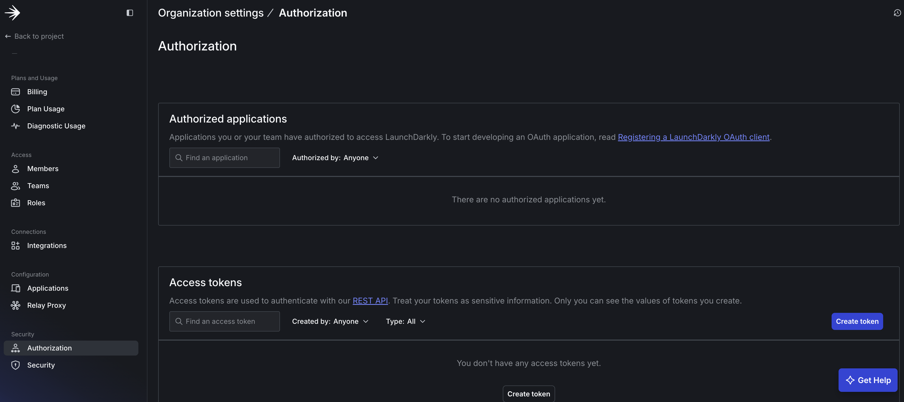
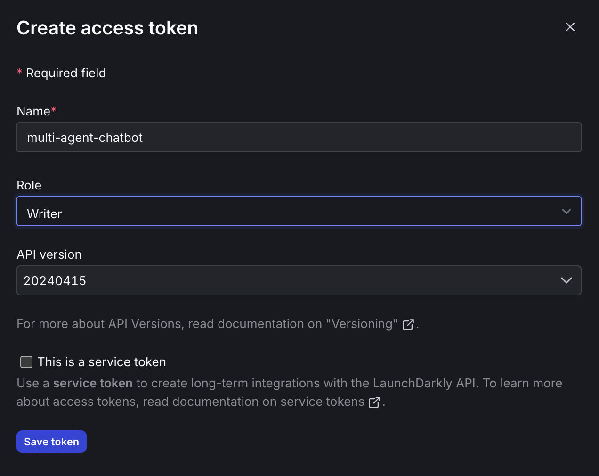
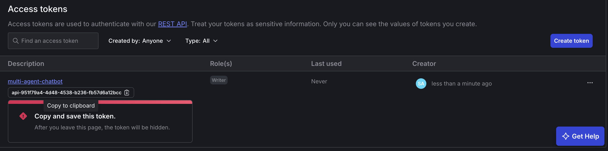
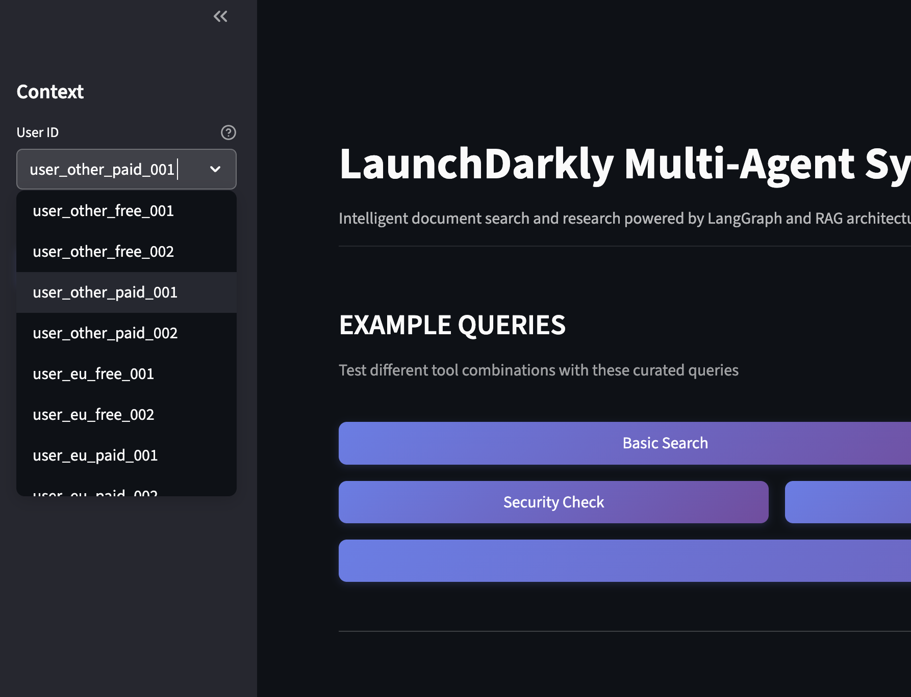

# Level Up Your Multi-Agent System: Geographic + Business-Tier Targeting with LaunchDarkly and MCP Tools

## Overview

Here's what nobody tells you about multi-agentic systems: the hard part isn't building them but making them profitable. One misconfigured model serving enterprise features to free users can burn $20K in a weekend. Meanwhile, you're manually juggling dozens of variations for different user tiers, regions, and privacy requirements and each one is a potential failure point.

*Part 2 of 3 of the series: **Chaos to Clarity: Defensible AI Systems That Deliver on Your Goals***

The solution? **LangGraph multi-agent workflows** controlled by **LaunchDarkly AI Config** targeting rules that intelligently route users: paid customers get premium tools and models, free users get cost-efficient alternatives, and EU users get Claude for enhanced privacy. Use the **LaunchDarkly REST API** to set up a custom variant-targeting matrix in 2 minutes instead of spending hours setting it up manually.

## What You'll Build Today

In the next 18 minutes, you'll transform your basic multi-agent system with:

- **Business Tiers & MCP Integration**: Free users get internal RAG search, Paid users get premium models with external research tools and expanded tool call limits, all controlled by [LaunchDarkly AI Configs](https://launchdarkly.com/docs/home/ai-configs)
- **Geographic Targeting**: EU users automatically get Claude models (enhanced privacy), other users get cost-optimized alternatives
- **Smart Configuration**: Deploy complex targeting matrices with [LaunchDarkly segments](https://launchdarkly.com/docs/home/flags/segments) and [targeting rules](https://launchdarkly.com/docs/home/flags/target-rules)

## Prerequisites

You'll need:
- **Completed [Part 1**: Working multi-agent system with basic AI Configs](README.md)
- **Same environment**: Python 3.9+, uv, API keys from [Part 1](README.md)
- **LaunchDarkly API key**: Add `LD_API_KEY=your-api-key` to your `.env` file ([get API key](https://launchdarkly.com/docs/home/account/api))

### Getting Your LaunchDarkly API Key

The automation scripts in this tutorial use the LaunchDarkly REST API to programmatically create configurations. Here's how to get your API key:

To get your LaunchDarkly API key, start by navigating to Organization Settings by clicking the gear icon (⚙️) in the left sidebar of [your LaunchDarkly dashboard](https://app.launchdarkly.com/). Once there, access Authorization Settings by clicking **"Authorization"** in the settings menu. Next, create a new access token by clicking **"Create token"** in the "Access tokens" section.


*Click "Create token" in the Access tokens section*

When configuring your token, give it a descriptive name like "multi-agent-chatbot", select **"Writer"** as the role (required for creating configurations), use the default API version (latest), and leave "This is a service token" unchecked for now.


*Configure your token with a descriptive name and Writer role*

After configuring the settings, click **"Save token"** and immediately copy the token value. This is **IMPORTANT** because it's only shown once!


*Copy the token value immediately - it's only shown once*

Finally, add the token to your environment:
   ```bash
   # Add this line to your .env file
   LD_API_KEY=your-copied-api-key-here
   ```

**Security Note**: Keep your API key private and never commit it to version control. The token allows full access to your LaunchDarkly account.

## Step 1: Add External Research Tools (4 minutes)

Your agents need more than just your internal documents. **Model Context Protocol (MCP)** connects AI assistants to live external data and they agents become orchestrators of your digital infrastructure, tapping into databases, communication tools, development platforms, and any system that matters to your business. MCP tools run as separate servers that your agents call when needed.

The [MCP Registry](https://github.com/modelcontextprotocol/registry) serves as a community-driven directory for discovering available MCP servers - like an app store for MCP tools. Browse available servers at [registry.modelcontextprotocol.io](https://registry.modelcontextprotocol.io/docs#/operations/list-servers) to see what's currently available. Registry servers install through standard package managers:

```bash
# Example registry installations (not used in this tutorial)
npx @modelcontextprotocol/server-filesystem    # File system access
npx @modelcontextprotocol/server-slack         # Slack workspace integration  
pip install mcp-server-git                     # Git repository integration
```

For this tutorial, we'll use manual installation since our specific academic research servers (ArXiv and Semantic Scholar) aren't yet available in the registry.

Install external research capabilities:

```bash
# Install ArXiv MCP server for academic paper search
uv tool install arxiv-mcp-server

# Install Semantic Scholar MCP server for citation data  
git clone https://github.com/JackKuo666/semanticscholar-MCP-Server.git
```

**MCP Tools Added:**
- **arxiv_search**: Live academic paper search (Paid users)
- **semantic_scholar**: Citation and research database (Paid users)

These tools integrate with your agents via LangGraph - LaunchDarkly controls which users get access to which tools.

## Step 2: Deploy with API Automation (2 minutes)

Now we'll use programmatic API automation to deploy the complete configuration including tools and targeting matrix. The [LaunchDarkly REST API](https://launchdarkly.com/docs/guides/api/rest-api) lets you manage tools, segments, and [AI Configs](https://launchdarkly.com/docs/home/ai-configs) programmatically. Instead of manually creating dozens of variations in the UI, you'll deploy complex targeting matrices with a single Python script. This approach is essential when you need to handle multiple geographic regions × business tiers with conditional tool assignments.

Deploy your complete targeting matrix with one command:

```bash
cd bootstrap
uv run python create_configs.py
```

The bootstrap script intelligently handles existing resources from Part 1:
- **Reuses**: `supervisor-agent` (identical), existing `search_v2` and `reranking` tools 
- **Updates**: `security-agent` with addition geographic compliance config variations
- **Creates New**: `support-agent` config variations for business tier targeting, plus new tools (`search_v1`, `arxiv_search`, `semantic_scholar`)

**LaunchDarkly Resources Added**
- **3 new tools**: `search_v1` (basic search), `arxiv_search` and `semantic_scholar` (MCP research tools)
- **4 combined user segments** with [geographic and tier targeting rules](https://launchdarkly.com/docs/home/flags/segments)  
- **3 [AI Configs](https://launchdarkly.com/docs/home/ai-configs) Variations** with intelligent handling:
  - **security-agent**: Updated with 2 new geographic variations (basic vs strict GDPR)
  - **support-agent-business-tiers**: New config with 5 variations (geographic × tier matrix)
- **Complete [targeting rules](https://launchdarkly.com/docs/home/flags/target-rules)** that route users to appropriate variations

## Step 3: See How Smart Segmentation Works (2 minutes)

Here's how it works: EU free users get Claude Haiku with basic search (privacy + cost efficiency). EU paid users get Claude Sonnet with full research tools (privacy + premium features). Non-EU free users get GPT-4o Mini with basic search (maximum cost efficiency). Non-EU paid users get GPT-4 with complete research tools (maximum capability).

This segmentation strategy optimizes costs through efficient models for free users while providing premium capabilities to paid users. It also enhances privacy by giving EU users Anthropic Claude models with a privacy-by-design approach.

## Step 4: Test Segmentation with Script (2 minutes)

The included test script simulates real user scenarios across all segments, verifying that your targeting rules work correctly. It sends actual API requests to your system and confirms each user type gets the right model, tools, and behavior - giving you confidence before real users arrive.

Validate your segmentation with the test script:

```bashi
uv run api/test_tutorial_2.py
```

This confirms your targeting matrix is working correctly across all user segments!

## Step 5: Experience Segmentation in the Chat UI (3 minutes)

Now let's see your segmentation in action through the actual user interface that your customers will experience.

```bash
# Start your system (2 terminals)
uv run uvicorn api.main:app --reload --port 8000
uv run streamlit run ui/chat_interface.py --server.port 8501
```

Open http://localhost:8501 and test different user types:

1. **User Dropdown**: Select different regions (eu, other) and plans (Free, Paid)
2. **Ask Questions**: Try "Search for machine learning papers" 
3. **Watch Workflow**: See which model and tools get used for each user type
4. **Verify Routing**: EU users get Claude, Other users get GPT, Paid users get MCP tools

<div align="center">


*Select different user types to test segmentation in the chat interface*

</div>

## What You've Accomplished

You've built a sophisticated multi-agent system that demonstrates how modern AI applications can handle complex user segmentation and feature differentiation. Automated configuration deployment shows a practical approach to managing multi-dimensional targeting and provides a clear framework for expanding into additional geographic regions or business tiers as needed.

Your multi-agent system now has:
- **Smart Geographic Routing**: Enhanced privacy protection for EU users
- **Business Tier Management**: Feature scaling that grows with customer value
- **API Automation**: Complex configurations deployed programmatically via [LaunchDarkly REST API](https://launchdarkly.com/docs/guides/api/rest-api)
- **External Tool Integration**: Research capabilities for premium users

## What's Next: Part 3 Preview

**In Part 3**, we'll prove what actually works using controlled A/B experiments:

### **Three-Experiment Strategy**  
- **Tool Implementation Test**: Compare search_v1 vs search_v2 on identical models to measure search quality impact
- **Model Efficiency Analysis**: Test Claude vs GPT-4 with the same full tool stack to measure tool-calling precision and cost
- **Security Configuration Study**: Compare basic vs strict security settings to quantify enhanced privacy costs

### **Real Metrics You'll Track**
- **User satisfaction** - thumbs up/down feedback
- **Tool call efficiency** - average number of tools used per successful query
- **Token cost analysis** - cost per query across different model configurations  
- **Response latency** - performance impact of security and tool variations

Instead of guessing which configurations work better, you'll have data proving which tool implementations provide value, which models use tools more efficiently, and what security enhancements actually costs in performance.

## Related Resources

Explore the **[LaunchDarkly MCP Server](https://launchdarkly.com/docs/home/getting-started/mcp)** - enable AI agents to access feature flag configurations, user segments, and experimentation data directly through the Model Context Protocol.

---

*Ready for data-driven optimization? Part 3 will show you how to run experiments that prove ROI and guide product decisions with real user behavior data.*