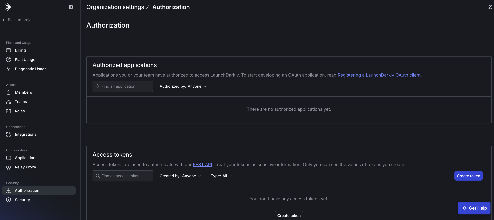
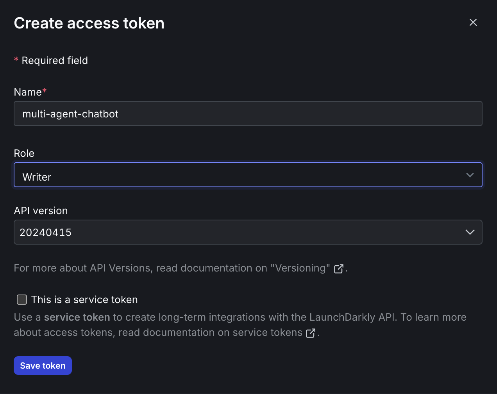
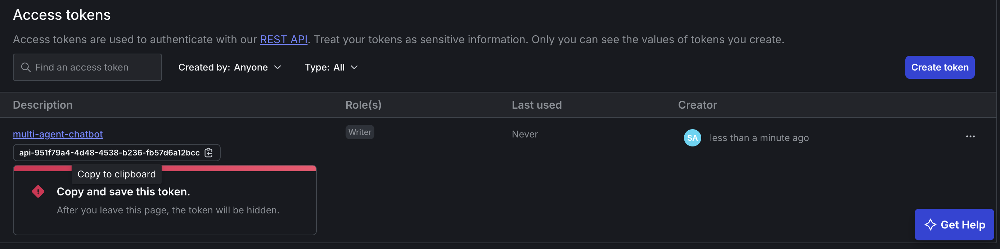
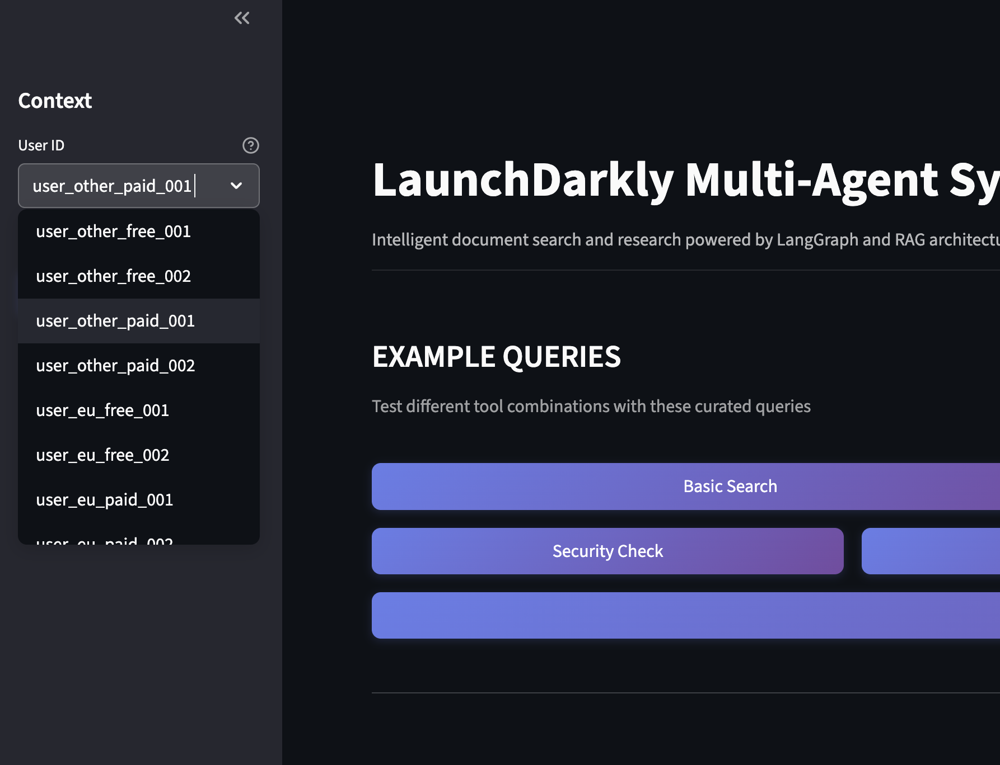

# Smart AI Agent Targeting with MCP Tools

> Read the published version on [LaunchDarkly Docs](https://launchdarkly.com/docs/tutorials/multi-agent-mcp-targeting). _Published September 22nd, 2025 by Scarlett Attensil._

<Callout intent="info" title="Published September 2025 — newer AgentControl features available">

This tutorial was published in September 2025, before LaunchDarkly shipped several features that complement or supersede the targeting patterns shown below. The walkthrough still works, but for new builds you'll likely want to use:

- [**Agent graphs**](https://launchdarkly.com/docs/home/ai-configs/agent-graphs) — externalize the multi-agent topology into a visual graph and combine it with the targeting rules in this tutorial
- [**Online evaluations**](https://launchdarkly.com/docs/home/ai-configs/online-evaluations) and [**custom judges**](https://launchdarkly.com/docs/home/ai-configs/custom-judges) — score live traffic per variation, including per-segment quality scores
- [**Prompt snippets**](https://launchdarkly.com/docs/home/ai-configs/snippets) — reusable prompt fragments so you can compose region-specific or tier-specific instructions without duplicating

LaunchDarkly is also rebranding **AI Configs** as **AgentControl**. Slugs, SDK names, and APIs are unchanged. For the current reference, see [AgentControl documentation](https://launchdarkly.com/docs/home/ai-configs).

</Callout>

## Overview

Here's what nobody tells you about multi-agentic systems: the hard part isn't building them but making them profitable. One misconfigured model serving enterprise features to free users can burn $20K in a weekend. Meanwhile, you're manually juggling dozens of requirements for different user tiers, regions, and privacy compliance and each one is a potential failure point.

*Part 2 of 3 of the series: **Chaos to Clarity: Defensible AI Systems That Deliver on Your Goals***

The solution? **LangGraph multi-agent workflows** controlled by **LaunchDarkly AI Config** targeting rules that intelligently route users: paid customers get premium tools and models, free users get cost-efficient alternatives, and EU users get Mistral for enhanced privacy. Use the **LaunchDarkly REST API** to set up a custom variant-targeting matrix in 2 minutes instead of spending hours setting it up manually.

## What You'll Build Today

In the next 18 minutes, you'll transform your basic multi-agent system with:

- **Business Tiers & MCP Integration**: Free users get internal keyword search, Paid users get premium models with RAG, external research tools and expanded tool call limits, all controlled by [LaunchDarkly AI Configs](https://launchdarkly.com/docs/home/ai-configs)
- **Geographic Targeting**: EU users automatically get Mistral and Claude models (enhanced privacy), other users get cost-optimized alternatives
- **Smart Configuration**: Set up complex targeting matrices with [LaunchDarkly segments](https://launchdarkly.com/docs/home/flags/segments) and [targeting rules](https://launchdarkly.com/docs/home/flags/target)

## Prerequisites

✅ **[Part 1 completed](README.md)** with exact naming:
- Project: `multi-agent-chatbot`
- AI Configs: `supervisor-agent`, `security-agent`, `support-agent`
- Tools: `search_v2`, `reranking`
- Variations: `supervisor-basic`, `pii-detector`, `rag-search-enhanced`

🔑 **Add to your `.env` file**:
```bash
LD_API_KEY=your-api-key        # Get from LaunchDarkly settings
MISTRAL_API_KEY=your-key       # Get from console.mistral.ai (free, requires phone + email validation)
```

### Getting Your LaunchDarkly API Key

The automation scripts in this tutorial use the LaunchDarkly REST API to programmatically create configurations. Here's how to get your API key:

To get your LaunchDarkly API key, start by navigating to Organization Settings by clicking the gear icon (⚙️) in the left sidebar of [your LaunchDarkly dashboard](https://app.launchdarkly.com/). Once there, access Authorization Settings by clicking **"Authorization"** in the settings menu. Next, create a new access token by clicking **"Create token"** in the "Access tokens" section.

<br />

<div align="center">

<Frame caption="Click 'Create token' in the Access tokens section">

</Frame>

</div>

When configuring your token, give it a descriptive name like "multi-agent-chatbot", select **"Writer"** as the role (required for creating configurations), use the default API version (latest), and leave "This is a service token" unchecked for now.

<br />

<div align="center">

<Frame caption="Configure your token with a descriptive name and Writer role">

</Frame>

</div>

After configuring the settings, click **"Save token"** and immediately copy the token value. This is **IMPORTANT** because it's only shown once!

<br />

<div align="center">

<Frame caption="Copy the token value immediately - it's only shown once">

</Frame>

</div>

Finally, add the token to your environment:
   ```bash
   # Add this line to your .env file
   LD_API_KEY=your-copied-api-key-here
   ```

**Security Note**: Keep your API key private and never commit it to version control. The token allows full access to your LaunchDarkly account.

## Step 1: Add External Research Tools (4 minutes)

Your agents need more than just your internal documents. **Model Context Protocol (MCP)** connects AI assistants to live external data and they agents become orchestrators of your digital infrastructure, tapping into databases, communication tools, development platforms, and any system that matters to your business. MCP tools run as separate servers that your agents call when needed.

> The [MCP Registry](https://registry.modelcontextprotocol.io) serves as a community-driven directory for discovering available MCP servers - like an app store for MCP tools. For this tutorial, we'll use manual installation since our specific academic research servers (ArXiv and Semantic Scholar) aren't yet available in the registry.

Install external research capabilities:

```bash
# Install ArXiv MCP server for academic paper search
uv tool install arxiv-mcp-server

# Install Semantic Scholar MCP server for citation data
git clone https://github.com/JackKuo666/semanticscholar-MCP-Server.git
```

**MCP Tools Added:**
- **arxiv_search**: Live academic paper search (Paid users)
- **semantic_scholar**: Citation and research database (Paid users)

These tools integrate with your agents via LangGraph while LaunchDarkly controls which users get access to which tools.

## Step 2: Configure with API Automation (2 minutes)

Now we'll use programmatic API automation to configure the complete setup. The [LaunchDarkly REST API](https://launchdarkly.com/docs/guides/api/rest-api) lets you manage tools, segments, and [AI Configs](https://launchdarkly.com/docs/home/ai-configs) programmatically. Instead of manually creating dozens of variations in the UI, this **configuration automation** makes REST API calls to provision user segments, AI Config variations, targeting rules, and tools. These are the same resources you could create manually through the LaunchDarkly dashboard. Your actual chat application continues running unchanged.

Configure your complete targeting matrix with one command:

```bash
cd bootstrap
uv run python create_configs.py
```

**What the script creates**:
- **3 new tools**: `search_v1` (basic search), `arxiv_search` and `semantic_scholar` (MCP research tools)
- **4 combined user segments** with [geographic and tier targeting rules](https://launchdarkly.com/docs/home/flags/segments)
- **Updated AI Configs**: `security-agent` with 2 new geographic variations
- **Complete [targeting rules](https://launchdarkly.com/docs/home/flags/target)** that route users to appropriate variations
- **Intelligently reuses** existing resources: `supervisor-agent`, `search_v2`, and `reranking` tools from Part 1

### Understanding the Bootstrap Script

The automation works by reading a YAML manifest and translating it into LaunchDarkly API calls. Here's how the key parts work:

**Segment Creation with Geographic Rules**:
```python
def create_segment(self, project_key, segment_data):
    # Step 1: Create empty segment
    payload = {
        "key": segment_data["key"],
        "name": segment_data["key"].replace("-", " ").title()
    }
    
    # Step 2: Add targeting rules via semantic patch
    clauses = []
    for clause in segment_data["rules"]:
        clauses.append({
            "attribute": clause["attribute"],  # "country" or "plan"
            "op": clause["op"],              # "in"
            "values": clause["values"],      # ["DE", "FR", ...] or ["free"]
            "contextKind": "user",
            "negate": clause["negate"]       # false for EU, true for non-EU
        })
```

**Model Configuration Mapping**:
```python
# The script maps your YAML model IDs to LaunchDarkly's internal keys
model_config_key_map = {
    "claude-sonnet-4-6": "Anthropic.claude-sonnet-4-6",
    "claude-haiku-4-5-20251001": "Anthropic.claude-haiku-4-5-20251001", 
    "gpt-4o": "OpenAI.gpt-4o",
    "gpt-4o-mini": "OpenAI.gpt-4o-mini-2024-07-18",
    "mistral-small-latest": "Mistral.mistral-small-latest"
}
```

**Customizing for Your Use Case**:

To adapt this for your own multi-agent system:

1. **Add your geographic regions** in the YAML segments:
   ```yaml
   - key: apac-paid
     rules:
       - attribute: "country" 
         values: ["JP", "AU", "SG", "KR"]  # Your APAC countries
   ```

2. **Define your business tiers**:
   ```yaml
   - attribute: "plan"
     values: ["enterprise", "professional", "starter"]  # Your pricing tiers
   ```

3. **Map your models** in the script:
   ```python
   "your-model-id": "Provider.your-launchdarkly-key"
   ```

The script handles the complexity of LaunchDarkly's API while letting you define your targeting logic in simple YAML.

### Validating the Bootstrap Script

**Expected terminal output:**
```bash
🚀 LaunchDarkly AI Config Bootstrap
==================================================
⚠️  IMPORTANT: This script is for INITIAL SETUP ONLY
📝 After bootstrap completes:
   • Make ALL configuration changes in LaunchDarkly UI
   • Do NOT modify ai_config_manifest.yaml
   • LaunchDarkly is your single source of truth
==================================================

🚀 Starting multi-agent system bootstrap (add-only)...
📦 Project: multi-agent-chatbot

🔧 Creating tools...
  ✅ Tool 'search_v1' created
  ✅ Tool 'arxiv_search' created
  ✅ Tool 'semantic_scholar' created

🤖 Ensuring AI configs exist...
✅ AI Config 'supervisor-agent' exists
✅ AI Config 'security-agent' exists
✅ AI Config 'support-agent' exists

🧩 Creating variations...
  ✅ Variation 'strict-security' created
  ✅ Variation 'eu-free' created
  ✅ Variation 'eu-paid' created
  ✅ Variation 'other-free' created
  ✅ Variation 'other-paid' created

📦 Creating segments (for targeting rules)...
✅ Empty segment 'eu-free' created
  ✅ Rules added to segment 'eu-free' (final count: 1)
✅ Empty segment 'eu-paid' created
  ✅ Rules added to segment 'eu-paid' (final count: 1)
✅ Empty segment 'other-free' created
  ✅ Rules added to segment 'other-free' (final count: 1)
✅ Empty segment 'other-paid' created
  ✅ Rules added to segment 'other-paid' (final count: 1)

🎯 Updating targeting rules...
✅ Targeting rules updated for 'security-agent'
✅ Targeting rules updated for 'support-agent'

✨ Bootstrap complete!
```

**In your LaunchDarkly dashboard**, navigate to your `multi-agent-chatbot` project. You should see:

1. **AI Configs tab**: Three configs (`supervisor-agent`, `security-agent`, `support-agent`) with new variations
2. **Segments tab**: Four new segments (`eu-free`, `eu-paid`, `other-free`, `other-paid`) 
3. **Tools tab**: Five tools total (including `search_v1`, `arxiv_search`, `semantic_scholar`)

**Troubleshooting Common Issues**:

❌ **Error: "LD_API_KEY environment variable not set"**
- Check your `.env` file contains: `LD_API_KEY=your-api-key`
- Verify the API key has "Writer" permissions in LaunchDarkly settings

❌ **Error: "AI Config 'security-agent' not found"**
- Ensure you completed [Part 1](README.md) with exact naming requirements
- Verify your project is named `multi-agent-chatbot`
- Check that `supervisor-agent`, `security-agent`, and `support-agent` exist in your LaunchDarkly project

❌ **Error: "Failed to create segment"**
- Your LaunchDarkly account needs segment creation permissions
- Try running the script again; it's designed to handle partial failures

❌ **Script runs but no changes appear**
- Wait 30-60 seconds for LaunchDarkly UI to refresh
- Check you're looking at the correct project and environment (Production)
- Verify your API key matches your LaunchDarkly organization

## Step 3: See How Smart Segmentation Works (2 minutes)

Here's how the smart segmentation works:

**By Region:**
- **EU users**: Mistral for security processing + Claude for support (privacy + compliance)
- **Non-EU users**: Claude for security + GPT for support (cost optimization)
- **All users**: Claude for supervision and workflow orchestration

**By Business Tier:**
- **Free users**: Basic search tools (`search_v1`)
- **Paid users**: Full research capabilities (`search_v1`, `search_v2`, `reranking`, `arxiv_search`, `semantic_scholar`)

## Step 4: Test Segmentation with Script (2 minutes)

The included test script simulates real user scenarios across all segments, verifying that your targeting rules work correctly. It sends actual API requests to your system and confirms each user type gets the right model, tools, and behavior.

First, start your system:

```bash
# Terminal 1: Start the backend
uv run uvicorn api.main:app --reload --port 8000

# Terminal 2: Run the test script
uv run python api/segmentation_test.py
```

**Expected test output:**
```bash
🚀 COMPREHENSIVE TUTORIAL 2 SEGMENTATION TESTS
Testing Geographic + Business Tier Targeting Matrix
======================================================================

🔄 Running: EU Paid → Claude Sonnet + Full MCP Tools

============================================================
🧪 TESTING: DE paid user (ID: user_eu_paid_001)
============================================================
📊 SUPPORT AGENT:
   Model: claude-sonnet-4-6 (expected: claude-sonnet-4-6) ✅
   Variation: eu-paid (expected: eu-paid) ✅
   Tools: ['search_v1', 'search_v2', 'reranking', 'arxiv_search', 'semantic_scholar'] ✅
   Expected: ['search_v1', 'search_v2', 'reranking', 'arxiv_search', 'semantic_scholar']
   MCP Tools: Yes (should be: Yes) ✅

📝 RESPONSE:
   Length: 847 chars
   Tools Called: ['search_v2', 'arxiv_search']
   Preview: Based on your request, I'll search both internal documentation and recent academic research...

🎯 RESULT: ✅ PASSED

🔄 Running: EU Free → Claude Haiku + Basic Tools
[Similar detailed output for EU Free user...]

🔄 Running: US Paid → GPT-4 + Full MCP Tools  
[Similar detailed output for US Paid user...]

🔄 Running: US Free → GPT-4o Mini + Basic Tools
[Similar detailed output for US Free user...]

======================================================================
📊 FINAL RESULTS
======================================================================
✅ PASSED: 4/4
❌ FAILED: 0/4

🎉 ALL TESTS PASSED! LaunchDarkly targeting is working correctly.
   • Geographic segmentation: Working
   • Business tier routing: Working
   • Model assignment: Working
   • Tool configuration: Working
   • MCP integration: Working

🔗 Next: Test manually in UI at http://localhost:8501
```

This confirms your targeting matrix is working correctly across all user segments!

## Step 5: Experience Segmentation in the Chat UI (3 minutes)

Now let's see your segmentation in action through the user interface. With your backend already running from Step 4, start the UI:

```bash
# Terminal 3: Start the chat interface
uv run streamlit run ui/chat_interface.py --server.port 8501
```

Open http://localhost:8501 and test different user types:

1. **User Dropdown**: Find the user dropdown by using the **>> icon** to open the  **left nav menu**.. Select different regions (eu, other) and plans (Free, Paid).
2. **Ask Questions**: Try "Search for machine learning papers."
3. **Watch Workflow**: In the server logs, watch which model and tools get used for each user type.
4. **Verify Routing**: EU users get Mistral for security. Other users get GPT. Paid users get MCP tools.

<Frame caption="Select different user types to test segmentation in the chat interface">

</Frame>

## What's Next: Part 3 Preview

**In Part 3**, we'll prove what actually works using controlled A/B experiments:

### **Set up Easy Experiments**
- **Tool Implementation Test**: Compare search_v1 vs search_v2 on identical models to measure search quality impact
- **Model Efficiency Analysis**: Test models with the same full tool stack to measure tool-calling precision and cost

### **Real Metrics You'll Track**
- **User satisfaction**: thumbs up/down feedback
- **Tool call efficiency**: average number of tools used per successful query
- **Token cost analysis**: cost per query across different model configurations
- **Response latency**: performance impact of security and tool variations

Instead of guessing which configurations work better, you'll have data proving which tool implementations provide value, which models use tools more efficiently, and what security enhancements actually costs in performance.

## The Path Forward

You've built something powerful: a multi-agent system that adapts to users by design. More importantly, you've proven that sophisticated AI applications don't require repeated deployments; they require smart configuration.

This approach scales beyond tutorials. Whether you're serving 100 users or 100,000, the same targeting principles apply: segment intelligently, configure dynamically, and let data guide decisions instead of assumptions.

## Related tutorials

- [Build a LangGraph Multi-Agent system in 20 Minutes](https://launchdarkly.com/docs/tutorials/agents-langgraph) - Part 1: the multi-agent system this tutorial layers targeting on top of
- [Proving ROI with data-driven AI agent experiments](https://launchdarkly.com/docs/guides/experimentation/ai-experiments-roi) - Part 3: A/B test the targeted variations you just built
- [Beyond n8n for Workflow Automation: Agent Graphs](https://launchdarkly.com/docs/tutorials/agent-graphs) - Combine targeting with visual graph topology and per-node monitoring
- [Build AI Configs with Agent Skills](https://launchdarkly.com/docs/tutorials/agent-skills-quickstart) - Generate the agent and targeting configurations from natural-language prompts
- [Offline Evaluation of RAG-Grounded Answers](https://launchdarkly.com/docs/tutorials/offline-evals) - Validate each targeted variation against a reference dataset before rollout

---
*Questions? Issues? Reach out at `aiproduct@launchdarkly.com` or open an issue in the [GitHub repo](https://github.com/launchdarkly-labs/devrel-agents-tutorial/tree/tutorial/agent-graphs).*
