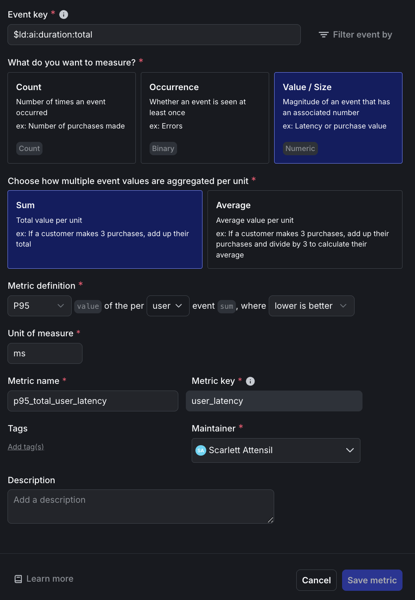
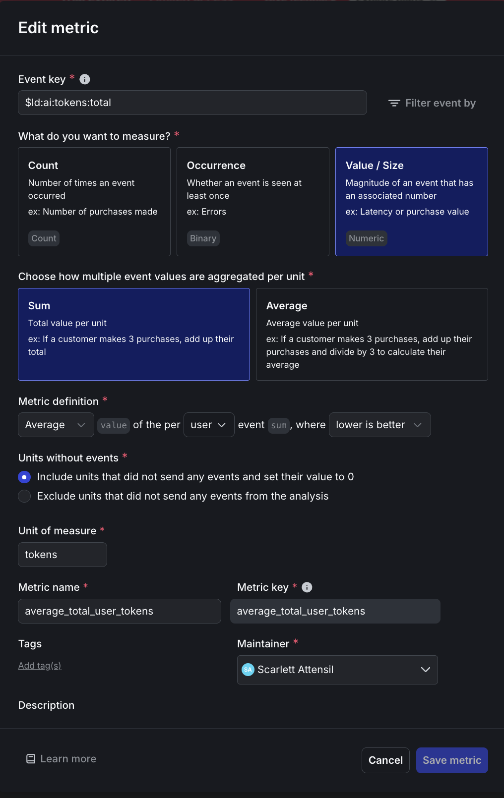
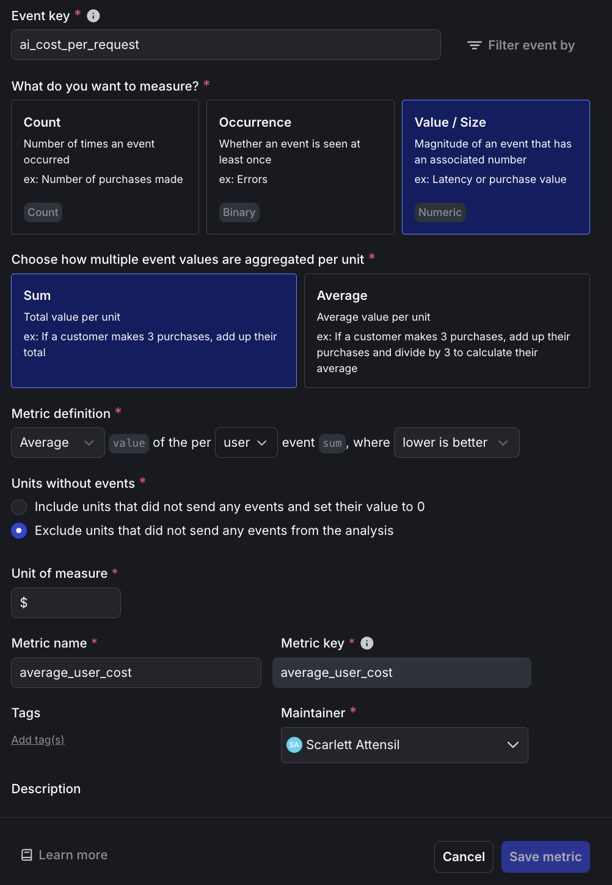
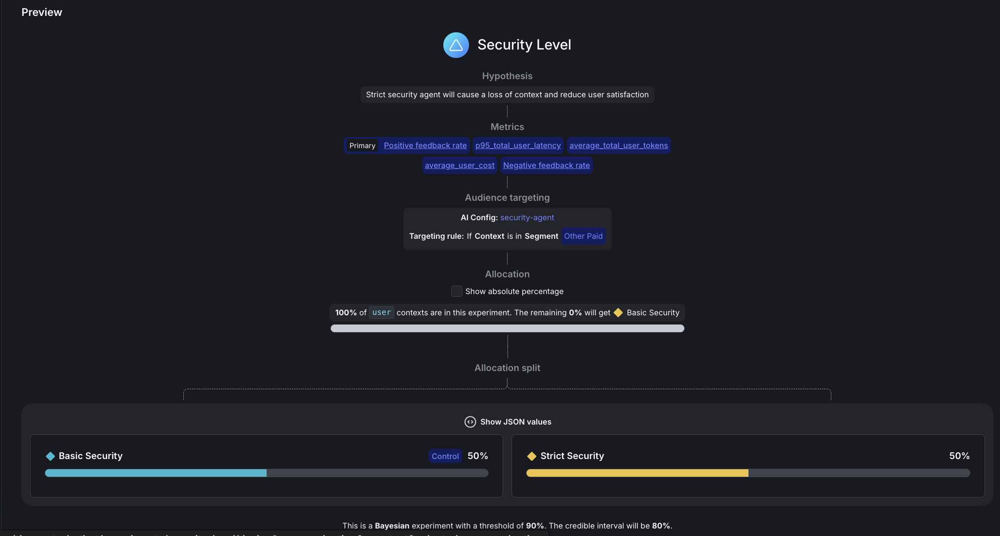
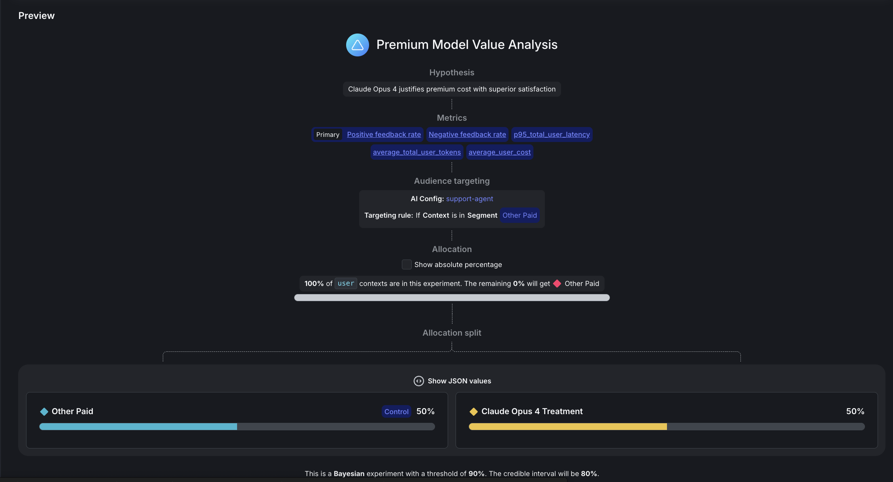

# Proving ROI with Data-Driven AI Agent Experiments

## Overview

You've built a sophisticated multi-agent system with smart targeting and premium research tools. What you and every AI product team now face is: stakeholders need concrete proof that advanced features deliver measurable value. They want to see hard numbers showing that premium search tools increase user satisfaction and that expensive models use resources more efficiently.

*Part 3 of 3 of the series: **Chaos to Clarity: Defensible AI Systems That Deliver on Your Goals***

The solution? **Rigorous A/B experiments** with specific hypotheses and clear success criteria. Instead of guessing which configurations work better, you'll run two strategic experiments that prove ROI with scientific rigor: tool implementation impact and model efficiency analysis.

## What You'll Prove Today

In the next 25 minutes, you'll design and execute experiments that answer two critical business questions:

- **Security Agent Analysis**: Does enhanced security improve safety without significantly impacting user satisfaction?
- **Premium Model Value Analysis**: Does Claude Opus 4 justify its premium cost with superior user satisfaction for paid users?

## Prerequisites

> **⚠️ CRITICAL: Required Previous Steps**

You'll need:
- **Completed Parts 1 & 2**: Working multi-agent system with segmentation
- **Active LaunchDarkly Project**: With AI Configs and user segments from Part 2
- **API Keys**: All keys from previous parts (Anthropic, OpenAI, LaunchDarkly, Mistral)

## ⚠️ Cost and Time Investment

> **IMPORTANT: This tutorial costs approximately $35-45 with default settings**
>
> **Time Investment**:
> - Setup: 25 minutes
> - Data generation: 40-60 minutes
> - Analysis: 10 minutes
> - **Total: ~90 minutes active time**
>
> To reduce costs to $5-10: Use `--queries 50` and consider switching Opus 4 to Sonnet 3.5 in `bootstrap/tutorial_3_experiment_variations.py`

## Data Foundation

**Realistic Experiment Data**: We'll target other-paid users (non-EU countries, paid tier) with queries randomly selected from YOUR knowledge base topics. The system uses 3-option feedback simulation (thumbs_up/thumbs_down/no_feedback) matching real user patterns, sending feedback data to LaunchDarkly for experiment analysis.

**Important**: You'll run two independent experiments concurrently on the same user population. Each user gets randomly assigned to one variation in each experiment. LaunchDarkly analyzes each experiment separately. For this tutorial we won't consider interaction effect analysis between experiments.

## Understanding Your Two Experiments

### **Experiment 1: Security Agent Analysis**

**Question**: Does enhanced security improve safety compliance without significantly harming user satisfaction?

**Variations** (50% each):
- **Control**: Baseline security agent (existing baseline variation)
- **Treatment**: Enhanced security agent (existing enhanced variation)

**Success Criteria** (measured per user):
1. ≥10% improvement in positive feedback rate per user
2. ≤5% cost increase per user
3. ≤2.0s response latency (completion time p95 per user)
4. 90% confidence threshold

### **Experiment 2: Premium Model Value Analysis**

**Question**: Does Claude Opus 4 justify its premium cost vs GPT-4o?

**Variations** (50% each):
- **Control**: GPT-4o with full tools (current version)
- **Treatment**: Claude Opus 4 with identical tools (current version)

**Success Criteria** (measured per user):
- ≥15% satisfaction improvement by Claude Opus 4 (positive feedback rate per user)
- Cost-value ratio ≥ 0.25 (satisfaction gain % ÷ cost increase % per user)
- 90% confidence threshold

## Setting Up Metrics and Experiments

### **Step 1: Configure Metrics**

Navigate to **Metrics** and create these three custom metrics (feedback rates are built-in):

#### **Metric 1: P95 User Latency**

1. **Event key:** Enter `$ld:ai:duration:total`
2. **What do you want to measure:** Select "Value / Size" then choose "Numeric"
3. **Aggregation:** Select "Sum"
4. **Metric definition:** Select "P95" from the first dropdown, "value" from the second, "user" from the third, "sum" from the fourth, and "lower is better" from the final dropdown
5. **Unit of measure:** Enter `ms`
6. **Metric name:** Enter `p95_total_user_latency`
7. **Metric key:** Enter `user_latency`

<br>

<div align="center">

</div>

<br>

#### **Metric 2: Average Total Tokens**

1. **Event key:** Enter `$ld:ai:tokens:total`
2. **What do you want to measure:** Select "Value / Size" then choose "Numeric"
3. **Aggregation:** Select "Average"
4. **Metric definition:** Select "Average" from the first dropdown, "value" from the second, "user" from the third, "sum" from the fourth, and "lower is better" from the final dropdown
5. **Unit of measure:** Enter `tokens`
6. **Metric name:** Enter `average_total_user_tokens`
7. **Metric key:** Enter `average_tokens`

<br>

<div align="center">

</div>

<br>

#### **Metrics 3 & 4: Feedback Rates**

The positive and negative feedback rate metrics are **built-in LaunchDarkly AI metrics** that are automatically available. You don't need to create these - they'll appear in the metrics dropdown when configuring your experiments:
- **Positive Feedback Rate** (`$ld:ai:feedback:positive`)
- **Negative Feedback Rate** (`$ld:ai:feedback:negative`)

#### **Metric 5: AI Cost Per Request**

1. **Event key:** Enter `ai_cost_per_request`
2. **What do you want to measure:** Select "Value / Size" then choose "Numeric"
3. **Aggregation:** Select "Average"
4. **Metric definition:** Select "Average" from the first dropdown, "value" from the second, "user" from the third, "sum" from the fourth, and "lower is better" from the final dropdown
5. **Unit of measure:** Enter `$`
6. **Metric name:** Enter `ai_cost_per_request`
7. **Metric key:** Enter `ai_cost`

<br>

<div align="center">

</div>

<br>

The cost tracking is implemented in `utils/cost_calculator.py`, which calculates actual dollar costs using the formula `(input_tokens × input_price + output_tokens × output_price) / 1M`. The system has pre-configured pricing for each model: GPT-4o at $2.50/$10 per million tokens, Claude Opus 4 at $15/$75, and Claude Sonnet at $3/$15. When a request completes, the cost is immediately calculated and sent to LaunchDarkly as a custom event, enabling direct cost-per-user analysis in your experiments.

### **Step 2: Create Experiment Variations**

Create the experiment variations using the bootstrap script:

```bash
uv run python bootstrap/tutorial_3_experiment_variations.py
```

This creates the `claude-opus-treatment` variation for the Premium Model Value experiment. The Security Agent Analysis experiment will use your existing baseline and enhanced variations. Both experiments use the existing other-paid configuration as their control group.

### **Step 3: Configure Security Agent Experiment**

Navigate to **AI Configs → security-agent → Experiments** tab → **Create experiment**.

#### **Experiment Design**

**Experiment type:**
- Keep `Feature change` selected (default)

**Name:** `Security Level`

#### **Hypothesis and Metrics**

**Hypothesis:** `Enhanced security improves safety compliance without significantly harming user satisfaction`

**Randomize by:** `user`

**Metrics:** Click "Select metrics or metric groups" and add:
1. `Positive feedback rate` → Select first to set as **Primary**
2. `Negative feedback rate` 
3. `p95_total_user_latency`
4. `ai_cost_per_request`

#### **Audience Targeting**

**Flag or AI Config**
- Click the dropdown and select **security-agent**

**Targeting rule:** 
- Click the dropdown and select **Rule 4**
- This will configure: `If Context` → `is in Segment` → `Other Paid`

#### **Audience Allocation**

**Variations served outside of this experiment:** 
- `Basic Security`

**Sample size:** Set to `100%` of users in this experiment

**Variations split:** Click "Edit" and configure:
- `pii-detector`: `0%`
- `Basic Security`: `50%`
- `Strict Security`: `50%`

**Control:** 
- `Basic Security`

#### **Statistical Approach and Success Criteria**

**Statistical approach:** `Bayesian`
**Threshold:** `90%`

Click **"Save"** 
Click **"Start experiment"** to launch.

<br>

<div align="center">

</div>

<br>

#### **Success Criteria to Monitor**
- ≥10% improvement in positive feedback rate
- ≤5% cost increase (track via `ai_cost_per_request` metric)
- ≤2.0s p95 latency
- 90% statistical confidence

### **Step 4: Configure Premium Model Experiment**

Navigate to **AI Configs → support-agent → Experiments** tab → **Create experiment**.

#### **Experiment Design**

**Experiment type:**
- Keep `Feature change` selected (default)

**Name:** `Premium Model Value Analysis`

#### **Hypothesis and Metrics**

**Hypothesis:** `Claude Opus 4 justifies premium cost with superior satisfaction`

**Randomize by:** `user`

**Metrics:** Click "Select metrics or metric groups" and add:
1. `Positive feedback rate` → Select first to set as **Primary**
2. `Negative feedback rate`
3. `p95_total_user_latency`
4. `average_total_user_tokens`
5. `ai_cost_per_request`

#### **Audience Targeting**

**Flag or AI Config**
- Click the dropdown and select **support-agent**

**Targeting rule:**
- Click the dropdown and select **Rule 4**
- This will configure: `If Context` → `is in Segment` → `Other Paid`

#### **Audience Allocation**

**Variations served outside of this experiment:** 
- `other-paid`

**Sample size:** Set to `100%` of users in this experiment

**Variations split:** Click "Edit" and configure:
- `rag-search-enhanced`: `0%`
- `eu-free`: `0%`
- `eu-paid`: `0%`
- `other-free`: `0%`
- `other-paid`: `50%`
- `international-standard`: `0%`
- `claude-opus-treatment`: `50%`

**Control:** 
- `other-paid`

#### **Statistical Approach and Success Criteria**

**Statistical approach:** `Bayesian`
**Threshold:** `90%`

Click **"Save"** 
Click **"Start experiment"** to launch.

<br>

<div align="center">

</div>

<br>

#### **Success Criteria to Monitor**
- ≥15% satisfaction improvement (positive feedback rate)
- Cost-value ratio ≥ 0.25 (satisfaction % ÷ cost increase %)
- 90% statistical confidence

## Understanding Your Experimental Design

**Two Independent Experiments Running Concurrently:**
```
Experiment 1: Security Agent (200 users)
├── 50% Baseline (100 users)
└── 50% Enhanced (100 users)

Experiment 2: Premium Model (200 users)
├── 50% GPT-4o (100 users)
└── 50% Opus 4 (100 users)
```

Since these are the **same 200 users**, each user experiences:
- One security variation (baseline OR enhanced)
- One model variation (GPT-4o OR Opus 4)

Random assignment ensures balance: ~50 users get each combination naturally.

## Generating Experiment Data

### **Step 5: Run Traffic Generator**

Start your backend and generate realistic experiment data. Choose between sequential or concurrent traffic generation:

#### **Option A: Concurrent Traffic Generator (Recommended for large datasets)**

For faster experiment data generation with parallel requests:

```bash
# Start backend API
uv run uvicorn api.main:app --reload --port 8000

# Generate experiment data with 10 concurrent requests (separate terminal)
./run_experiment_concurrent.sh
```

**Configuration**:
- **200 queries** by default (edit script to adjust)
- **10 concurrent requests** running in parallel
- **2000-second timeout** (33 minutes) per request to handle MCP tool rate limits
- **~40-60 minutes** total runtime (vs 66+ hours sequential for 200 queries)
- **Logs saved** to `logs/concurrent_experiment_TIMESTAMP.log`

Alternatively, run directly with custom settings:
```bash
uv run python -u tools/concurrent_traffic_generator.py --queries 200 --concurrency 10
```

#### **Option B: Sequential Traffic Generator (Simple, one-at-a-time)**

For smaller test runs or debugging:

```bash
# Start backend API
uv run uvicorn api.main:app --reload --port 8000

# Generate experiment data sequentially (separate terminal)
python tools/traffic_generator.py --queries 50 --delay 2
```

**What Happens (Both Options)**:

The simulation begins with knowledge base analysis, where Claude extracts 20+ topics from your documents to create a realistic query foundation. During execution, each query randomly selects from these analyzed topics to ensure diverse, relevant testing scenarios. AI-powered feedback evaluation follows, with Claude assessing each response to determine whether a real user would provide positive, negative, or no feedback based on answer quality and relevance. All feedback and cost metrics are automatically sent to LaunchDarkly for experiment analysis, while dual experiments run simultaneously—the same queries feed both your security agent and model experiments for direct comparison. Throughout the process, real dollar costs are calculated and tracked per request, giving you accurate financial impact data for each experimental variation.

**Progress Example (Concurrent)**:
```
📚 Analyzing knowledge base...
✅ Generated 23 topics

⚡ Sending 200 requests with 10 concurrent workers...

✅ [1/200] Success (23.4s) - other_paid: What is reinforcement learning?...
✅ [2/200] Success (45.2s) - other_paid: How does Q-learning work?...
⏱️  [15/200] Timeout (>2000s) - other_paid: Complex research query...
✅ [200/200] Success (387.1s) - eu_paid: Explain temporal difference...

======================================================================
✅ COMPLETE
======================================================================
Total time: 45.3 minutes (2718s)
Successful: 195/200 (97.5%)
Failed: 5/200 (2.5%)
Average: 13.6s per query (with concurrency)
```

**Performance Notes**:
- Most queries complete in 10-60 seconds
- Queries using `semantic_scholar` MCP tool may take 5-20 minutes due to API rate limits
- Concurrent execution handles slow requests gracefully by continuing with others
- Failed/timeout requests (<5% typically) don't affect experiment validity

**Monitor Results**: Refresh your LaunchDarkly experiment "Results" tabs to see data flowing in. Cost metrics appear as custom events alongside feedback and token metrics.

## Interpreting Your Results (After Data Collection)

Once your experiments have collected data from ~100 users per variation, you'll see results in the LaunchDarkly UI. Here's how to interpret them:

### **Security Agent Analysis - Sample Results**

After 100 users per variation (200 total), LaunchDarkly shows:

**Primary Metric: Positive Feedback Rate (Conversion)**
- **Control (Baseline)**: 38.0% ± 4.8%
- **Treatment (Enhanced)**: 43.5% ± 4.9%
- **Lift**: +14.5% (relative improvement)
- **Confidence**: 94%
- **Status**: ✅ Meets ≥10% threshold

**Secondary Metrics:**
| Metric | Control | Treatment | Change | Status |
|--------|---------|-----------|---------|---------|
| P95 Latency | 1.85s | 1.92s | +3.8% | ✅ <2.0s |
| Avg Cost/User | $0.124 | $0.129 | +4.0% | ✅ <5% |
| Avg Tokens/User | 2,847 | 2,956 | +3.8% | ℹ️ Monitor |
| Negative Feedback | 18.0% | 15.5% | -13.9% | ✅ Improved |

**Decision Logic:**
```
IF positive_feedback_lift ≥ 10%
   AND confidence ≥ 90%
   AND p95_latency ≤ 2.0s
   AND cost_increase ≤ 5%
THEN deploy_enhanced_security()
```

**Result: ✅ Ship Enhanced Security**
- Significant safety improvement (14.5% lift, 94% confidence)
- Acceptable latency impact (1.92s vs 2.0s threshold)
- Cost increase within budget (4% vs 5% threshold)
- Bonus: Reduced negative feedback

### **Premium Model Analysis - Sample Results**

**Primary Metric: Positive Feedback Rate**
- **Control (GPT-4o)**: 42.0% ± 4.9%
- **Treatment (Opus 4)**: 51.5% ± 5.0%
- **Lift**: +22.6% (relative improvement)
- **Confidence**: 96%
- **Status**: ✅ Meets ≥15% threshold

**Cost Analysis:**
| Metric | GPT-4o | Opus 4 | Change |
|--------|--------|---------|---------|
| Avg Cost/User | $0.158 | $0.412 | +161% |
| Positive Feedback | 42.0% | 51.5% | +22.6% |

**Cost-Value Ratio Calculation:**
```python
satisfaction_gain = 22.6%  # relative improvement
cost_increase = 161%       # relative increase
ratio = satisfaction_gain / cost_increase
ratio = 22.6 / 161 = 0.14
```

**Decision Logic:**
```
IF positive_feedback_lift ≥ 15%
   AND confidence ≥ 90%
   AND cost_value_ratio ≥ 0.25
THEN deploy_opus_4()
ELSE keep_gpt4o()
```

**Result: ❌ Keep GPT-4o**
- Strong satisfaction improvement (22.6% lift, 96% confidence)
- BUT cost-value ratio too low (0.14 < 0.25 threshold)
- Opus 4 costs 2.6x more but only improves satisfaction 1.2x
- ROI doesn't justify premium pricing

### **Understanding Cost-Value Thresholds**

The 0.25 cost-value threshold means that for every 1% increase in cost, we need at least 0.25% improvement in satisfaction. This is a pragmatic threshold that accounts for margin requirements, ensures sustainable unit economics, and balances quality improvements with cost constraints.

**Alternative Scenarios Where Opus 4 Would Win:**
- If Opus 4 averaged $0.25/user (58% increase): Ratio = 22.6% / 58% = 0.39 ✅
- If Opus 4 showed 40% satisfaction gain: Ratio = 40% / 161% = 0.25 ✅
- Target enterprise users with lower cost sensitivity

### **Key Insights from These Results**

**Enhanced Security is a clear win that should be shipped immediately.** With a strong positive lift and acceptable tradeoffs, this exemplifies what a successful experiment looks like.

**Opus 4 demonstrates why we need cost-value analysis.** While the quality improvement is confirmed with a 22.6% lift, the cost increase of 161% far outpaces the value delivered. This analysis prevents the expensive mistake of deploying premium models to all users.

**Both experiments succeeded in learning.** The security experiment validated our improvement hypothesis ✅, while the model experiment prevented a costly deployment ✅. Remember that saving money is also a successful outcome.

**For Opus 4, consider these next steps:** Test with enterprise segments who have higher willingness to pay, negotiate better pricing with Anthropic, or reserve it for complex queries only by adding routing logic.

## Experimental Limitations & Mitigations

**Model-as-Judge Evaluation**
- ⚠️ **Limitation**: We use Claude to evaluate response quality, not real users
- ✅ **Mitigation**: Model-as-judge correlates well with human preferences (see: Anthropic's Constitutional AI paper)
- 💡 **Next step**: Validate findings with a smaller human evaluation study (20-30 responses per variation)

**Sample Size**
- ⚠️ **Limitation**: 100 users per variation is minimum for detecting 15-20% effects
- ✅ **Mitigation**: Both experiments showed large effects (14.5% and 22.6% lifts)
- 💡 **For smaller effects** (<10%), increase to 200-300 users per variation

**Independent Experiments**
- ⚠️ **Limitation**: LaunchDarkly treats these as two separate experiments, not a factorial design
- ✅ **Mitigation**: Random assignment naturally balances security versions across model versions
- 💡 **Note**: You cannot analyze interaction effects between security and model choices

**Statistical Confidence**
LaunchDarkly uses **Bayesian statistics** to calculate confidence, where 90% confidence means there's a 90% probability the true effect is positive. This is NOT the same as p-value < 0.10 from frequentist tests. We set the threshold at 90% (rather than 95%) to balance false positives versus false negatives, though for mission-critical features you should consider raising the confidence threshold to 95%.

## What You've Accomplished

You've built a **data-driven optimization engine** with statistical rigor through falsifiable hypotheses and confidence thresholds. Your predefined success criteria ensure clear decisions and prevent post-hoc rationalization. Every feature investment now has quantified business impact for ROI justification, and you have a framework for continuous optimization through ongoing measurable experimentation.

## Troubleshooting

### **Long Response Times (>20 minutes)**

If you see requests taking exceptionally long:
- **Root cause**: The `semantic_scholar` MCP tool can hit API rate limits, causing 30-second retry delays
- **Impact**: Queries using this tool may take 5-20 minutes to complete
- **Solution**: The 2000-second timeout handles this gracefully
- **Alternative**: Remove `semantic_scholar` from tool configurations for faster responses (60-120 seconds typical)
- **Verification**: Check logs for `HTTP/1.1 429` errors indicating rate limiting

### **Cost Metrics Not Appearing**

If `ai_cost_per_request` events aren't showing in LaunchDarkly:
- **Verify model pricing**: Check `utils/cost_calculator.py` has pricing for your models
- **Check completion**: Cost only tracked when requests complete successfully (not timeout/error)
- **LaunchDarkly flush**: Cost events flush immediately after each request completion
- **Debug logging**: Look for `💰 COST CALCULATED:` and `COST TRACKING (async):` in API logs

## Beyond This Tutorial

**Next Steps**: Moving forward, require statistical proof before deploying any new tools to production. A/B test your prompt engineering changes to measure instruction variations with concrete outcomes. When model updates become available, compare versions using confidence intervals to ensure improvements are real. Consider exploring advanced experimental designs like multi-armed bandits, sequential analysis, and interaction effects as your experimentation maturity grows.

## From Chaos to Clarity

Across this three-part series, you've transformed from hardcoded AI configurations to a scientifically rigorous, data-driven optimization engine. **[Part 1](tutorial_1.md)** established your foundation with a dynamic multi-agent LangGraph system controlled by LaunchDarkly AI Configs, eliminating the need for code deployments when adjusting AI behavior. **[Part 2](tutorial_2.md)** added sophisticated targeting with geographic privacy rules, user segmentation by plan tiers, and MCP tool integration for real academic research capabilities. **[Part 3](tutorial_3.md)** completed your journey with statistical experimentation that proves ROI and guides optimization decisions with mathematical confidence rather than intuition.

You now possess a defensible AI system that adapts to changing requirements, scales across user segments, and continuously improves through measured experimentation. Your stakeholders receive concrete evidence for AI investments, your engineering team deploys features with statistical backing, and your users benefit from optimized experiences driven by real data rather than assumptions. The chaos of ad-hoc AI development has given way to clarity through systematic, scientific product development.

## Related Resources

Explore **[LaunchDarkly Experimentation](https://launchdarkly.com/docs/home/experimentation)** for advanced statistical analysis and **[AI Config Experiments](https://launchdarkly.com/docs/home/experimentation/types)** for LLM-specific testing methodologies.

---

*Ready to ship AI products that prove their own value? Your framework is built, your experiments are running, and your data-driven optimization journey begins now.*