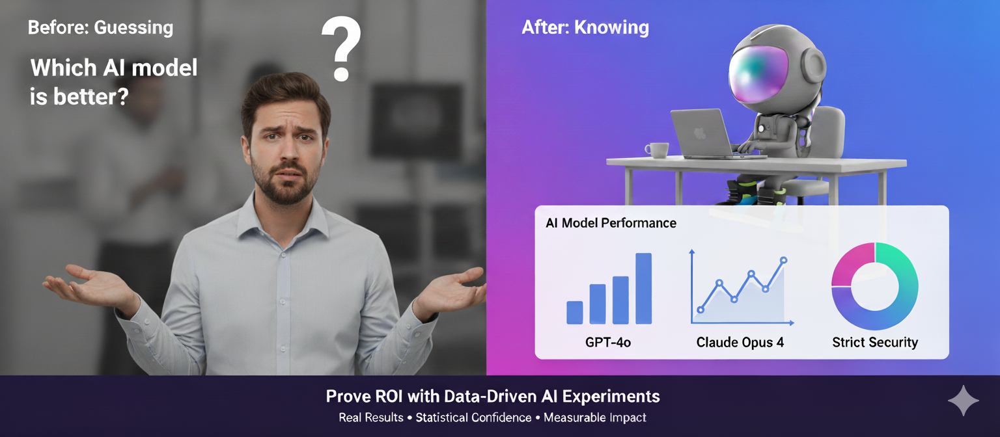
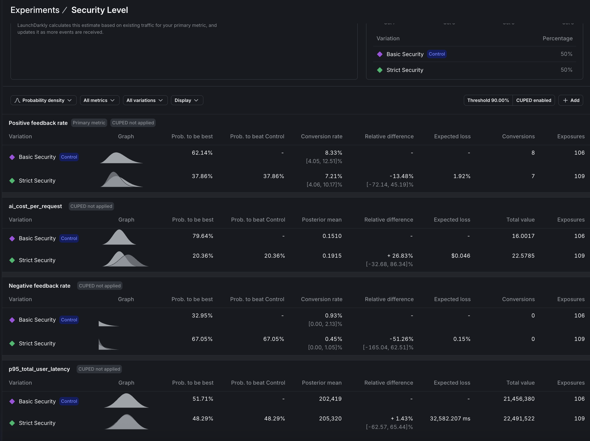
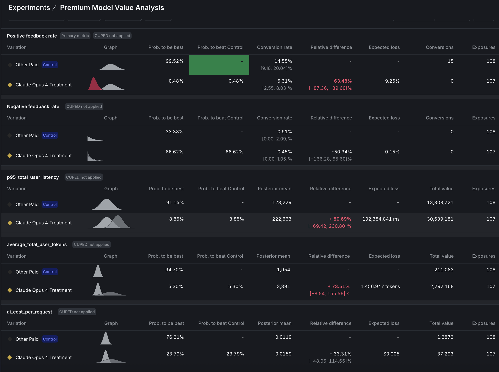

# Proving ROI with Data-Driven AI Agent Experiments

<div align="center">

</div>

<br>

## What You'll Learn in 5 Minutes (or Build in 30)

> **Key Findings from Our Experiments:**
> - **Strict security is a win**: 36% faster response times + enhanced privacy for only 14.6% cost increase
> - **Unexpected discovery**: Free Mistral model is not only $0 but also significantly faster than Claude Haiku
> - **Cost paradox revealed**: "Free" security agent increased total system costs by forcing downstream agents to compensate
> - **Premium model failure**: Claude Opus 4 performed 64% worse than GPT-4o despite costing 33% more
> - **Sample size reality**: High-variance metrics (cost, feedback) require 5-10x more data than low-variance ones (latency)

## The Problem

Your CEO asks: **"Is the new expensive AI model worth it?"**

Your product manager worries: **"Will aggressive PII redaction hurt user satisfaction?"**

Your finance team wonders: **"Does the enhanced privacy justify the cost?"**

Without experiments, you're guessing. This tutorial shows you how to **measure the truth** - and sometimes discover unexpected wins.

## The Solution: Real Experiments, Real Answers

In 30 minutes, you'll run actual A/B tests that reveal:

**Does strict security hurt positive feedback rates?**
**Is Claude Opus 4 worth 33% more than GPT-4o?**

*Part 3 of 3: **Chaos to Clarity: Defensible AI Systems That Deliver***

## Quick Start Options

### **Option 1: Just Want the Concepts?** (5 min read)
Skip to [Understanding the Experiments](#understanding-your-two-experiments) to learn the methodology without running code.

### **Option 2: Full Hands-On Tutorial** (30 min)
Follow the complete guide to run your own experiments.

<details>
<summary><strong>Prerequisites for Hands-On Tutorial</strong></summary>

**Required from Previous Parts:**
- Completed Parts [1](README.md) & [2](README.md) (multi-agent system with segmentation)
- Active LaunchDarkly project with AI Configs
- API keys: Anthropic, OpenAI, LaunchDarkly

**Investment:**
- Time: ~30 minutes (15 min setup, 10 min data collection, 5 min analysis)
- Cost: $25-35 default ($5-10 with `--queries 50`)

</details>

## How the Experiments Work

**The Setup**: Your AI system will automatically test variations on simulated users, collecting real performance data that flows directly to LaunchDarkly for statistical analysis.

**The Process**:
1. **Traffic simulation** generates queries from your actual knowledge base
2. **Each user** gets randomly assigned to experiment variations
3. **AI responses** are evaluated for quality and tracked for cost/speed
4. **LaunchDarkly** calculates statistical significance automatically

**Note**: The two experiments can run independently. Each user can participate in both, but the results are analyzed separately.

**Reality Check**: Not all metrics reach significance at the same rate. In our security experiment with 2,727 users:
- **Latency**: 87% confidence (nearly significant, clear 36% improvement)
- **Cost**: 21% confidence (high variance, needs 5-10x more data)
- **Feedback**: 58% confidence (sparse signal, needs 5-10x more data)

This is normal! Low-variance metrics (latency, tokens) prove out quickly. High-variance metrics (cost, feedback) need massive samples. **You may not be able to wait for every metric to hit 90%** - use strong signals on some metrics plus directional insights on others.

**Experiment Methodology**: Our supervisor agent routes PII queries to the security agent (then to support), while clean queries go directly to support. LaunchDarkly tracks metrics **at the user level across all agents**, revealing system-wide effects. We ran 500+ PII queries (`--pii-percentage 100`) to maximize security agent traffic. Cost tracking captures all three agents (supervisor, security, support), showing how "free" security models can paradoxically increase total system costs.

## Understanding Your Two Experiments

> **Before:** You guess whether stricter security helps or hurts.
> **After:** You'll have mathematical proof of user preferences.

### **Experiment 1: Security Agent Analysis**

**Question**: Does Strict Security (free Mistral model with aggressive PII redaction) improve performance without harming user experience or significantly increasing system costs?

**Variations** (50% each):
- **Control**: Basic Security (Claude Haiku, moderate PII redaction)
- **Treatment**: Strict Security (Mistral free, aggressive PII redaction)

**Success Criteria**:
1. Positive feedback rate: stable or improving (not significantly worse)
2. Cost increase: ≤15% with ≥75% confidence
3. Latency increase: ≤3 seconds (don't significantly slow down)
4. Enhanced privacy protection delivered

### **Experiment 2: Premium Model Value Analysis**

**Question**: Does Claude Opus 4 justify its premium cost vs GPT-4o?

**Variations** (50% each):
- **Control**: GPT-4o with full tools (current version)
- **Treatment**: Claude Opus 4 with identical tools

**Success Criteria (must meet 90% threshold)**:
- ≥15% positive feedback rate improvement by Claude Opus 4
- Cost-value ratio ≥ 0.25 (positive feedback rate gain % ÷ cost increase %)

## Setting Up Metrics and Experiments

> **Why this matters:** Without metrics, you're flying blind. These five metrics reveal the truth about AI performance.

### **Step 1: Configure Metrics (5 minutes)**

#### **Quick Metric Setup**

Navigate to **Metrics** in LaunchDarkly and create three custom metrics:

| Metric | Event Key | Type | What It Measures |
|--------|-----------|------|------------------|
| **P95 Latency** | `$ld:ai:duration:total` | P95 | Response speed |
| **Avg Tokens** | `$ld:ai:tokens:total` | Average | Token usage |
| **Cost/Request** | `ai_cost_per_request` | Average | Dollar cost |
| **Positive Feedback** | Built-in | Rate | Positive feedback rate |
| **Negative Feedback** | Built-in | Rate | User complaints |

<details>
<summary><strong>See detailed setup for P95 Latency</strong></summary>

1. Event key: `$ld:ai:duration:total`
2. Type: Value/Size → Numeric, Aggregation: Sum
3. Definition: P95, value, user, sum, "lower is better"
4. Unit: `ms`, Name: `p95_total_user_latency`

<div align="center">

</div>

</details>

<details>
<summary><strong>View other metric configurations</strong></summary>

- **Tokens**: Same as latency but Average instead of P95
- **Cost**: Event key `ai_cost_per_request`, Average in dollars
- Screenshots: `screenshots/tokens.png` and `screenshots/cost.png`

</details>

The cost tracking is implemented in `utils/cost_calculator.py`, which calculates actual dollar costs using the formula `(input_tokens × input_price + output_tokens × output_price) / 1M`. The system has pre-configured pricing for each model: GPT-4o at $2.50/$10 per million tokens, Claude Opus 4 at $15/$75, and Claude Sonnet at $3/$15. When a request completes, the cost is immediately calculated and sent to LaunchDarkly as a custom event, enabling direct cost-per-user analysis in your experiments.

### **Step 2: Create Experiment Variations**

Create the experiment variations using the bootstrap script:

```bash
uv run python bootstrap/tutorial_3_experiment_variations.py
```

This creates the `claude-opus-treatment` variation for the Premium Model Value experiment. The Security Agent Analysis experiment will use your existing baseline and enhanced variations. Both experiments use the existing other-paid configuration as their control group.

### **Step 3: Configure Security Agent Experiment**

<details>
<summary>Click for details</summary>

Navigate to <strong>AI Configs → security-agent → Experiments</strong> tab → <strong>Create experiment</strong>
#### **Experiment Design**

**Experiment type:**
- Keep `Feature change` selected (default)

**Name:** `Security Level`

#### **Hypothesis and Metrics**

**Hypothesis:** `Enhanced security improves safety compliance without significantly harming positive feedback rates`

**Randomize by:** `user`

**Metrics:** Click "Select metrics or metric groups" and add:
1. `Positive feedback rate` → Select first to set as **Primary**
2. `Negative feedback rate`
3. `p95_total_user_latency`
4. `ai_cost_per_request`

#### **Audience Targeting**

**Flag or AI Config**
- Click the dropdown and select **security-agent**

**Targeting rule:**
- Click the dropdown and select **Rule 4**
- This will configure: `If Context` → `is in Segment` → `Other Paid`

#### **Audience Allocation**

**Variations served outside of this experiment:**
- `Basic Security`

**Sample size:** Set to `100%` of users in this experiment

**Variations split:** Click "Edit" and configure:
- `pii-detector`: `0%`
- `Basic Security`: `50%`
- `Strict Security`: `50%`

**Control:**
- `Basic Security`

#### **Statistical Approach and Success Criteria**

**Statistical approach:** `Bayesian`
**Threshold:** `90%`

Click **"Save"**
Click **"Start experiment"** to launch.

</details>

<br>

<div align="center">

</div>

<br>

### **Step 4: Configure Premium Model Experiment**

<details>
<summary>Click for details</summary>

Navigate to <strong>AI Configs → support-agent → Experiments</strong> tab → <strong>Create experiment</strong>

#### **Experiment Design**

**Experiment type:**
- Keep `Feature change` selected (default)

**Name:** `Premium Model Value Analysis`

#### **Hypothesis and Metrics**

**Hypothesis:** `Claude Opus 4 justifies premium cost with superior positive feedback rate`

**Randomize by:** `user`

**Metrics:** Click "Select metrics or metric groups" and add:
1. `Positive feedback rate` → Select first to set as **Primary**
2. `Negative feedback rate`
3. `p95_total_user_latency`
4. `average_total_user_tokens`
5. `ai_cost_per_request`

#### **Audience Targeting**

**Flag or AI Config**
- Click the dropdown and select **support-agent**

**Targeting rule:**
- Click the dropdown and select **Rule 4**
- This will configure: `If Context` → `is in Segment` → `Other Paid`

#### **Audience Allocation**

**Variations served outside of this experiment:**
- `other-paid`

**Sample size:** Set to `100%` of users in this experiment

**Variations split:** Click "Edit" and configure:
- `rag-search-enhanced`: `0%`
- `eu-free`: `0%`
- `eu-paid`: `0%`
- `other-free`: `0%`
- `other-paid`: `50%`
- `international-standard`: `0%`
- `claude-opus-treatment`: `50%`

**Control:**
- `other-paid`

#### **Statistical Approach and Success Criteria**

**Statistical approach:** `Bayesian`
**Threshold:** `90%`

Click **"Save"**
Click **"Start experiment"** to launch.

</details>

<br>

<div align="center">

</div>

<br>

## Understanding Your Experimental Design

**If Two Independent Experiments Running Concurrently:**

Since these are the **same users**, each user experiences:
- One security variation (baseline OR enhanced)
- One model variation (GPT-4o OR Opus 4)

Random assignment ensures balance: ~50 users get each combination naturally.

## Generating Experiment Data

### **Step 5: Run Traffic Generator**

Start your backend and generate realistic experiment data. Choose between sequential or concurrent traffic generation:

#### **Concurrent Traffic Generator (Recommended for large datasets)**

For faster experiment data generation with parallel requests:

```bash
# Start backend API
uv run uvicorn api.main:app --reload --port 8000

# Generate experiment data with 10 concurrent requests (separate terminal)
uv run python -u tools/concurrent_traffic_generator.py --queries 200 --concurrency 10
```

**Configuration**:
- **200 queries** by default (edit script to adjust)
- **10 concurrent requests** running in parallel
- **2000-second timeout** (33 minutes) per request to handle MCP tool rate limits
- **Logs saved** to `logs/concurrent_experiment_TIMESTAMP.log`

Note: runtime depends largely on if you retain MCP tool enablement as these take much longer to complete.

<details>
<summary>For smaller test runs or debugging</summary>

#### **Sequential Traffic Generator (Simple, one-at-a-time)**

```bash
# Start backend API
uv run uvicorn api.main:app --reload --port 8000

# Generate experiment data sequentially (separate terminal)
python tools/traffic_generator.py --queries 50 --delay 2
```

**What Happens During Simulation:**

1. **Knowledge extraction**
   Claude analyzes your docs and identifies 20+ realistic topics

2. **Query generation**
   Each test randomly selects from these topics for diversity

3. **AI-powered evaluation**
   Claude judges responses as thumbs_up/thumbs_down/neutral

4. **Automatic tracking**
   All metrics flow to LaunchDarkly in real-time

</details>

**Generation Output**:
```
📚 Analyzing knowledge base...
✅ Generated 23 topics

⚡ Sending 200 requests with 10 concurrent workers...

✅ [1/200] Success (23.4s) - other_paid: What is reinforcement learning?...
✅ [2/200] Success (45.2s) - other_paid: How does Q-learning work?...
⏱️  [15/200] Timeout (>2000s) - other_paid: Complex research query...
                              ↑ This is normal - MCP rate limits
✅ [200/200] Success (387.1s) - other_paid: Explain temporal difference...

======================================================================
✅ COMPLETE
======================================================================
Total time: 45.3 minutes (2718s)
Successful: 195/200 (97.5%)
Failed: 5/200 (2.5%)
Average: 13.6s per query (with concurrency)
```

**Performance Notes**:
- Most queries complete in 10-60 seconds
- Queries using `semantic_scholar` MCP tool may take 5-20 minutes due to API rate limits
- Concurrent execution handles slow requests gracefully by continuing with others
- Failed/timeout requests (<5% typically) don't affect experiment validity

**Monitor Results**: Refresh your LaunchDarkly experiment "Results" tabs to see data flowing in. Cost metrics appear as custom events alongside feedback and token metrics.

## Interpreting Your Results (After Data Collection)

Once your experiments have collected data from ~100 users per variation, you'll see results in the LaunchDarkly UI. Here's how to interpret them:

### **1. Security Agent Analysis: Does enhanced security improve safety without significantly impacting positive feedback rates?**

> ## ✅ VERDICT: Deploy Strict Security: Enhanced Privacy Worth the Modest Cost
>
> **Sample:** 2,727 users (1,350 Basic Security, 1,377 Strict Security)

**Latency (p95) - APPROACHING SIGNIFICANCE (Unexpected Win!)**
- **87.39% confidence** that Strict Security is faster
- **36% improvement**: 38.1ms (Basic) → 24.4ms (Strict)
- **Result**: Surprising performance advantage; Mistral not only costs $0 but is also significantly faster than Claude Haiku

**Cost Per Request - APPROACHING SIGNIFICANCE**
- **79.12% confidence** that Basic Security costs less (or 20.88% that Strict costs more)
- **+14.58% increase**: $0.0246 (Basic) → $0.0281 (Strict)
- **Result**: Modest cost increase with reasonable confidence - the enhanced privacy protection of Strict Security costs only ~$0.0035 more per request

**Positive Feedback Rate - INCONCLUSIVE**
- **58.38% confidence** that Strict Security is better
- **+1.14% improvement**: 33.95% (Basic) → 34.34% (Strict)  
- **Result**: Slight positive trend, needs more data

**The Hidden Cost Paradox:**

Strict Security uses **FREE Mistral** for PII detection, yet **increases total system cost by 14.6%**. Why?

```
Basic Security (Claude Haiku):
- Supervisor: gpt-4o-mini     ~$0.0001
- Security:   claude-haiku    ~$0.0003  
- Support:    gpt-4o          ~$0.0242
Total: $0.0246

Strict Security (Mistral):
- Supervisor: gpt-4o-mini     ~$0.0001
- Security:   mistral         $0.0000  (FREE!)
- Support:    gpt-4o          ~$0.0280  (+15.7%)
Total: $0.0281 (+14.6%)
```

**Why does the support agent cost more?** More aggressive PII redaction removes context, forcing the support agent to generate longer, more detailed responses to compensate for the missing information. This demonstrates why **system-level experiments** matter - optimizing one agent can inadvertently increase costs downstream.

**Decision Logic:**
```
IF latency increase ≤ 3s
   AND cost increase ≤ 15% AND confidence ≥ 75%
   AND positive_feedback_rate stable or improving
   AND enhanced_privacy_protection = true
THEN deploy_strict_security()
ELSE need_more_data()
```

**Bottom line:** Deploy Strict Security. We expected latency to stay within 3 seconds of baseline, but discovered a **36% improvement** instead (87% confidence) - Mistral is significantly faster than Claude Haiku. Combined with enhanced privacy protection, this more than justifies the modest 14.58% cost increase (79% confidence). At scale, paying ~$0.0035 more per request for significantly better privacy compliance *and* faster responses is a clear win for EU users and privacy-conscious segments.

**Key Insight:** The experiment revealed an unexpected performance advantage alongside the expected privacy benefits. While the "free" Mistral model does increase total system costs by forcing downstream agents to work harder with reduced context, the latency gains and privacy improvements make this a worthwhile tradeoff. LaunchDarkly's user-level tracking was essential for discovering both the cost increase and the performance win - neither would be visible in agent-level metrics alone.


**The Data That Proves It:**
<br>

<div align="center">

</div>

<br>

### **2. Premium Model Value Analysis: Does Claude Opus 4 justify its premium cost with superior positive feedback rates?**

> ## 🔴 VERDICT: Reject Claude Opus 4
>
**Performance:** 63% WORSE positive feedback rate (5.31% vs 14.55%) 

**Probability:** 99.52% that GPT-4o is superior

**Cost:** 33% more expensive ($0.0159 vs $0.0119)

**Speed:** 81% slower (223ms vs 123ms)

**Cost-to-value Ratio:** -63%/33% = -.18

**Decision Logic:**
```
IF positive_feedback_rate increase ≥ 15%
   AND probability_to_beat for positive_feedback_rate ≥ 90%
   AND probability_to_beat for cost ≥ 90%
   AND cost-value ratio increase ≥ .25
THEN deploy_claude_opus_4()
ELSE keep_current_model()
```

**Bottom line:** Premium price delivered worse results on every metric. Experiment was stopped when positive feedbarck rate reached significance.

**Read across:** GPT-4o dominates on performance, and most likely also on speed, and cost

**The Numbers Don't Lie:**

<br>

<div align="center">

</div>

<br>

### **Key Insights from Real Experiment Data**

**1. Metric Variance Determines Sample Size Requirements**

Low-variance metrics (latency, tokens) reach significance quickly (~1,000 samples). High-variance metrics (cost, feedback) may need 5,000-10,000+ samples. This isn't a flaw in your experiment but the reality of statistical power. Don't chase 90% confidence on every metric; focus on directional insights for high-variance metrics and statistical proof for low-variance ones.

**2. System-Level Tracking Reveals Hidden Trade-offs (Both Good and Bad)**

Using a free Mistral model for security reduced that agent's cost to $0, yet **increased total system cost by 14.58%** because downstream agents had to work harder with reduced context. However, the experiment also revealed an **unexpected 36% latency improvement** - Mistral is not just free but significantly faster. LaunchDarkly's user-level tracking captured both effects, enabling an informed decision: enhanced privacy + faster responses for ~$0.0035 more per request is a worthwhile tradeoff.

**3. "Near Significance" Still Provides Actionable Insights**

At 87% confidence for latency (vs 90% target), the 36% improvement is clear enough for decision-making. Perfect statistical significance is ideal, but 85-89% confidence combined with other positive signals (stable feedback, acceptable cost) can justify deployment when the effect size is large.

**4. Statistical Rigor Prevents Premature Optimization**

Without LaunchDarkly's Bayesian analysis, you might see "Strict Security is 14.6% more expensive" and optimize prematurely. The 21% confidence reveals high variance - that cost difference could easily be noise. Requiring 90% confidence prevents expensive reactions to random fluctuations.


## Experimental Limitations & Mitigations

**Model-as-Judge Evaluation**

We use Claude to evaluate response quality rather than real users, which represents a limitation of this experimental setup. However, research shows that model-as-judge approaches correlate well with human preferences, as documented in [Anthropic's Constitutional AI paper](https://arxiv.org/abs/2212.08073).

**Sample Size**

With approximately 100 users per variation, we're at the minimum threshold for detecting 15-20% effects reliably. For experiments where you expect smaller effects, you should increase the sample to ensure adequate statistical power.

**Independent Experiments**

While random assignment naturally balances security versions across model versions, preventing systematic bias, you cannot analyze interaction effects between security and model choices. If interaction effects are important to your use case, consider running a proper [factorial experiment design](https://en.wikipedia.org/wiki/Factorial_experiment).

**Statistical Confidence**
LaunchDarkly uses **[Bayesian statistics](https://launchdarkly.com/docs/home/experimentation/bayesian)** to calculate confidence, where 90% confidence means there's a 90% probability the true effect is positive. This is NOT the same as p-value < 0.10 from [frequentist tests](https://en.wikipedia.org/wiki/Frequentist_inference). We set the threshold at 90% (rather than 95%) to balance false positives versus false negatives, though for mission-critical features you should consider raising the confidence threshold to 95%.

## Common Mistakes We Avoided

❌ **"Let's run the experiment for a week and see"**

✅ **We defined success criteria upfront** (≥15% improvement threshold)

❌ **"We need 90% confidence on every metric to ship"**

✅ **We used 87% confidence + directional signals** (36% latency win was decision-worthy)

❌ **"Let's run experiments until all metrics reach significance"**

✅ **We understood variance** (cost/feedback need 5-10x more data than latency)

❌ **"This cost difference looks bad, let's optimize"**

✅ **We checked confidence first** (21% confidence = probably just noise)

❌ **"Agent-level metrics show the full picture"**

✅ **We tracked user-level workflows** (revealed downstream cost increases)

## What You've Accomplished

You've built a **data-driven optimization engine** with statistical rigor through falsifiable hypotheses and clear success criteria. Your predefined success criteria ensure clear decisions and prevent post-hoc rationalization. Every feature investment now has quantified business impact for ROI justification, and you have a framework for continuous optimization through ongoing measurable experimentation.

## Troubleshooting

### **Long Response Times (>20 minutes)**

If you see requests taking exceptionally long, the root cause is likely the `semantic_scholar` MCP tool hitting API rate limits, which causes 30-second retry delays. Queries using this tool may take 5-20 minutes to complete. The 2000-second timeout handles this gracefully, but if you need faster responses (60-120 seconds typical), consider removing `semantic_scholar` from tool configurations. You can verify this issue by checking logs for `HTTP/1.1 429` errors indicating rate limiting.

### **Cost Metrics Not Appearing**

If `ai_cost_per_request` events aren't showing in LaunchDarkly, first verify that `utils/cost_calculator.py` has pricing configured for your models. Cost is only tracked when requests complete successfully (not on timeout or error). The system flushes cost events to LaunchDarkly immediately after each request completion. To debug, look for `💰 COST CALCULATED:` and `COST TRACKING (async):` messages in your API logs.

## Beyond This Tutorial: Advanced AI Experimentation Patterns

### **Other AI experimentation types you can run in LaunchDarkly**

*Context from earlier:* you ran two experiments:
- **Security‑agent test** → a **bundle change** (both prompt/instructions **and** model changed).
- **Premium‑model test** → a **model‑only** change.

AI Configs come in two modes—**prompt‑based** (single‑step completions) and **agent‑based** (multi‑step workflows with tools). Below are additional patterns to explore.

---

#### Experiments you can run **entirely in AI Configs** (no app redeploy)
- **Prompt & template experiments (prompt‑based or agent instructions)**  
  Duplicate a variation and iterate on system/assistant messages or agent instructions to measure adherence to schema, tone, or qualitative satisfaction. Use LD Experimentation to tie those variations to product metrics.  

- **Model‑parameter experiments**  
  In a single model, vary parameters like `temperature` or `max_tokens`, and (optionally) add **custom parameters** you define (for example, an internal `max_tool_calls` or decoding setting) directly on the variation.  

- **Tool‑bundle experiments (agent mode or tool‑enabled completions)**  
  Attach/detach reusable tools from the **Tools Library** to compare stacks (e.g., `search_v2`, a reranker, or MCP‑exposed research tools) across segments. Keep one variable at a time when possible

- **Cost/latency trade‑offs**  
  Compare “slim” vs “premium” stacks by segment. Track tokens, time‑to‑first‑token, duration, and satisfaction to decide where higher spend is warranted.

> **Practical notes**
> - Use **Experimentation** for behavior impact (clicks, task success); use the **Monitoring** tab for LLM‑level metrics (tokens, latency, errors, satisfaction).  
> - You **can’t** run a guarded rollout and an experiment on the same flag at the same time. Pick one: guarded rollout for risk‑managed releases, experiment for causal measurement.
---

#### Patterns that **usually need feature flags and/or custom instrumentation**
- **Fine‑grained RAG tuning**  
  k‑values, similarity thresholds, chunking, reranker swaps, and cache policy are typically coded inside your retrieval layer. Expose these as flags or AI Config custom parameters if you want to A/B them.

- **Tool‑routing guardrails**  
  Fallback flows (e.g., retry with a different tool/model on error), escalation rules, or heuristics need logic in your agent/orchestrator. Gate those behaviors behind flags and measure with custom metrics.

- **Safety guardrail calibration**  
  Moderation thresholds, red‑team prompts, and PII sensitivity levers belong in a dedicated safety service or the agent wrapper. Wire them to flags so you can raise/lower sensitivity by segment (e.g., enterprise vs free).

- **Session budget enforcement**  
  Monitoring will show token costs and usage, but enforcing per‑session or per‑org budgets (denylist, degrade model, or stop‑tooling) requires application logic. Wrap policies in flags before you experiment.

---

#### Targeting & segmentation ideas (works across all the above)
- Route by **plan/tier**, **geo**, **device**, or **org** using AI Config targeting rules and percentage rollouts.
- Keep variations narrow (one change per experiment) to avoid confounding; reserve “bundle” tests for tool‑stack bake‑offs.

**Advanced Practices:** Require statistical evidence before shipping configuration changes. Pair each variation with clear success metrics, then A/B test prompt or tool adjustments and use confidence intervals to confirm improvements. When you introduce the new code paths above, protect them behind feature flags so you can run sequential tests, [multi-armed bandits](https://launchdarkly.com/docs/home/multi-armed-bandits) for faster convergence, or change your [experiment design](https://docs.launchdarkly.com/guides/experimentation/designing-experiments) to understand how prompts, tools, and safety levers interact.

## From Chaos to Clarity

Across this three-part series, you've transformed from hardcoded AI configurations to a scientifically rigorous, data-driven optimization engine. **[Part 1](tutorial_1.md)** established your foundation with a dynamic multi-agent [LangGraph](https://langchain-ai.github.io/langgraph/) system controlled by [LaunchDarkly AI Configs](https://launchdarkly.com/ai-config/), eliminating the need for code deployments when adjusting AI behavior. **[Part 2](tutorial_2.md)** added sophisticated targeting with geographic privacy rules, user segmentation by plan tiers, and [MCP (Model Context Protocol)](https://modelcontextprotocol.io/) tool integration for real academic research capabilities. **[Part 3](tutorial_3.md)** completed your journey with statistical experimentation that proves ROI and guides optimization decisions with mathematical confidence rather than intuition.

You now possess a defensible AI system that adapts to changing requirements, scales across user segments, and continuously improves through measured experimentation. Your stakeholders receive concrete evidence for AI investments, your engineering team deploys features with statistical backing, and your users benefit from optimized experiences driven by real data rather than assumptions. The chaos of ad-hoc AI development has given way to clarity through systematic, scientific product development.

## Resources

- **[LaunchDarkly Experimentation Docs](https://launchdarkly.com/docs/home/experimentation)** - Deep dive into statistical methods
---

**Remember:** Every AI decision backed by data is a risk avoided and a lesson learned. Start small, measure everything, ship with confidence.
