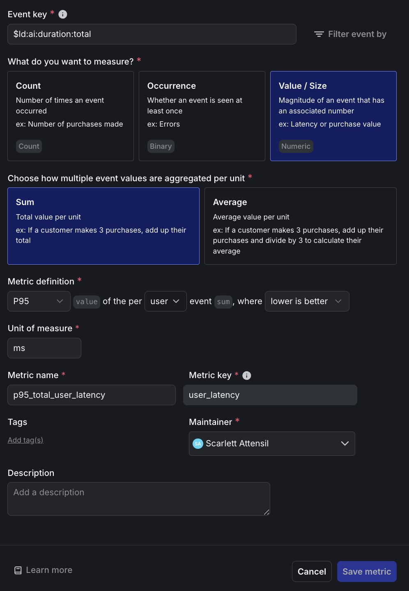
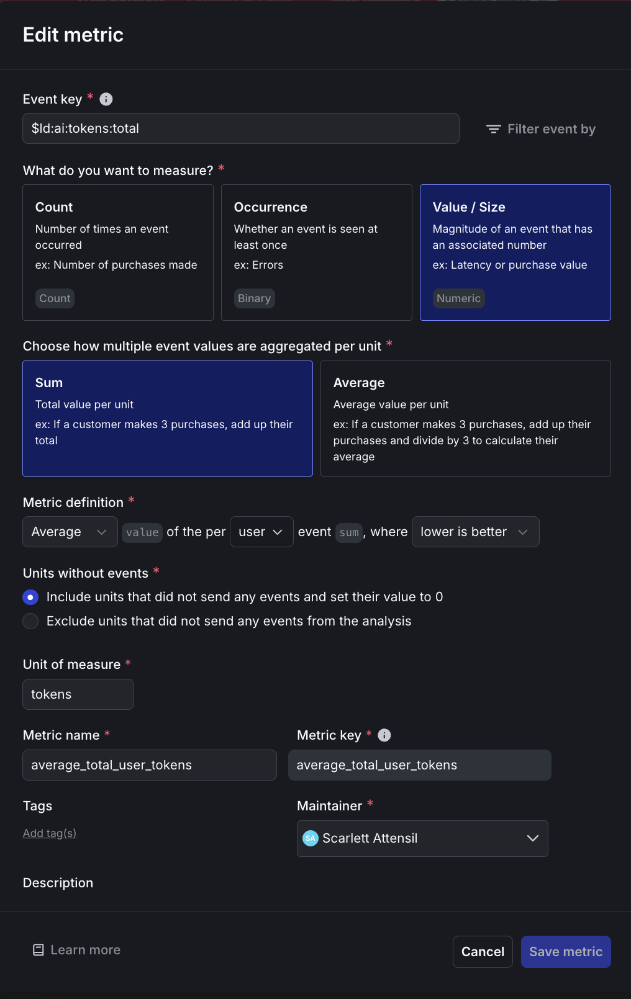
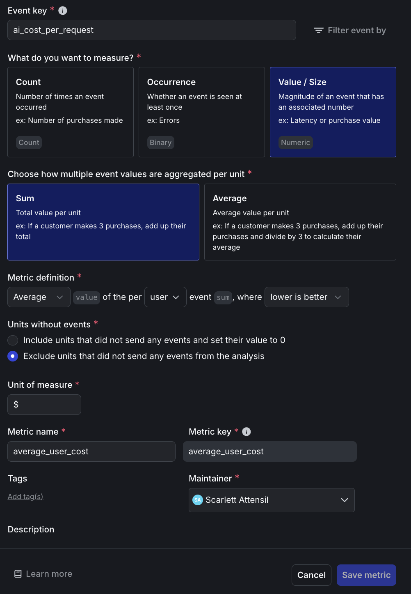
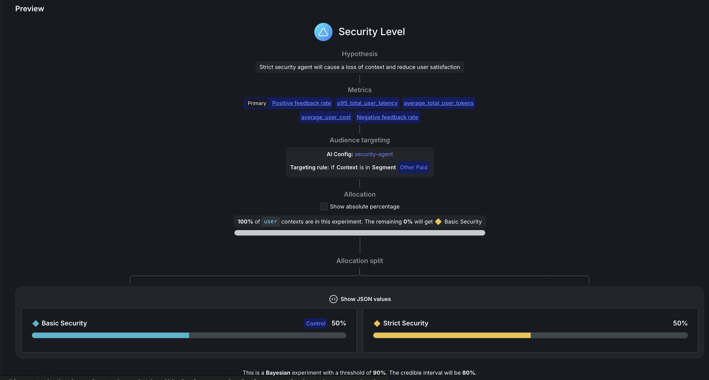
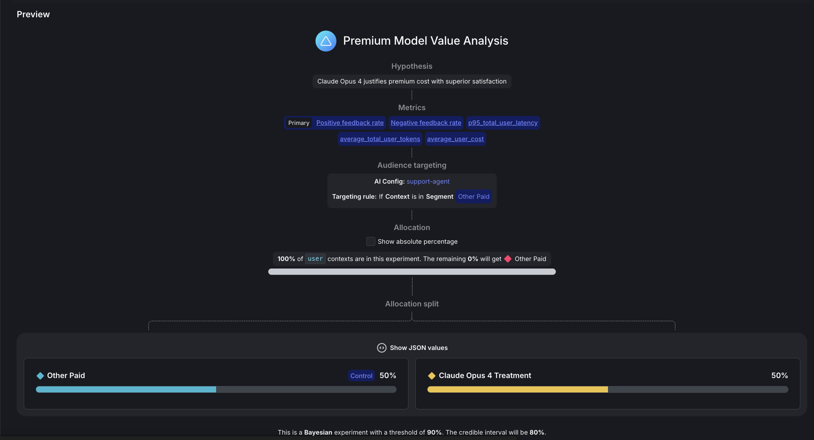
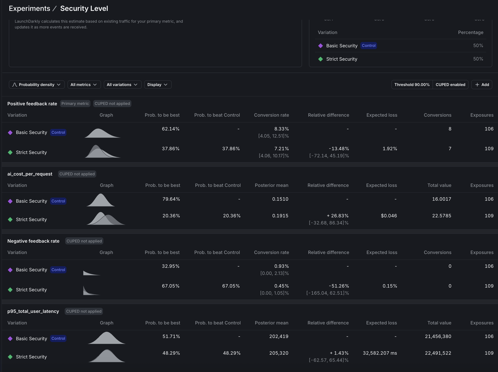
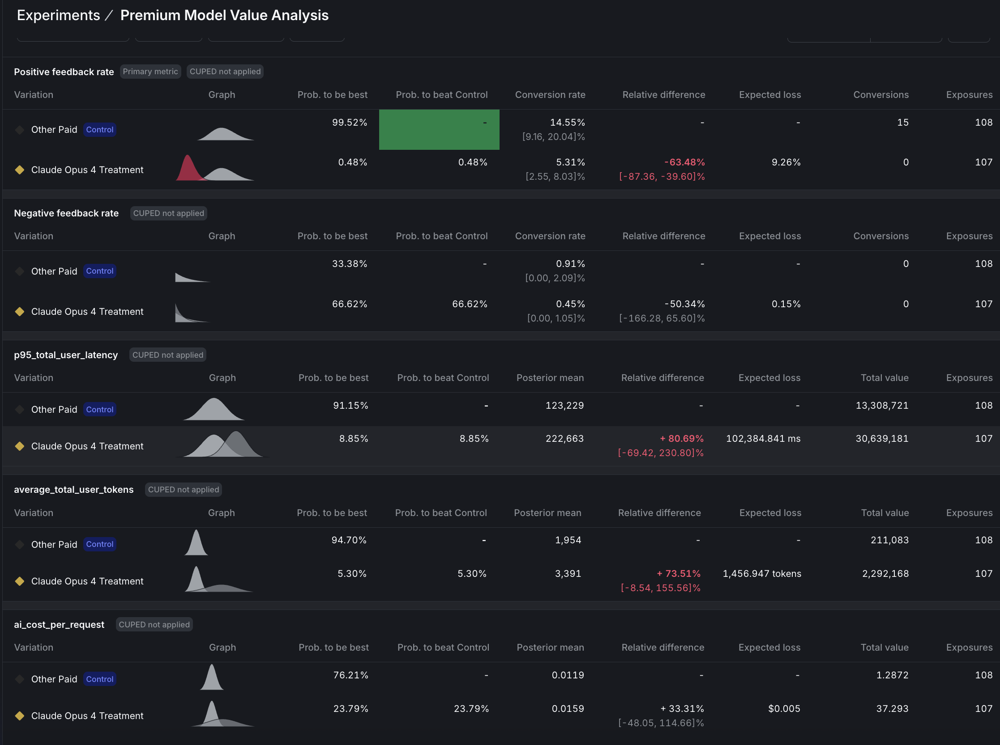

# Proving ROI with data-driven AI agent experiments

> Read the published version on [LaunchDarkly Docs](https://launchdarkly.com/docs/guides/experimentation/ai-experiments-roi).

## Overview

<Callout intent="info" title="Published October 2025 — newer AgentControl features available">

This guide was published in October 2025, before LaunchDarkly shipped several features that supersede or extend the experiment patterns shown below. The methodology still works, but for new experiments you'll likely also want to use:

- [**Online evaluations**](https://launchdarkly.com/docs/home/ai-configs/online-evaluations) and [**custom judges**](https://launchdarkly.com/docs/home/ai-configs/custom-judges) — LLM-as-a-judge scores feed directly into experiment metrics, so judge accuracy or toxicity can be the primary metric
- [**Agent graphs**](https://launchdarkly.com/docs/home/ai-configs/agent-graphs) — A/B test routing topology and per-node model choices, not just whole-config swaps
- [**Offline evaluations + datasets**](https://launchdarkly.com/docs/home/ai-configs/offline-evaluations) — lock in a regression baseline before running a live experiment
- [**LLM Playground**](https://launchdarkly.com/docs/home/ai-configs/playground) — pilot variations on test prompts before sending them to real traffic

LaunchDarkly is also rebranding **AI Configs** as **AgentControl**. Slugs, SDK names, and APIs are unchanged. For the current reference, see [AgentControl documentation](https://launchdarkly.com/docs/home/ai-configs).

</Callout>

This guide explains how to measure and prove the return on investment (ROI) of AI model changes with LaunchDarkly experiments. It shows you how to use statistical analysis to find unexpected performance wins and cost paradoxes.

Imagine a scenario where your CEO asks you "Is the new expensive AI model worth it? And does the enhanced privacy justify the cost?" By the end of this guide, you will be able to answer this question.

You will run two A/B tests that reveal:

- Whether aggressive PII redaction hurts user satisfaction
- Whether Claude Opus 4 is worth 33% more than GPT-4o
- Any other unexpected gains from using the new model

You can use this guide in one of two ways:

- **Just the concepts** (5-minute read): Skip to [About the two experiments](#about-the-two-experiments) to learn the methodology without running code.
- **Full working tutorial** (30 minutes): Follow the complete guide to run your own experiments.

## Prerequisites

If you choose to complete the full tutorial, you need the following prerequisites:

- An active LaunchDarkly project, set up according to the following tutorials:
    - [Build a LangGraph Multi-Agent system in 20 Minutes with LaunchDarkly AI Configs](https://launchdarkly.com/docs/tutorials/agents-langgraph)
    - [Smart AI Agent Targeting with MCP Tools](https://launchdarkly.com/docs/tutorials/multi-agent-mcp-targeting)
- API keys for Anthropic, OpenAI, and LaunchDarkly:
    - [Sign up for a free LaunchDarkly account](http://app.launchdarkly.com/signup) and then [follow these instructions to get your API access token](https://launchdarkly.com/docs/home/account/api-create).

### Agent costs

The agent costs associated with the experiment may cost anywhere from \$5 to \$35. The default walk-through uses Claude Opus 4 (premium model) for testing. To reduce costs while still learning the experimentation patterns, you can modify `bootstrap/tutorial_3_experiment_variations.py` in your cloned repository to test with the free Mistral model instead.

To reduce costs, change the following in the `create_premium_model_variations` function:

<CodeBlocks>
<CodeBlock title="model options">

```python
# Original (expensive):
"model": {
    "name": "claude-opus-4-7",
    "provider": "anthropic"
}

# Change to (free Mistral):
"model": {
    "name": "mistral-small-latest",
    "provider": "mistral"
}
```

</CodeBlock>
</CodeBlocks>

This reduces the experiment cost by about \$20. You will still have costs from the control group using GPT-4o and other agents in the system.

## How the experiments work

Your AI system will automatically test variations on simulated users, collecting real performance data that flows directly to LaunchDarkly for statistical analysis.

Here's how:

- Traffic simulation generates queries from your knowledge base
- The experiments randomly assign each user to experiment variations
- LaunchDarkly evaluates AI responses for quality and tracks cost and speed
- LaunchDarkly calculates statistical significance automatically

The two experiments can run independently. Users can participate in both, but the results are analyzed separately.

### Methodology 

Our supervisor agent routes PII queries to the security agent, then to support, while clean queries go directly to support. LaunchDarkly tracks metrics at the user level across all agents, which can reveal system-wide effects. 

## About the two experiments

This guide explains how to run two concurrent experiments:

- Security agent analysis
- Premium model value analysis

The experiments are explained below.

### Experiment 1: Security agent analysis

Here is an overview of the first experiment:

- Hypothesis: "Strict security using free Mistral model with aggressive PII redaction will improve performance without harming user experience or significantly increasing system costs."
- Variations (50% each):
    - **Control**: Basic security with Claude Haiku, including moderate PII redaction
    - **Treatment**: Strict security with Mistral free, including aggressive PII redaction
- Success criteria:
    - Positive feedback rate: stable or improving (not significantly worse)
    - Cost increase: ≤15% with ≥75% confidence
    - Latency increase: ≤3 seconds (don't significantly slow down)
    - Enhanced privacy protection delivered

### Experiment 2: Premium model value analysis

Here is an overview of the second experiment:

- Hypothesis: "Claude Opus 4 will justify its premium cost over GPT-4o due to its improved feedback rate."
- Variations (50% each):
    - **Control**: GPT-4o with full tools (current version)
    - **Treatment**: Claude Opus 4 with identical tools
- Success criteria (must meet 90% threshold):
    - ≥15% positive feedback rate improvement by Claude Opus 4
    - Cost-value ratio ≥ 0.25 (positive feedback rate gain % ÷ cost increase %)

## Step 1: Set up metrics

This section explains how to configure the metrics needed for your two experiments.

Navigate to **Metrics** in LaunchDarkly and [create three custom metrics](https://launchdarkly.com/docs/home/metrics/create-metrics):

<table class="fern-table">
  <tr>
    <th></th>
    <th>Metric 1</th>
    <th>Metric 2</th>
    <th>Metric 3</th>
  </tr>
  <tr>
    <th>Event key</th>
    <td>`$ld:ai:duration:total`</td>
    <td>`$ld:ai:tokens:total`</td>
    <td>`ai_cost_per_request`</td>
  </tr>
  <tr>
    <th>Measurement</th>
    <td>Value/size</td>
    <td>Value/size</td>
    <td>Value/size</td>
  </tr>
  <tr>
    <th>Aggregation</th>
    <td>Sum</td>
    <td>Sum</td>
    <td>Sum</td>
  </tr>
  <tr>
    <th>Definition</th>
    <td>P95, lower is better</td>
    <td>Average, lower is better</td>
    <td>Average, lower is better</td>
  </tr>
  <tr>
    <th>Metric name</th>
    <td>p95_total_user_latency</td>
    <td>average_total_user_tokens</td>
    <td>ai_cost_per_request</td>
  </tr>
  <tr>
    <th>What it measures</th>
    <td>Response speed</td>
    <td>Token usage</td>
    <td>Dollar cost</td>
  </tr>
</table>

Expand the sections below to view the full metric setups.

<Accordion title="Click to expand the P95 latency metric setup">

Here is the detailed setup for the P95 latency metric:

<Frame caption="P95 Setup configuration.">
  
</Frame>

</Accordion>

<Accordion title="Click to expand the total tokens metric setup">

Here is the detailed setup for the total tokens metric:

<Frame caption="Tokens configuration.">
  
</Frame>

</Accordion>

<Accordion title="Click to expand the cost per request metric setup">

Here is the detailed setup for the cost per request metric:

<Frame caption="Cost configuration.">
  
</Frame>

</Accordion>

In addition to the above custom metrics, you will also use these [built-in metrics](https://launchdarkly.com/docs/home/metrics/autogen/ai):

<table class="fern-table">
  <tr>
    <th>Event key</th>
    <td>Built-in</td>
    <td>Built-in</td>
  </tr>
  <tr>
    <th>Name</th>
    <th>Positive feedback</th>
    <th>Negative feedback</th>
  </tr>
  <tr>
    <th>Type</th>
    <td>Rate</td>
    <td>Rate</td>
  </tr>
  <tr>
    <th>What it measures</th>
    <td>Positive feedback rate</td>
    <td>User complaints</td>
  </tr>
</table>

The cost tracking is implemented in `utils/cost_calculator.py`, which calculates actual dollar costs using the formula `(input_tokens × input_price + output_tokens × output_price) / 1M`. The system has pre-configured pricing for each model as of October 2025: GPT-4o at \$2.50/\$10 per million tokens, Claude Opus 4 at \$15/\$75, and Claude Sonnet at \$3/\$15. When a request completes, the cost is immediately calculated and sent to LaunchDarkly as a custom event, enabling direct cost-per-user analysis in your experiments.

## Step 2: Create experiment variations

Create the experiment variations using this bootstrap script:

<CodeBlocks>
<CodeBlock title="Bootstrap script">

```bash
uv run python bootstrap/tutorial_3_experiment_variations.py
```

 </CodeBlock>
</CodeBlocks>

This creates the `claude-opus-treatment` variation for the "Premium model value analysis" experiment. To verify the script worked correctly, navigate to your "support-model-config" feature flag in LaunchDarkly. You should now see the `claude-opus-treatment` variation alongside your existing variations. The "Security agent analysis" experiment will use your existing baseline and enhanced variations. Both experiments use the existing `other-paid` configuration as their control group.

## Step 3: Configure the security agent experiment

In the left navigation, expand **AI**, then select **Configs**, then open **security-agent**. In the right navigation, click the plus **+** sign next to **Experiments** to create a new experiment.

Here is how to set up your experiment:

- **Name:** Security level
- **Hypothesis:** "Strict security using free Mistral model with aggressive PII redaction will improve performance without harming user experience or significantly increasing system costs."
- **Randomize by:** `user`
- **Metrics:** Click "Select metrics or metric groups" and add:
    - `Positive feedback rate`: Select first to set as **Primary**
    - `Negative feedback rate`
    - `p95_total_user_latency`
    - `ai_cost_per_request`
- **Flag or AI Config**: security-agent
**Targeting rule:** Rule 4
    - This configures `If Context` > `is in Segment` then `Other Paid`
- **Variations served outside of this experiment:** `Basic Security`
- **Sample size:** Set to `100%` of users in this experiment
- **Variations split:** Click "Edit" and configure:
    - `pii-detector`: `0%`
    - `Basic Security`: `50%`
    - `Strict Security`: `50%`
    - To set these percentages, first scroll down to the **Control** field and set `Basic Security` as the control variation, otherwise you won't be able to allocate 50% traffic to it.
- **Control:** `Basic Security`
- **Statistical approach:** `Bayesian`
- **Threshold:** `90%`

Click **Save**, then click **Start experiment**.

You may see a "Health warning" indicator after starting the experiment. This is normal and expected when no variations have been exposed yet. The warning will clear after your experiment starts receiving traffic and data begins flowing.

<Frame caption="Security Agent Experiment Configuration.">
  
</Frame>

## Step 4: Configure the premium model experiment

In the left navigation, expand **AI**, then select **Configs**, then open **support-agent**. In the right navigation, click the plus **+** sign next to **Experiments** to create a new experiment.

Here is how to set up your experiment:

- **Name:** Premium model value analysis
- **Hypothesis:** "Claude Opus 4 will justify its premium cost over GPT-4o due to its improved feedback rate."
- **Randomize by:** `user`
- **Metrics:** Click "Select metrics or metric groups" and add:
    - `Positive feedback rate`: Select first to set as **Primary**
    - `Negative feedback rate`
    - `p95_total_user_latency`
    - `average_total_user_tokens`
    - `ai_cost_per_request`
- **Flag or AI Config**: support-agent
- **Targeting rule:** Rule 4
    - This configures `If Context` > `is in Segment` then `Other Paid`
- **Variations served outside of this experiment:** `other-paid`
- **Sample size:** Set to `100%` of users in this experiment
- **Variations split:** Click "Edit" and configure:
    - `rag-search-enhanced`: `0%`
    - `eu-free`: `0%`
    - `eu-paid`: `0%`
    - `other-free`: `0%`
    - `other-paid`: `50%`
    - `international-standard`: `0%`
    - `claude-opus-treatment`: `50%`
    - To set these percentages, first scroll down to the **Control** field and set `Basic Security` as the control variation, otherwise you won't be able to allocate 50% traffic to it.
- **Control:** `other-paid`
- **Statistical approach:** `Bayesian`
- **Threshold:** `90%`

Click **Save**, then click **Start experiment**.

You may see a "Health warning" indicator after starting the experiment. This is normal and expected when no variations have been exposed yet. The warning will clear once your experiment starts receiving traffic and data begins flowing.

<Frame caption="Premium model value analysis experiment configuration.">
  
</Frame>

### Understanding your experiment design

If two independent experiments are running concurrently on the same users, then each user experiences:

- One security variation (`Basic Security` or `Strict Security`)
- One model variation (`Claude Opus 4 Treatment` or `Other Paid (GPT-4o)`)

Random assignment ensures balance, because ~50% of users receive each combination.

## Step 5: Run a traffic generator

Start your backend and generate realistic experiment data. Choose between sequential or concurrent traffic generation.

### Concurrent traffic generator

We recommend this option for large datasets. 

Here is the code for faster experiment data generation with parallel requests:

<CodeBlocks>
<CodeBlock title="Data generation">

```bash
# Start backend API
uv run uvicorn api.main:app --reload --port 8000

# Generate experiment data with 10 concurrent requests (separate terminal)
uv run python -u tools/concurrent_traffic_generator.py --queries 200 --concurrency 10
```

</CodeBlock>
</CodeBlocks>

This configuration includes:

- 200 queries by default. You can edit the script to change this number.
- 10 concurrent requests running in parallel.
- 2000-second timeout (33 minutes) per request to handle MCP tool rate limits.

Runtime depends largely on if you retain MCP tool enablement as these take much longer to complete.

### Sequential traffic generator

We recommend this option for simple, one-at-a-time traffic generation:

<CodeBlocks>
<CodeBlock title="Data generation">

```bash
# Start backend API
uv run uvicorn api.main:app --reload --port 8000

# Generate experiment data sequentially (separate terminal)
uv run python tools/traffic_generator.py --queries 50 --delay 2
```

</CodeBlock>
</CodeBlocks>

What happens during traffic simulation:

1. **Knowledge extraction:** Claude analyzes your docs and identifies 20+ realistic topics
2. **Query generation:** Each test randomly selects from these topics for diversity
3. **AI-powered evaluation:** Claude judges responses as thumbs_up/thumbs_down/neutral
4. **Automatic tracking:** All metrics flow to LaunchDarkly in real-time

Here is an example of the traffic generation output you might see:

<CodeBlocks>
<CodeBlock title="Data output">

```
📚 Analyzing knowledge base...
✅ Generated 23 topics

⚡ Sending 200 requests with 10 concurrent workers...

✅ [1/200] Success (23.4s) - other_paid: What is reinforcement learning?...
✅ [2/200] Success (45.2s) - other_paid: How does Q-learning work?...
⏱️  [15/200] Timeout (>2000s) - other_paid: Complex research query...
                              ↑ This is normal - MCP rate limits
✅ [200/200] Success (387.1s) - other_paid: Explain temporal difference...

======================================================================
✅ COMPLETE
======================================================================
Total time: 45.3 minutes (2718s)
Successful: 195/200 (97.5%)
Failed: 5/200 (2.5%)
Average: 13.6s per query (with concurrency)
```

</CodeBlock>
</CodeBlocks>

Relevant performance information includes:

- Most queries complete in 10-60 seconds
- Queries using `semantic_scholar` MCP tool may take 5-20 minutes due to API rate limits
- Concurrent execution handles slow requests gracefully by continuing with others
- Failed/timeout requests (typically less than 5%) don't affect experiment validity

### Monitor results

Refresh your LaunchDarkly experiment **Results** tabs to see data flowing in. Cost metrics appear as custom events alongside feedback and token metrics.

## Interpreting your results

After your experiments have collected data from about 100 users per variation, you'll see results in the LaunchDarkly UI. Here's how to interpret them:

### Question 1: Security agent analysis

Question: Does enhanced security improve safety without significantly impacting positive feedback rates?

Answer: Not all metrics reach significance at the same rate. In our security experiment we ran over 2,000 more users than the model experiment, turning off the MCP tools and using `--pii-percentage 100` to maximize PII detection.

This is what we found:

- **Latency**: 87% confidence (nearly significant, clear 36% improvement)
- **Cost**: 21% confidence (high variance, needs 5-10x more data)
- **Feedback**: 58% confidence (sparse signal, needs 5-10x more data)

This is normal. Low-variance metrics (latency, tokens) produce results quickly. High-variance metrics (cost, feedback) need massive samples. You may not be able to wait for every metric to hit 90%. Some metrics produce strong signals quickly, but for others, draw conclusions from the data and judgment based on your own experience.

#### Verdict: Deploy strict security

These results show that enhanced privacy is worth the modest cost.

The results tell a compelling story:

- Latency (p95) is approaching significance with 87% confidence that "Strict security" is faster, a win we didn't anticipate.
- Cost per request shows 79% confidence that "Basic security" costs less, or conversely, 21% confidence that "Strict" costs more, also approaching significance. 
- Positive feedback rate remains inconclusive with only 58% confidence that "Strict security" performs better, indicating we need more data to draw conclusions about user satisfaction.

#### The hidden cost paradox

Strict security uses free Mistral for PII detection, yet increases total system cost by 14.6%:

```
Basic Security (Claude Haiku):
- Supervisor: gpt-4o-mini     ~\$0.0001
- Security:   claude-haiku    ~\$0.0003
- Support:    gpt-4o          ~\$0.0242
Total: \$0.0246

Strict Security (Mistral):
- Supervisor: gpt-4o-mini     ~\$0.0001
- Security:   mistral         \$0.0000  (FREE!)
- Support:    gpt-4o          ~\$0.0280  (+15.7%)
Total: \$0.0281 (+14.6%)
```

Why does the support agent cost more? More aggressive PII redaction removes context, forcing the support agent to generate longer, more detailed responses to compensate for the missing information. This demonstrates why system-level experiments matter. Optimizing one agent can inadvertently increase costs downstream.

Decision logic:

```
IF latency increase ≤ 3s
   AND cost increase ≤ 15% AND confidence ≥ 75%
   AND positive_feedback_rate stable or improving
   AND enhanced_privacy_protection = true
THEN deploy_strict_security()
ELSE need_more_data()
```

Conclusion: Deploy strict security. We expected latency to stay within 3 seconds of baseline, but discovered a 36% improvement instead (with 87% confidence). Mistral is significantly faster than Claude Haiku. Combined with enhanced privacy protection, this more than justifies the modest 14.5% cost increase (with 79% confidence). 

At scale, paying ~\$0.004 more per request for significantly better privacy compliance *and* faster responses is a clear win for EU users and privacy-conscious segments.

Here are the results:

<Frame caption="Security level experiment results.">
  
</Frame>

### Question 2: Premium model value analysis

Question: Does Claude Opus 4 justify its premium cost with superior positive feedback rates?

Answer: Reject Claude Opus 4.

The experiment delivered a decisive verdict:

- Positive feedback rate showed a significant failure with 99.5% confidence that GPT-4o is superior.
- Cost per request is approaching significance with 76% confidence that Claude Opus is 33% more expensive, while latency (p95) reached significance with 91% confidence that Claude Opus is **81% slower**.
- The cost-to-value ratio tells the whole story: -1.9x, meaning we're paying 33% more for 64% worse performance, which is a clear case of premium pricing without premium results.

Decision logic:

```
IF positive_feedback_rate increase ≥ 15%
   AND probability_to_beat for positive_feedback_rate ≥ 90%
   AND probability_to_beat for cost ≥ 90%
   AND cost-value ratio increase ≥ .25
THEN deploy_claude_opus_4()
ELSE keep_current_model()
```

Conclusion: Premium price delivered worse results on every metric. Experiment was stopped when positive feedback rate reached significance.

GPT-4o dominates on performance and speed and most likely also on cost.

Here are the results:

<Frame caption="Premium model value analysis results.">
  
</Frame>

### What we learned from our experiment data

Here's what we learned running these experiments ourselves:

- Low-variance metrics (latency, tokens) reach significance quickly (~1,000 samples). High-variance metrics (cost, feedback) may need 5,000-10,000+ samples. This isn't a flaw in your experiment but the reality of statistical power. Don't chase 90% confidence on every metric; focus on directional insights for high-variance metrics and statistical proof for low-variance ones.

- Using a free Mistral model for security reduced that agent's cost to \$0, yet increased total system cost by 14.5 because downstream agents had to work harder with reduced context. However, the experiment also revealed an unexpected 36% latency improvement. Mistral is not just free but significantly faster. LaunchDarkly's user-level tracking captured both effects, enabling an informed decision: enhanced privacy + faster responses for ~\$0.004 more per request is a worthwhile tradeoff.

- At 87% confidence for latency (as compared to 90% target), the 36% improvement is clear enough for decision-making. Perfect statistical significance is ideal, but 85-89% confidence combined with other positive signals (stable feedback, acceptable cost) can justify deployment when the effect size is large.

## Experiment limitations

We encountered some limitations while running these experiments:

- **Model-as-judge evaluation:** We use Claude to evaluate response quality rather than real users, which represents a limitation of this experimental setup. However, research shows that model-as-judge approaches correlate well with human preferences, as documented in [Anthropic's Constitutional AI paper](https://arxiv.org/abs/2212.08073).

- **Independent experiments:** While random assignment naturally balances security versions across model versions, preventing systematic bias, you cannot analyze interaction effects between security and model choices. If interaction effects are important to your use case, consider running a proper [factorial experiment design](https://en.wikipedia.org/wiki/Factorial_experiment).

- **Statistical confidence:** LaunchDarkly uses [Bayesian statistics](https://launchdarkly.com/docs/home/experimentation/bayesian) to calculate confidence, where 90% confidence means there's a 90% probability the true effect is positive. This is not the same as p-value < 0.10 from [frequentist tests](https://en.wikipedia.org/wiki/Frequentist_inference). We set the threshold at 90%, rather than 95%, to balance false positives versus false negatives, though for mission-critical features you should consider raising the confidence threshold to 95%.

## Common mistakes you have avoided

Here are common mistakes you avoided, and what you did instead:

<table class="fern-table">
  <tr>
    <th>Mistake&nbsp;you&nbsp;avoided</th>
    <th>What you did instead</th>
  </tr>
  <tr>
    <td>"Let's run the experiment for a week and see"</td>
    <td>"We defined success criteria upfront" (≥15% improvement threshold)</td>
  </tr>
  <tr>
    <td>"We need 90% confidence on every metric to ship"</td>
    <td>"We used 87% confidence and our judgment" (36% latency win was decision-worthy)</td>
  </tr>
  <tr>
    <td>"Let's run experiments until all metrics reach significance"</td>
    <td>"We understood variance" (cost/feedback need 5-10x more data than latency)</td>
  </tr>
  <tr>
    <td>"Agent-level metrics show the full picture"</td>
    <td>"We tracked user-level workflows" (revealed downstream cost increases)</td>
  </tr>
</table>

## What you've accomplished

You've built a data-driven optimization engine with statistical rigor through falsifiable hypotheses and clear success criteria. Your predefined success criteria ensure clear decisions and prevent post-hoc rationalization. Every feature investment now has quantified business impact for ROI justification, and you have a framework for continuous optimization through ongoing measurable experimentation.

Findings from our experiments include:

- **Unexpected discovery**: Free Mistral model is not only \$0 but also significantly faster than Claude Haiku
- **Cost paradox revealed**: "Free" security agent increased total system costs by forcing downstream agents to compensate
- **Premium model failure**: Claude Opus 4 performed 64% worse than GPT-4o despite costing 33% more
- **Sample size reality**: High-variance metrics (cost, feedback) require 5-10x more data than low-variance ones (latency)

## Troubleshooting

This section includes troubleshooting solutions.

### **Long response times (>20 minutes)**

If you see requests taking exceptionally long, the root cause is likely the `semantic_scholar` MCP tool hitting API rate limits, which causes 30-second retry delays. Queries using this tool may take 5-20 minutes to complete. The 2000-second timeout handles this gracefully, but if you need faster responses (60-120 seconds typical), consider removing `semantic_scholar` from tool configurations. You can verify this issue by checking logs for `HTTP/1.1 429` errors indicating rate limiting.

### **Cost metrics not appearing**

If `ai_cost_per_request` events aren't showing in LaunchDarkly, first verify that `utils/cost_calculator.py` has pricing configured for your models. Cost is only tracked when requests complete successfully (not on timeout or error). The system flushes cost events to LaunchDarkly immediately after each request completion. To debug, look for `COST CALCULATED:` and `COST TRACKING (async):` messages in your API logs.

## Beyond this tutorial: Advanced AI Experimentation patterns

In this guide you ran two experiments:

- **Security‑agent test**: a bundle change, where both prompt/instructions and the model changed.
- **Premium‑model test**: a model‑only change.

AI Configs come in two modes: **prompt‑based** (single‑step completions) and **agent‑based** (multi‑step workflows with tools). Below are additional patterns to explore.

### AI Config experiments

Experiments you can run entirely in AI Configs with no app redeploy include:

- **Prompt and template experiments (prompt‑based or agent instructions):** Duplicate a variation and iterate on system/assistant messages or agent instructions to measure adherence to schema, tone, or qualitative satisfaction. Use LaunchDarkly Experimentation to tie those variations to product metrics.

- **Model‑parameter experiments:** In a single model, vary parameters like `temperature` or `max_tokens`, and optionally add custom parameters you define, for example, an internal `max_tool_calls` or decoding setting, directly on the variation.

- **Tool‑bundle experiments (agent mode or tool‑enabled completions):** Attach/detach reusable tools from the **Tools Library** to compare stacks, such as `search_v2`, a reranker, or MCP‑exposed research tools, across segments. Keep one variable at a time when possible

- **Cost/latency trade‑offs:** Compare "slim" versus "premium" stacks by segment. Track tokens, time‑to‑first‑token, duration, and satisfaction to decide where higher spend is warranted.

Recommendations include:

- Use Experimentation for behavior impact (clicks, task success). Use the **Monitoring** tab for LLM‑level metrics (tokens, latency, errors, satisfaction).
- You can't run a guarded rollout and an experiment on the same flag at the same time. Pick one: guarded rollout for risk‑managed releases, experiment for causal measurement.

### Feature flag experiments

Experiments you can run with feature flags include:

- **Fine‑grained RAG tuning:** k‑values, similarity thresholds, chunking, reranker swaps, and cache policy are typically coded inside your retrieval layer. Expose these as flags or AI Config custom parameters if you want to A/B them.

- **Tool‑routing guardrails:** Fallback flows (for example, retry with a different tool/model on error), escalation rules, or heuristics need logic in your agent/orchestrator. Gate those behaviors behind flags and measure with custom metrics.

- **Safety guardrail calibration:** Moderation thresholds, red‑team prompts, and PII sensitivity levers belong in a dedicated safety service, for example, enterprise as compared to free.

- **Session budget enforcement:** Monitoring will show token costs and usage, but enforcing per‑session or per‑org budgets (denylist, degrade model, or stop‑tooling) requires application logic. Wrap policies in flags before you experiment.

### Targeting and segmentation ideas 

These ideas work with all of the experiment suggestions we listed above:

- Target by plan/tier, geo, device, or org using AI Config targeting rules and percentage rollouts.
- Keep variations narrow, one change per experiment, to avoid confounding. Reserve "bundle" tests for tool‑stack comparisons.

Require statistical evidence before shipping configuration changes. Pair each variation with clear success metrics, then A/B test prompt or tool adjustments and use confidence intervals to confirm improvements. When you introduce the new code paths above, protect them behind feature flags so you can run sequential tests, [multi-armed bandits](https://launchdarkly.com/docs/home/multi-armed-bandits) for faster convergence, or change your [experiment design](https://launchdarkly.com/docs/guides/experimentation/designing-experiments) to understand how prompts, tools, and safety levers interact.

## Conclusion: From chaos to clarity

Across this three-part series, you've transformed from hardcoded AI configurations to a scientifically rigorous, data-driven optimization engine. [Part 1](https://launchdarkly.com/docs/tutorials/agents-langgraph) established your foundation with a dynamic multi-agent [LangGraph](https://langchain-ai.github.io/langgraph/) system controlled by [LaunchDarkly AI Configs](https://launchdarkly.com/docs/guides/ai-configs), eliminating the need for code deployments when adjusting AI behavior. [Part 2](https://launchdarkly.com/docs/tutorials/multi-agent-mcp-targeting) added sophisticated targeting with geographic privacy rules, user segmentation by plan tiers, and [MCP (Model Context Protocol)](https://modelcontextprotocol.io/) tool integration for real academic research capabilities. This tutorial, Part 3, completed your journey with statistical experimentation that proves ROI and guides optimization decisions with mathematical confidence rather than intuition.

You now possess a defensible AI system that adapts to changing requirements, scales across user segments, and continuously improves through measured experimentation. Your stakeholders receive concrete evidence for AI investments, your engineering team deploys features with statistical backing, and your users benefit from optimized experiences driven by real data rather than assumptions. The chaos of ad-hoc AI development has given way to clarity through systematic, scientific product development.

{version === "LaunchDarkly docs" && (<Callout intent="note" title='Want to know more? Start a trial.'>

Your 14-day trial begins as soon as you sign up. Get started in minutes using the in-app Quickstart. You'll discover how easy it is to release, monitor, and optimize your software.<br/><br/>

Want to try it out? <a href="https://app.launchdarkly.com/signup">Start a trial</a>.

</Callout>)}

## Related tutorials

- [Build a LangGraph Multi-Agent system in 20 Minutes](https://launchdarkly.com/docs/tutorials/agents-langgraph) - Part 1 of this series: build the agent system that the experiments here measure
- [Smart AI Agent Targeting with MCP Tools](https://launchdarkly.com/docs/tutorials/multi-agent-mcp-targeting) - Part 2: add user, geo, and tier targeting before experimenting on it
- [Beyond n8n for Workflow Automation: Agent Graphs](https://launchdarkly.com/docs/tutorials/agent-graphs) - Externalize the multi-agent topology with visual graph builder and per-node metrics
- [When to add online evals](https://launchdarkly.com/docs/tutorials/when-to-add-online-evals) - Surface the metrics experiments measure with judge-based scoring on live traffic
- [Offline Evaluation of RAG-Grounded Answers](https://launchdarkly.com/docs/tutorials/offline-evals) - Lock in an offline baseline before running A/B tests
- [Evaluate LLM code generation with LLM-as-judge evaluators](https://launchdarkly.com/docs/tutorials/custom-evals-claude-code) - Build custom judges to produce the quality metrics your experiments compare