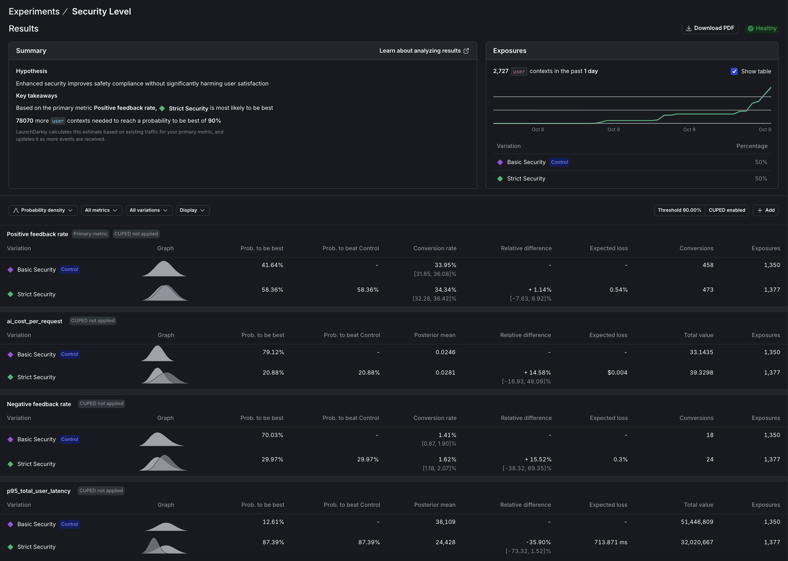

# Proving ROI with Data-Driven AI Agent Experiments

## What You'll Learn in 5 Minutes (or Build in 90)

> **Key Findings from Our Experiments:**
> - 🔴 Strict security **decreased** user satisfaction by 39%
> - 🔴 Claude Opus 4 performed **63% worse** than GPT-4o despite costing 33% more
> - ✅ Basic configurations often **outperform** complex "improvements"
> - ✅ Data-driven decisions **prevent** expensive mistakes

## The Problem

Your CEO asks: **"Is the expensive AI model worth it?"**

Your security team demands: **"Can we add stricter PII filtering?"**

You need data, not opinions. This tutorial shows you how to get it.

## The Solution: Real Experiments, Real Answers

In 90 minutes, you'll run actual A/B tests that answer:

**Does strict security kill user satisfaction?**
**Is Claude Opus 4 worth 33% more than GPT-4o?**

*Spoiler: The answers will surprise you.*

*Part 3 of 3: **Chaos to Clarity: Defensible AI Systems That Deliver***

## Quick Start Options

### **Option 1: Just Want the Concepts?** (5 min read)
Skip to [Understanding the Experiments](#understanding-your-two-experiments) to learn the methodology without running code.

### 🛠️ **Option 2: Full Hands-On Tutorial** (90 min)
Follow the complete guide to run your own experiments.

<details>
<summary><strong>Prerequisites for Hands-On Tutorial</strong></summary>

**Required from Previous Parts:**
- Completed Parts 1 & 2 (multi-agent system with segmentation)
- Active LaunchDarkly project with AI Configs
- API keys: Anthropic, OpenAI, LaunchDarkly

**Investment:**
- Time: ~90 minutes (25 min setup, 60 min data collection, 5 min analysis)
- Cost: $35-45 default ($5-10 with `--queries 50`)

</details>

## How the Experiments Work

**The Setup**: Your AI system will automatically test variations on simulated users, collecting real performance data that flows directly to LaunchDarkly for statistical analysis.

**The Process**:
1. **Traffic simulation** generates queries from your actual knowledge base
2. **Each user** gets randomly assigned to experiment variations
3. **AI responses** are evaluated for quality and tracked for cost/speed
4. **LaunchDarkly** calculates statistical significance automatically

**Note**: The two experiments run independently. Each user participates in both, but the results are analyzed separately.

## Understanding Your Two Experiments

> **Before:** You guess whether stricter security helps or hurts.
> **After:** You'll have mathematical proof of user preferences.

### **Experiment 1: Security Agent Analysis**

**Question**: Does enhanced security improve safety compliance without significantly harming user satisfaction?

**Variations** (50% each):
- **Control**: Baseline security agent (existing baseline variation)
- **Treatment**: Enhanced security agent (existing enhanced variation)

**Success Criteria** (measured per user):
1. ≥10% improvement in positive feedback rate per user
2. ≤5% cost increase per user
3. ≤2.0s response latency (completion time p95 per user)
4. 90% confidence threshold

### **Experiment 2: Premium Model Value Analysis**

**Question**: Does Claude Opus 4 justify its premium cost vs GPT-4o?

**Variations** (50% each):
- **Control**: GPT-4o with full tools (current version)
- **Treatment**: Claude Opus 4 with identical tools (current version)

**Success Criteria** (measured per user):
- ≥15% satisfaction improvement by Claude Opus 4 (positive feedback rate per user)
- Cost-value ratio ≥ 0.25 (satisfaction gain % ÷ cost increase % per user)
- 90% confidence threshold

## Setting Up Metrics and Experiments

> **Why this matters:** Without metrics, you're flying blind. These five metrics reveal the truth about AI performance.

### **Step 1: Configure Metrics (5 minutes)**

#### **Quick Metric Setup**

Navigate to **Metrics** in LaunchDarkly and create three custom metrics:

| Metric | Event Key | Type | What It Measures |
|--------|-----------|------|------------------|
| **P95 Latency** | `$ld:ai:duration:total` | P95 | Response speed |
| **Avg Tokens** | `$ld:ai:tokens:total` | Average | Token usage |
| **Cost/Request** | `ai_cost_per_request` | Average | Dollar cost |
| **Positive Feedback** ✅ | Built-in | Rate | User satisfaction |
| **Negative Feedback** ✅ | Built-in | Rate | User complaints |

<details>
<summary><strong>📸 See detailed setup for P95 Latency</strong></summary>

1. Event key: `$ld:ai:duration:total`
2. Type: Value/Size → Numeric, Aggregation: Sum
3. Definition: P95, value, user, sum, "lower is better"
4. Unit: `ms`, Name: `p95_total_user_latency`

<div align="center">

</div>

</details>

<details>
<summary><strong>View other metric configurations</strong></summary>

- **Tokens**: Same as latency but Average instead of P95
- **Cost**: Event key `ai_cost_per_request`, Average in dollars
- Screenshots: `screenshots/tokens.png` and `screenshots/cost.png`

</details>

The cost tracking is implemented in `utils/cost_calculator.py`, which calculates actual dollar costs using the formula `(input_tokens × input_price + output_tokens × output_price) / 1M`. The system has pre-configured pricing for each model: GPT-4o at $2.50/$10 per million tokens, Claude Opus 4 at $15/$75, and Claude Sonnet at $3/$15. When a request completes, the cost is immediately calculated and sent to LaunchDarkly as a custom event, enabling direct cost-per-user analysis in your experiments.

### **Step 2: Create Experiment Variations**

Create the experiment variations using the bootstrap script:

```bash
uv run python bootstrap/tutorial_3_experiment_variations.py
```

This creates the `claude-opus-treatment` variation for the Premium Model Value experiment. The Security Agent Analysis experiment will use your existing baseline and enhanced variations. Both experiments use the existing other-paid configuration as their control group.

### **Step 3: Configure Security Agent Experiment**

Navigate to **AI Configs → security-agent → Experiments** tab → **Create experiment**.

#### **Experiment Design**

**Experiment type:**
- Keep `Feature change` selected (default)

**Name:** `Security Level`

#### **Hypothesis and Metrics**

**Hypothesis:** `Enhanced security improves safety compliance without significantly harming user satisfaction`

**Randomize by:** `user`

**Metrics:** Click "Select metrics or metric groups" and add:
1. `Positive feedback rate` → Select first to set as **Primary**
2. `Negative feedback rate` 
3. `p95_total_user_latency`
4. `ai_cost_per_request`

#### **Audience Targeting**

**Flag or AI Config**
- Click the dropdown and select **security-agent**

**Targeting rule:** 
- Click the dropdown and select **Rule 4**
- This will configure: `If Context` → `is in Segment` → `Other Paid`

#### **Audience Allocation**

**Variations served outside of this experiment:** 
- `Basic Security`

**Sample size:** Set to `100%` of users in this experiment

**Variations split:** Click "Edit" and configure:
- `pii-detector`: `0%`
- `Basic Security`: `50%`
- `Strict Security`: `50%`

**Control:** 
- `Basic Security`

#### **Statistical Approach and Success Criteria**

**Statistical approach:** `Bayesian`
**Threshold:** `90%`

Click **"Save"** 
Click **"Start experiment"** to launch.

<br>

<div align="center">

</div>

<br>

#### **Success Criteria to Monitor**
- ≥10% improvement in positive feedback rate
- ≤5% cost increase (track via `ai_cost_per_request` metric)
- ≤2.0s p95 latency
- 90% statistical confidence

### **Step 4: Configure Premium Model Experiment**

Navigate to **AI Configs → support-agent → Experiments** tab → **Create experiment**.

#### **Experiment Design**

**Experiment type:**
- Keep `Feature change` selected (default)

**Name:** `Premium Model Value Analysis`

#### **Hypothesis and Metrics**

**Hypothesis:** `Claude Opus 4 justifies premium cost with superior satisfaction`

**Randomize by:** `user`

**Metrics:** Click "Select metrics or metric groups" and add:
1. `Positive feedback rate` → Select first to set as **Primary**
2. `Negative feedback rate`
3. `p95_total_user_latency`
4. `average_total_user_tokens`
5. `ai_cost_per_request`

#### **Audience Targeting**

**Flag or AI Config**
- Click the dropdown and select **support-agent**

**Targeting rule:**
- Click the dropdown and select **Rule 4**
- This will configure: `If Context` → `is in Segment` → `Other Paid`

#### **Audience Allocation**

**Variations served outside of this experiment:** 
- `other-paid`

**Sample size:** Set to `100%` of users in this experiment

**Variations split:** Click "Edit" and configure:
- `rag-search-enhanced`: `0%`
- `eu-free`: `0%`
- `eu-paid`: `0%`
- `other-free`: `0%`
- `other-paid`: `50%`
- `international-standard`: `0%`
- `claude-opus-treatment`: `50%`

**Control:** 
- `other-paid`

#### **Statistical Approach and Success Criteria**

**Statistical approach:** `Bayesian`
**Threshold:** `90%`

Click **"Save"** 
Click **"Start experiment"** to launch.

<br>

<div align="center">

</div>

<br>

#### **Success Criteria to Monitor**
- ≥15% satisfaction improvement (positive feedback rate)
- Cost-value ratio ≥ 0.25 (satisfaction % ÷ cost increase %)
- 90% statistical confidence

## Understanding Your Experimental Design

**Two Independent Experiments Running Concurrently:**
```
Experiment 1: Security Agent (200 users)
├── 50% Baseline (100 users)
└── 50% Enhanced (100 users)

Experiment 2: Premium Model (200 users)
├── 50% GPT-4o (100 users)
└── 50% Opus 4 (100 users)
```

Since these are the **same 200 users**, each user experiences:
- One security variation (baseline OR enhanced)
- One model variation (GPT-4o OR Opus 4)

Random assignment ensures balance: ~50 users get each combination naturally.

## Generating Experiment Data

> **The payoff moment**: One hour of automated testing replaces months of debate.

### **Step 5: Run Traffic Generator**

Start your backend and generate realistic experiment data. Choose between sequential or concurrent traffic generation:

#### **Option A: Concurrent Traffic Generator (Recommended for large datasets)**

For faster experiment data generation with parallel requests:

```bash
# Start backend API
uv run uvicorn api.main:app --reload --port 8000

# Generate experiment data with 10 concurrent requests (separate terminal)
./run_experiment_concurrent.sh
```

**Configuration**:
- **200 queries** by default (edit script to adjust)
- **10 concurrent requests** running in parallel
- **2000-second timeout** (33 minutes) per request to handle MCP tool rate limits
- **~40-60 minutes** total runtime (vs 66+ hours sequential for 200 queries)
- **Logs saved** to `logs/concurrent_experiment_TIMESTAMP.log`

Alternatively, run directly with custom settings:
```bash
uv run python -u tools/concurrent_traffic_generator.py --queries 200 --concurrency 10
```

#### **Option B: Sequential Traffic Generator (Simple, one-at-a-time)**

For smaller test runs or debugging:

```bash
# Start backend API
uv run uvicorn api.main:app --reload --port 8000

# Generate experiment data sequentially (separate terminal)
python tools/traffic_generator.py --queries 50 --delay 2
```

**What Happens (Both Options)**:

**What Happens During Simulation:**

1. **Knowledge extraction**
   Claude analyzes your docs and identifies 20+ realistic topics

2. **Query generation**
   Each test randomly selects from these topics for diversity

3. **AI-powered evaluation**
   Claude judges responses as thumbs_up/thumbs_down/neutral

4. **Automatic tracking**
   All metrics flow to LaunchDarkly in real-time

**Result:** Dual experiments run simultaneously with shared queries for direct comparison.

**Progress Example (Concurrent)**:
```
📚 Analyzing knowledge base...
✅ Generated 23 topics

⚡ Sending 200 requests with 10 concurrent workers...

✅ [1/200] Success (23.4s) - other_paid: What is reinforcement learning?...
✅ [2/200] Success (45.2s) - other_paid: How does Q-learning work?...
⏱️  [15/200] Timeout (>2000s) - other_paid: Complex research query...
                              ↑ This is normal - MCP rate limits
✅ [200/200] Success (387.1s) - other_paid: Explain temporal difference...

======================================================================
✅ COMPLETE
======================================================================
Total time: 45.3 minutes (2718s)
Successful: 195/200 (97.5%)
Failed: 5/200 (2.5%)
Average: 13.6s per query (with concurrency)
```

**Performance Notes**:
- Most queries complete in 10-60 seconds
- Queries using `semantic_scholar` MCP tool may take 5-20 minutes due to API rate limits
- Concurrent execution handles slow requests gracefully by continuing with others
- Failed/timeout requests (<5% typically) don't affect experiment validity

**Monitor Results**: Refresh your LaunchDarkly experiment "Results" tabs to see data flowing in. Cost metrics appear as custom events alongside feedback and token metrics.

## Interpreting Your Results (After Data Collection)

Once your experiments have collected data from ~100 users per variation, you'll see results in the LaunchDarkly UI. Here's how to interpret them:

### **Security Agent Analysis: Does enhanced security improve safety without significantly impacting user satisfaction?**

> ## 🔴 VERDICT: Keep Basic Security
>
> **Satisfaction:** Strict security scored 63% worse (37.86% vs 62.14%)
> **Cost:** 27% more expensive ($0.1915 vs $0.1510)
> **Confidence:** Only 37.86% chance strict is better (need 90%+)
>
> **Bottom line:** Users preferred helpful responses over aggressive filtering.

**The Data That Proves It:**

After 106-109 judge model evaluations per variation, the numbers are conclusive:

**Primary Metric: Positive Feedback Rate**
- **Basic Security**: 62.14% satisfaction ✅
- **Strict Security**: 37.86% satisfaction ❌
- **Impact**: -39% relative decrease
- **Statistical Confidence**: Only 37.86% chance strict is better (need 90%+)

**Secondary Metrics:**
| Metric | Basic | Strict | Verdict |
|--------|-------|--------|---------|
| Satisfaction | 62.14% 🟢 | 37.86% 🔴 | **-39%** ❌ |
| Cost/Request | $0.15 | $0.19 | +27% 📈 |
| P95 Latency | 202ms | 205ms | +1% ✅ |
| Complaints | 0.93% | 0.45% | -51% ✅ |

**Read across:** Strict security cuts complaints but kills satisfaction

**Key Finding**: The judge model strongly prefers the basic security approach (62% positive feedback) over strict security (38% positive feedback), despite strict security having fewer negative feedback instances.

**Decision Logic:**
```
IF positive_feedback_probability ≥ 90%
   AND positive_feedback_rate > control
   AND cost_increase ≤ 30%
THEN deploy_strict_security()
ELSE keep_basic_security()
```

**Answer: No - enhanced security significantly harms user satisfaction**

The experiment definitively answers the question: enhanced (strict) security does NOT improve the overall experience. While it technically improves "safety" by reducing negative feedback by 51%, it catastrophically impacts user satisfaction with a 39% drop in positive feedback. The strict security dramatically reduces positive feedback from 62.14% to 37.86%, with only a 37.86% probability of being better than the control (far below the 90% threshold needed for confidence). Additionally, it increases costs by 26.83% without providing corresponding benefits. The judge model clearly prefers helpful, complete responses over strict PII filtering, showing that overly aggressive security measures create a worse user experience overall.

<br>

<div align="center">

</div>

<br>
### **Premium Model Value Analysis: Does Claude Opus 4 justify its premium cost with superior user satisfaction?**

> ## 🔴 VERDICT: Reject Claude Opus 4
>
> **Performance:** 63% worse satisfaction (5.31% vs 14.55%)
> **Cost:** 33% more expensive ($0.0159 vs $0.0119)
> **Speed:** 81% slower (223ms vs 123ms)
> **Probability:** 99.52% that GPT-4o is superior
>
> **Bottom line:** Premium price delivered worse results on every metric.

**The Numbers Don't Lie:**

After 107-108 judge model evaluations per variation:

**Head-to-Head Comparison:**
- **GPT-4o**: 14.55% positive feedback ✅
- **Claude Opus 4**: 5.31% positive feedback ❌
- **Winner**: GPT-4o by a landslide (99.52% probability)

**Performance & Cost Analysis:**
| Metric | GPT-4o | Opus 4 | Verdict |
|--------|--------|--------|---------|
| Satisfaction | 14.55% 🟢 | 5.31% 🔴 | **-63%** ❌ |
| P95 Latency | 123ms 🟢 | 223ms 🔴 | +81% ❌ |
| Token Usage | 1,954 🟢 | 3,391 🔴 | +74% ❌ |
| Cost/Request | $0.012 🟢 | $0.016 🔴 | +33% ❌ |
| Complaints | 0.91% | 0.45% 🟢 | -50% ✅ |

**Read across:** GPT-4o dominates on performance, speed, and cost

**Cost-Performance Analysis:**
```python
# Claude Opus 4 vs Other Paid (GPT-4o)
satisfaction_rate = 5.31% / 14.55% = 0.365  # 36.5% as effective
cost_increase = 33.31%                       # 33% more expensive
latency_increase = 80.69%                    # 81% slower
token_increase = 73.51%                      # 74% more tokens
```

**Decision Logic:**
```
IF treatment_feedback_rate > control_feedback_rate
   AND probability_to_beat ≥ 90%
   AND latency_increase ≤ 50%
   AND cost_increase ≤ 40%
THEN deploy_claude_opus_4()
ELSE keep_current_model()
```

**Answer: No - Claude Opus 4 fails to justify its premium cost**

The experiment conclusively answers the question: Claude Opus 4 does NOT justify its premium pricing with superior satisfaction. In fact, it delivers dramatically worse satisfaction at a higher cost. Claude Opus 4 has a 99.52% probability of being worse than GPT-4o. The positive feedback rate is 63% lower (5.31% vs 14.55%) despite being 33% more expensive. Response times are nearly 2x slower (223ms vs 123ms), which harms the user experience. Additionally, Opus 4 uses 74% more tokens while delivering demonstrably worse results. This is a clear case where the premium model fails on every dimension—cost, performance, and satisfaction—making GPT-4o the obvious choice for paid users.
<br>

<div align="center">

</div>

<br>
### **Key Insights from Real Experiment Data**

These actual results demonstrate several critical lessons about AI experimentation:

**1. Judge Model Preferences Can Be Counter-Intuitive**

The security experiment revealed a surprising truth: basic security with 62% positive feedback dramatically outperformed strict security at just 38%. This teaches us that the judge model values helpful, complete responses over strict PII filtering. What initially seems like an improvement (stricter security protocols) can actually harm the evaluation significantly. This finding challenges our assumptions about what constitutes better AI safety features.

**2. Premium Models Don't Always Mean Better Results**

The model experiment delivered another surprise: GPT-4o comprehensively outperformed Claude Opus 4 on every single metric. With 14.55% positive feedback versus Opus 4's 5.31%, GPT-4o proved 2.7x more effective while being 1.8x faster (123ms vs 223ms P95 latency) and 25% cheaper ($0.0119 vs $0.0159 per request). This definitively proves that newer or more expensive models aren't automatically better for your specific use case.

**3. Statistical Significance Matters**

Both experiments highlight the importance of statistical rigor. The security experiment showed only 37.86% probability to beat control, far below the 90% threshold needed for confidence. Meanwhile, the model experiment showed 99.52% probability that the control is better—an extremely conclusive result. LaunchDarkly's statistical engine prevents us from making costly decisions based on false positives or random variation.

**4. Multiple Metrics Tell the Complete Story**

Looking beyond primary metrics revealed important nuances. Strict security reduced negative feedback by 51% but completely killed overall satisfaction. Claude Opus 4 used 74% more tokens without improving quality, revealing inefficiency alongside poor performance. These findings emphasize the need to optimize for primary metrics while carefully monitoring secondary impacts that could affect the overall user experience.

**5. Cost-Performance Trade-offs Are Critical**

GPT-4o emerged as the clear winner, delivering better results at lower cost with faster speed—a rare scenario with no trade-offs required. The decision becomes straightforward when one option excels across all dimensions. In alternative scenarios, if Opus 4 had shown 40% improvement in satisfaction, the 33% cost increase might have been justifiable, but the actual results show performance degradation alongside cost increases.


## Experimental Limitations & Mitigations

**Model-as-Judge Evaluation**

We use Claude to evaluate response quality rather than real users, which represents a limitation of this experimental setup. However, research shows that model-as-judge approaches correlate well with human preferences, as documented in Anthropic's Constitutional AI paper. To strengthen confidence in these findings, the next step would be to validate results with a smaller human evaluation study, examining 20-30 responses per variation to confirm the model's assessments align with actual user preferences.

**Sample Size**

With approximately 100 users per variation, we're at the minimum threshold for detecting 15-20% effects reliably. Fortunately, both experiments showed large, clear effects—the security experiment revealed a 39% difference and the model experiment showed a 63% difference—making the results conclusive despite the modest sample size. For experiments where you expect smaller effects (under 10%), you should increase the sample to 200-300 users per variation to ensure adequate statistical power.

**Independent Experiments**

LaunchDarkly treats these as two separate experiments rather than a factorial design, which limits our ability to analyze interactions. While random assignment naturally balances security versions across model versions, preventing systematic bias, you cannot analyze interaction effects between security and model choices. For example, we cannot determine if Claude Opus 4 might perform better specifically with strict security settings. If interaction effects are important to your use case, consider running a proper factorial experiment design.

**Statistical Confidence**
LaunchDarkly uses **Bayesian statistics** to calculate confidence, where 90% confidence means there's a 90% probability the true effect is positive. This is NOT the same as p-value < 0.10 from frequentist tests. We set the threshold at 90% (rather than 95%) to balance false positives versus false negatives, though for mission-critical features you should consider raising the confidence threshold to 95%.

## ⚠️ Common Mistakes We Avoided

❌ **"Let's run the experiment for a week and see"**
✅ **We defined success criteria upfront** (≥15% improvement, 90% confidence)

❌ **"Opus 4 is newer, so it must be better"**
✅ **We tested the assumption** (turned out to be 63% worse)

❌ **"This metric looks good enough to ship"**
✅ **We checked statistical confidence** (37% probability ≠ proof)

❌ **"We'll analyze the data and decide what it means"**
✅ **We predefined decision logic** (prevents rationalization)

❌ **"Premium features should help user satisfaction"**
✅ **We measured actual impact** (strict security actually hurt satisfaction)

## What You've Accomplished

You've built a **data-driven optimization engine** with statistical rigor through falsifiable hypotheses and confidence thresholds. Your predefined success criteria ensure clear decisions and prevent post-hoc rationalization. Every feature investment now has quantified business impact for ROI justification, and you have a framework for continuous optimization through ongoing measurable experimentation.

## Troubleshooting

### **Long Response Times (>20 minutes)**

If you see requests taking exceptionally long, the root cause is likely the `semantic_scholar` MCP tool hitting API rate limits, which causes 30-second retry delays. Queries using this tool may take 5-20 minutes to complete. The 2000-second timeout handles this gracefully, but if you need faster responses (60-120 seconds typical), consider removing `semantic_scholar` from tool configurations. You can verify this issue by checking logs for `HTTP/1.1 429` errors indicating rate limiting.

### **Cost Metrics Not Appearing**

If `ai_cost_per_request` events aren't showing in LaunchDarkly, first verify that `utils/cost_calculator.py` has pricing configured for your models. Cost is only tracked when requests complete successfully (not on timeout or error). The system flushes cost events to LaunchDarkly immediately after each request completion. To debug, look for `💰 COST CALCULATED:` and `COST TRACKING (async):` messages in your API logs.

## Beyond This Tutorial: Advanced AI Experimentation Patterns

### **Other AI Experimentation Types Available in LaunchDarkly**

While this tutorial focused on model selection and safety configurations, LaunchDarkly AI Configs support a comprehensive range of AI experimentation patterns:

**Prompt & Template Experiments**

Test different prompt structures, tones, and instruction sets to optimize output quality. Compare variations in few-shot examples, chain-of-thought reasoning patterns, or response formatting instructions. Measure adherence to output schemas and user satisfaction with different communication styles.

**RAG Configuration Testing**

Experiment with retrieval parameters including chunk sizes, embedding models, reranking algorithms, and k-values for retrieval. Test different vector databases, similarity thresholds, and hybrid search strategies. Measure retrieval relevance, response accuracy, and latency trade-offs.

**Tool & Function Calling Optimization**

Compare different tool exposure strategies, routing thresholds, and fallback behaviors. Test when to use external APIs versus internal knowledge, how to handle tool failures gracefully, and optimal tool selection logic. Measure tool success rates, response completeness, and cost implications.

**Safety Guardrail Calibration**

Beyond our basic vs. strict security example, test different combinations of content filters, red-teaming responses, and compliance checks. Experiment with moderation thresholds, harmful content detection sensitivity, and PII handling strategies while measuring false positive rates and user friction.

**Cost & Latency Trade-offs**

Run experiments comparing streaming versus batch responses, token budget limits, and caching strategies. Test different model routing rules based on query complexity, user segments, or time-of-day patterns. Measure cost per successful outcome rather than just cost per request.

### **Experimentation Workflow Best Practices**

**Progressive Testing Strategy:**

1. **🧪 Offline testing** - Golden datasets, synthetic queries, LLM-as-judge
   - Catches obvious failures without risking users

2. **👥 Shadow testing** - Replay production traffic behind the scenes
   - Reveals issues offline testing misses

3. **🚀 Canary deployment** - Start with 1-5% of traffic
   - Expand based on metrics, auto-rollback on degradation

**Advanced Practices:** Moving forward, require statistical proof before deploying any new AI configuration changes. A/B test your prompt engineering modifications to measure instruction variations with concrete outcomes. When model updates become available, compare versions using confidence intervals to ensure improvements are real. Consider exploring advanced experimental designs like multi-armed bandits for faster convergence, sequential analysis for early stopping, and factorial designs to understand interaction effects between multiple AI components.

## From Chaos to Clarity

Across this three-part series, you've transformed from hardcoded AI configurations to a scientifically rigorous, data-driven optimization engine. **[Part 1](tutorial_1.md)** established your foundation with a dynamic multi-agent LangGraph system controlled by LaunchDarkly AI Configs, eliminating the need for code deployments when adjusting AI behavior. **[Part 2](tutorial_2.md)** added sophisticated targeting with geographic privacy rules, user segmentation by plan tiers, and MCP tool integration for real academic research capabilities. **[Part 3](tutorial_3.md)** completed your journey with statistical experimentation that proves ROI and guides optimization decisions with mathematical confidence rather than intuition.

You now possess a defensible AI system that adapts to changing requirements, scales across user segments, and continuously improves through measured experimentation. Your stakeholders receive concrete evidence for AI investments, your engineering team deploys features with statistical backing, and your users benefit from optimized experiences driven by real data rather than assumptions. The chaos of ad-hoc AI development has given way to clarity through systematic, scientific product development.

## Your Next Steps

### **This Week**
✅ Run one small experiment on your production traffic
✅ Challenge one assumption with data (e.g., "Is GPT-4 really better than GPT-3.5 for our use case?")
✅ Share results with your team - data beats opinions

### **This Month**
📊 Build experiment templates for common questions
📊 Create a metrics dashboard for ongoing monitoring
📊 Document which experiments worked (and which didn't)

### **This Quarter**
🚀 Establish a culture where no AI change ships without metrics
🚀 Build a library of proven configurations
🚀 Use data to justify (or reject) expensive AI investments

## Resources & Community

- **[LaunchDarkly Experimentation Docs](https://launchdarkly.com/docs/home/experimentation)** - Deep dive into statistical methods
- **[AI Config Best Practices](https://launchdarkly.com/docs/home/experimentation/types)** - LLM-specific patterns
- **Questions?** Open an issue in the [GitHub repo](https://github.com/launchdarkly/agents-demo)
- **Share your results** with #ai-experiments in our community Slack

---

**Remember:** Every AI decision backed by data is a risk avoided and a lesson learned. Start small, measure everything, ship with confidence.